Integralregning
===============

Integralregning kan bruges til at finde arealer under kurver. Når man integrerer er det den modsatte matematiske operation af differentiation, vi kalder den integrerede funktion for stamfunktionen og skriver $F(x)$.

$$f\left( x \right) = 3x^{2}$$

$$F\left( x \right) = \frac{3}{3}x^{2 + 1} = x^{3} + k$$

Vi skriver et k for en konstant, man kunne også være lidt sløset med notationen og lege at k var 0. Når vi differentierer kommer vi tilbage til den oprindelige funktion :

$$F^{'}\left( x \right) = 3x^{2} = f(x)$$

Konstanten forsvandt igen da differentierede vi er altså tilbage ved den oprindelige funktion. Man kan angive at vi skal integrere vha. et integraltegn.

$$F\left( x \right) = \int\left( 3x^{2} \right)dx = x^{3}$$

Der er et en del regneregler for integration nogle er listet nedenfor, vi vil ikke komme ind på alle teknikker som partiel integration og integration ved hjælp af substitution i noterne her.

  $$f(x)$$                    $$F(x)$$
  --------------------------- ----------------------------------
  $$x^{a}$$                   $$\frac{1}{a + 1}x^{a + 1} + k$$
  $$e^{x}$$                   $$e^{x} + k$$
  $$\frac{1}{x} = x^{- 1}$$   $$\ln\left( x \right) + k$$

$$\int k \cdot f\left( x \right)dx = k \cdot \int f\left( x \right)\text{dx}$$

f.eks.

$$\int_{}^{}5 \cdot x^{2}dx = 5\int x^{2}dx = \ 5 \cdot \frac{1}{3}x^{3} + k$$

$$\int\left( f\left( x \right) \pm g\left( x \right) \right)dx = \int f\left( x \right)dx \pm \int g\left( x \right)\text{dx}$$

f.eks.

$${\int\left( 3x^{2} + 2x - 3 \right)dx = \int 3x^{2}dx + \int 2xdx - \int 3dx = }{x^{3} + x^{2} - 3 + k}$$

Partiel integration
-------------------

Hvis man ønsker at integrere produktet af 2 funktioner, er det muligt man kan finde en løsning vha. partiel integration.

$$\int f\left( x \right) \cdot g\left( x \right)dx = f\left( x \right) \cdot G\left( x \right) - \int f'\left( x \right) \cdot G\left( x \right)\text{dx}$$

Man vælger selv hvilken funktion der skal være $f\left( x \right)$ og $g\left( x \right)$, så man kan spare sig selv for bøvl, hvis man vælger klogt. Dvs. Hvis den ene funktion f.eks. bliver lettere at håndtere ved differentiation, er det en fordel at vælge denne som $f\left( x \right)$.

Eksempel:

$$\int_{}^{}{\ln\left( x \right) \cdot x^{3}\text{dx}} = \ln\left( x \right) \cdot \frac{1}{4}x^{4} - \int_{}^{}{\frac{1}{x} \cdot}\frac{1}{4}x^{4}dx =$$

$${\ln\left( x \right) \cdot \frac{1}{4}x^{4} - \frac{1}{4} \cdot \int x^{3}dx = \ln\left( x \right) \cdot \frac{1}{4}x^{4} - \left( \frac{1}{4} \right)^{2}x^{4} =}$$

$${\frac{1}{4}x^{4}(\ln\left( x \right) - \frac{1}{4})}$$

Hvis man er ude for en rigtig ubehagelig funktion, kan man måske integrere denne ved flere partielle integrationer. Man vil ikke altid kunne finde en stamfunktion til en funktion, f.eks. har tæthedsfunktionen for normalfordelingen ikke en eksplicit stamfunktion.

Arealberegning
--------------

Hvis man skal beregne arealet nedenfor vha. integralregning, gør man dette vha. bestemte integraler, det betyder vi udregner arealet under kurven for $x \in \rbrack\infty;2,5\rbrack$, 2,5 er den øvre grænse. Fra dette fratrækker vi arealet under kurven for $x \in \rbrack\infty;1\rbrack$, hvor 1 er den nedre grænse.

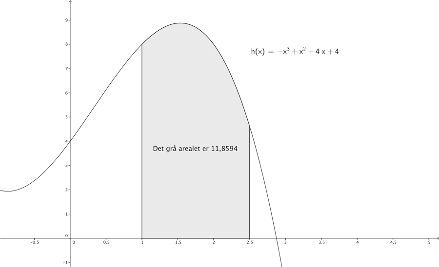{width="6.0in" height="3.651324365704287in"}

Notationsmæssigt opskriver man nedre og øvre grænse nederst og øverst på sit integral og mellemregningsparentes.

$${\int_{1}^{2,5}\left( - x^{3} + x^{2} + 4x + 4 \right)dx = \left\lbrack - \frac{1}{4}x^{4} + \frac{1}{3}x^{3} + 2x^{2} + 4x \right\rbrack_{1}^{2,5} = }{- \frac{1}{4}{2,5}^{4} + \frac{1}{3}{2,5}^{3} + 2{\cdot 2,5}^{2} + 4 \cdot 2,5 - \left( - \frac{1}{4}1^{4} + \frac{1}{3}1^{3} + 2{\cdot 1}^{2} + 4 \cdot 1 \right) =}$$

$${17,9427 - 6,0833 = 11,8594}$$

Excel Investering
=================

### Video om investering med excel

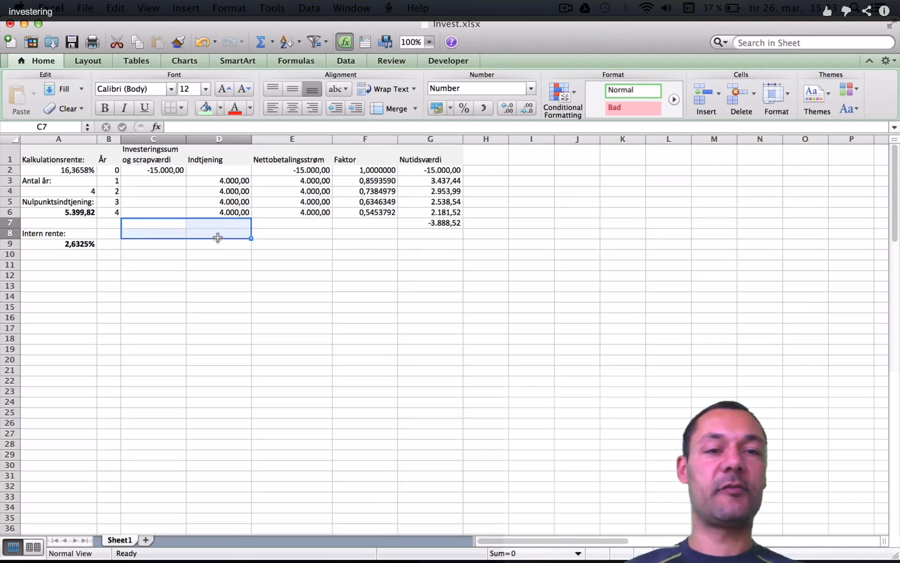{width="6.0in" height="3.75in"}

En lille virksomhed overvejer at investere i en maskine der koster 15.000,- , og giver en årlig indtjening på 3.000,- i 6 år. Efter de 6 år har maskinen en scrapværdi på 1.000,- dvs. man regner med at kunne sælge maskinen for 1.000. Hvis man skal afgøre om investeringen er lønsom, altså kan betale sig, kan man tilbagediskontere alle de fremtidige betalingsstrømme til tid 0. Det gør man ved at vælge en kalkulationsrente, hvis denne f.eks. er 8%, kan man beregne hvad nutidsværdien af investeringen bliver. Hvis nutidsværdien af investeringen er positiv kan man gennemføre projektet. Man kan i excel beregne nutidsværdien på flere måder i videoen tilbagediskonteres hvert år til tidspunkt 0. Den interne rente er den rente der gør at nutidsværdien af investeringen netop er 0. Man kan også afgøre om en investering er lønsom, ved at sammenligne kalkulationsrenten med den interne rente. Er den interne rente større end kalkulationsrenten, er nutidsværdien positiv dvs. investeringen er lønsom.

Man kan også bruge NPV-funktionen fra excel, i ovenstående eksempel skal man opskrive betalingsstrømmene fra tidspunkt 1 til 6 (C3:C8 på billedet nedenfor). I formlen skal man indsætte renten som første argument og tid 1 til 6 betalingsstrømmene som andet argument. Resultatet skal lægges sammen med den negative investeringssum på tidspunkt 0. Se nedenfor:

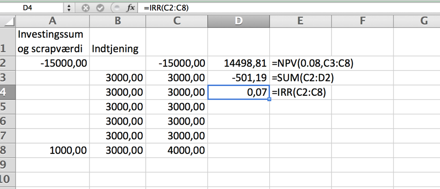{width="6.0in" height="2.577777777777778in"}

Vil man finde den interne rente for en investering med lige lange perioder mellem betalingsstrømmene kan man benytte IRR kommandoen. IRR kommandoen fungerer på samme måde som NPV, bemærk dog at man skal inkludere investeringen "C2" direkte som argument. Vi ser ovenfor netop at den interne rente 7% er mindre end kalkulationsrenten 8%, hvorfor nutidsværdien af investeringen må være negativ.

Investeringer med ikke-periodiske varierende betalingsstrømme i excel
---------------------------------------------------------------------

Der hvor excel virkelig excellerer er mht. til håndtering af datoer i forbindelse med investeringsanalyse. Excel har en meget stærk dato funktion, der tager højde for korte måneder og præcise datoer i beregning af den interne rente. Denne funktion hedder XIRR "XIRR(values,dates,guess**"**, hvor X indikerer vi har ikke-periodiske betalingsstrømme. Bemærk, man behøver, kun at udfylde values=betalingsstrømme og dates=datoer, guess er kun nødvendig hvis algoritmen ikke kører korrekt. XIRR modsvares af XNPV "XNPV(rate,values,dates)", der beregner nutidsværdien af en investering, denne funktion skal ligesom NPV have en kalkulationsrente som arguement.

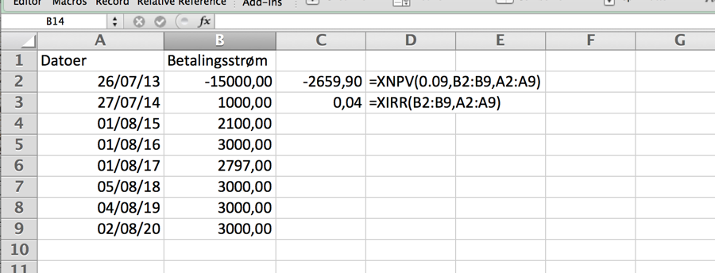{width="6.0in" height="2.295138888888889in"}

Man kan benytte XIRR funktionen til at finde ÅOP, man opstiller blot lånet som en investerings betalingsstrøm. Man kan få meget forskellige værdier for den interne rente/ÅOP alt efter hvilken software man benytter. Excel bruger 365 dage på et år, og håndterer ikke skudår, det gør f.eks. MATLAB. Andre mere skumle typer software regner med 360 dage om året, alle måneder med 30 dage. I gamle dage før vi fik computere lærte man at regne måneder som 30 dage.

Excel målsøgning
================

I eksemplet nedenfor har et par set et hus til 3 mio. De får at vide i banken at med et annuitetslån der løber over 30 år, med pålydende rente 4% p.a., månedlig rentetilskrivning , og en udbetaling på 100.000,-, vil de skulle betale en ydelse på 13.845,-. Parret har kun råd til at betale 13.000,- om måneden. Man kan nu bruge Goal Seek/Målsøgning til at regne tilbage, og dermed finde ud af hvor meget huset må koste for at ydelsen bliver netop 13.000. Goal Seek/Målsøgning ligger under tools/værktøjer fanen i toppen.

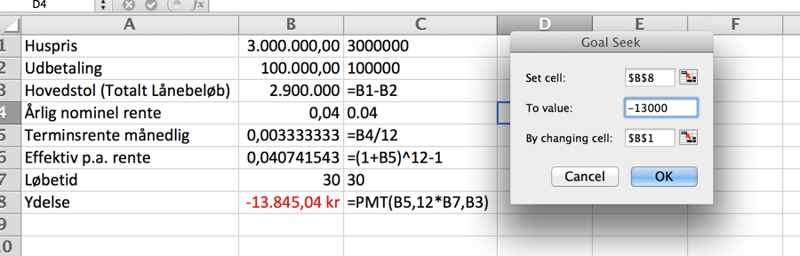{width="6.0in" height="1.917361111111111in"}

Bemærk C søjlen viser blot hvilken kode der står i B søjlen. Man hente filen via ved at klikke på billedet ovenfor, man skal trykke CTRL S eller CMD S. På billedet nedenfor kan man se resultatet af målsøgningen, parret kan altså kun købe et hus til 2.822.996,-, hvis man skal holde sig på ydelse på kr. 13.000,- om måneden.

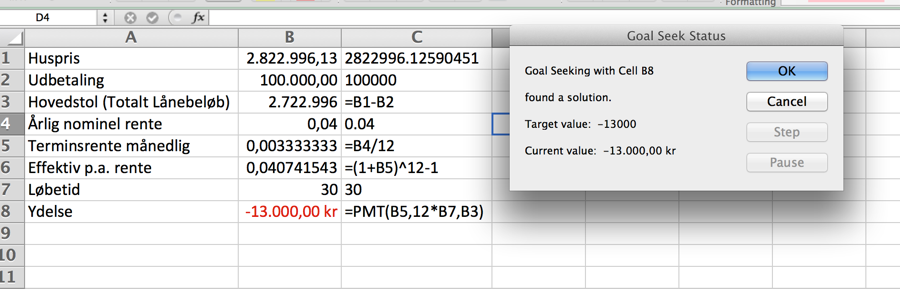{width="6.0in" height="1.9277777777777778in"}

 Excel lineær programmering
===========================

Hvis vi skal løse et lineært programmerings problem, kan vi benytte excels solver add-in. Hvis dette ikke er aktiveret skal man gøre dette i menuen Tools → Add-Ins (engelsk version). Hvis man benytter excel, kan man håndtere lineær programmering med mere end to variable som vi jo kan løse grafisk. Nedenstående eksempel er et der stammer fra Microsofts egne eksempler.

På en elektronikfabrik produceres tv- radioapparater og højtalere. Man skal bestemme den mest rentable produktsammensætning, under hensyntagen til et antal bibetingelser. Man har følgende dækningsbidrag: 75 tv- apparat, 50 radio- apparat, 35 højttalere.

Man har til rådighed for produktionen 450 kabinetter, 250 billedrør, 800 højtalerenheder, 450 strømforsyninger og 600 elektronikdele.

For at samle et tv-apparat skal der anvendes et kabinet, et billedrør, to højtalerenheder, en strømforsyning og to elektronikdele. For at samle et radioapparat skal der anvendes et kabinet, to højtalerenheder, en strømforsyning og en elektronikdel. For at samle en højtaler skal der anvendes en højtalerenhed og en elektronikdel.

Vi vælger nu at sætte $x_{1} =$ antal tv-apparater der skal produceres, $x_{2} =$ antal radio- apparater der skal produceres, $x_{3} =$ antal højtalere der skal produceres.

Vores problem går ud på at maksimere dækningsbidraget, dette kan vi jo opskrive vha. de valgte variable:

$DB = 75x_{1} + 50x_{2} + 35x_{3}$

Vi kan opskrive bibetingelserne således:

$1x_{1}\  + \ 1x_{2}\  + \ 0x_{3}\  \leq \ 450$ kabinetter

$1x_{1}\  + \ 0x_{2}\  + \ 0x_{3}\  \leq \ 250\ $ billedrør

$2x_{1}\  + \ 2x_{2}\  + \ 1x_{3}\  \leq \ 800$ højtalerenheder

$1x_{1}\  + \ 1x_{2}\  + \ 0x_{3}\  \leq \ 450$ strømforsyninger

$2x_{1}\text{\ \ } + 1x_{2}\text{\ \ } + 1x_{3}\  \leq \ 600$ elektronikdele

Da vi ikke kan producere et negativt antal produkter indfører vi ikke-negativitetsbetingelser dvs. $x_{1},x_{2},\ x_{3} \geq 0$.

Vi kan nu opstille vores problem i excel nedenfor er et billede der viser opstillingen man kan klikke på billedet og hente excel-skabelonen der er brugt til at løse problemet, man henter excel programmet via google docs ved at vælge filer → download eller ctrl s (Windows) eller cmd s (Mac).

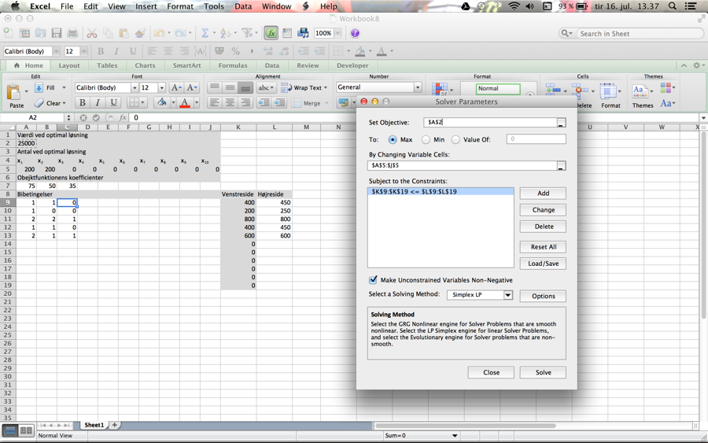{width="6.0in" height="3.75in"}

I celle A2 står det totale dækningsbidrag, vi opnåede ved den optimale produktsammensætning under hensyntagen til vore 5 bibetingelser og ikke-negativitetsbetingelser. Når man ønsker at skrive $75x_{1} + 50x_{2} + 35x_{3}$ i en celle kan man benytte sumproduct kommandoen. Det antal af de forskellige produkter, vi skal producere står i celle A5, B5 og C5, dvs. $A5 = x_{1}$ etc. Vort DB på produkterne står i celle A7, B7 og C7, dvs $A7 = 75$ osv. Når vi skal beregne det samlede DB skriver vi i celle A2:

=SUMPRODUCT(A5:J5;A7:J7)

Eller man kan klikke og trække cellerne som jeg viser i excel solver videoen.

Bibetingelseskoefficienterne skrives ind i skabelonens 3 første søjler fra række 9. Vi Skriver kun i de 3 første søjler da jeg har lavet skabelonen så man kan løse større problemer ved at inddrage flere variable. Bemærk man skriver ikke i de grå celler. Når vi skal skrive højresiden i bibetingelserne gøres dette i søjle L. Søjle K beregner sumprodukterne for højresiderne automatisk det skal man ikke gøre.

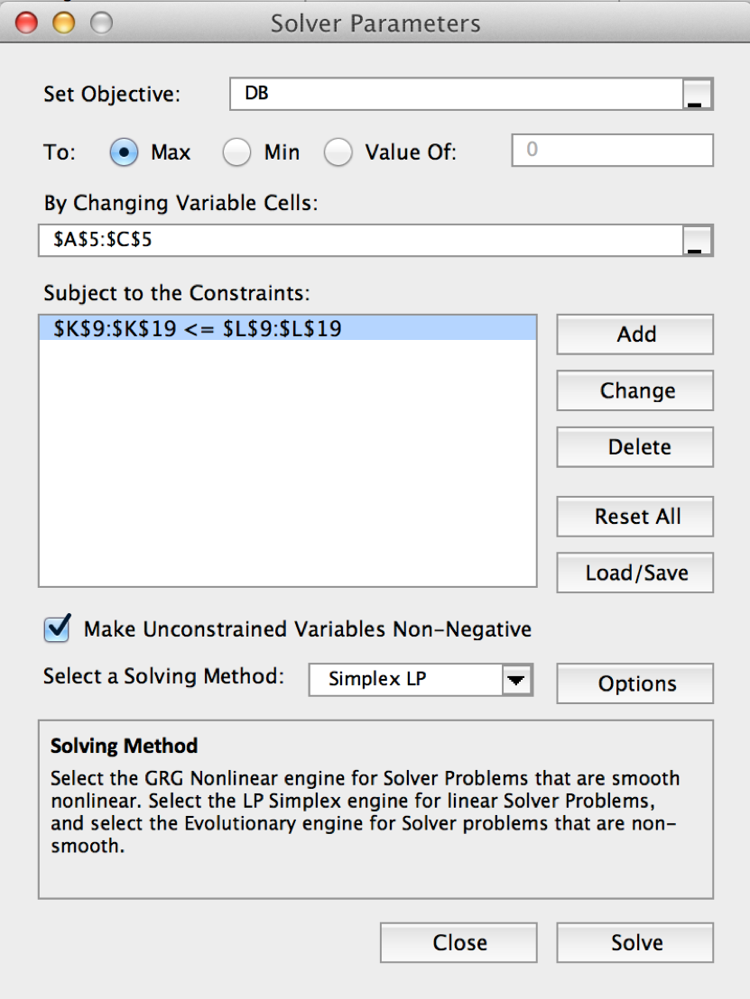{width="5.542051618547681in" height="7.389401793525809in"}

Nu kan man løse problemet ved at vælge værktøj/tools menuen i toppen → solver

Nu får man et pop-up billede med Solver Parameters som på billedet ovenfor. Her stiller man sig i solver feltet man ønsker at udfylde og klikker på den ønskede celle i regnearket. Man skal sørge for at der er flueben i make unconstrained variables non-negative, hvis man som i vort eksempel ikke kan have negative variabelværdier. Man skal også sørge for at dropdown boxen står på Simplex LP (det gør den default). Når bibetingelser skal ændres/oprettes, vælger man hhv. change/add (dansk ret/tilføj). Man kan får så højre og vensteside solver felter op som skal udfyldes, i vores eksempel som på billedet nedenfor (husk at vende ulighedstegnene rigtigt). I vores eksempel er alle bibetingelserne af formen $VS \leq HS$, har man forskellige typer kan man blot tilføje disse ved at vælge add igen i Solver Parameter hovedvinduet. Hvis man f.eks. havde et minimeringsproblem ville vi klikke Min i stedet for Max.

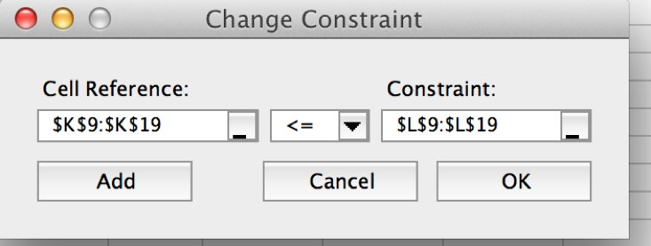{width="4.889227909011374in" height="1.8473501749781278in"}

Når man til slut klikker solve beregner excel den optimale løsning, hvis man får en melding om at der ikke findes optimal løsning da mulighedsområdet er ubegrænset, har man muligvis lavet en fejl undervejs.

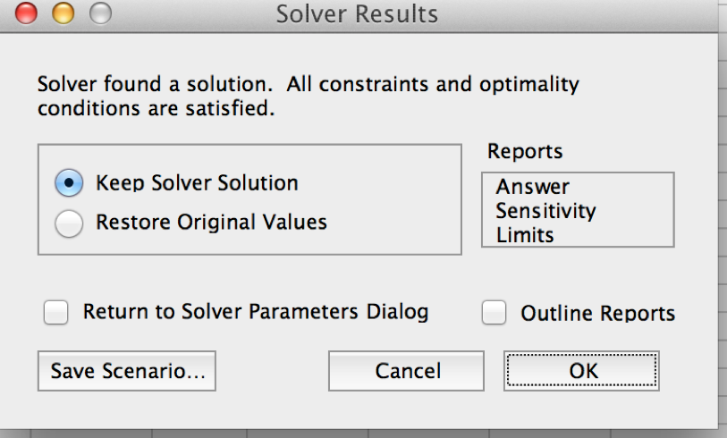{width="5.4170428696412944in" height="3.2641152668416447in"}

Her kan man vælge at bestille yderligere informationer, i form at følsomhedsanalyse og skyggepriser ved at klikke Sensitivity.

Følsomhedsnanalyse giver os oplysninger om, hvor meget DB altså objektfunktions-koefficienterne for de enkelte variable kan ændre sig uden at påvirke den optimale løsning. Hvis f.eks. DB for tv apparater stiger vil det muligvis betyde man i den optimale løsning skal producere flere tv-apparater, følsomhedsanalysen fortæller os præcis hvor meget hvert produkts DB kan ændres uden at ændre den optimale produktsammensætning. Nedenfor kan vi se at x1 altså tv-apparaters DB på 75, kan falde med 5 og vokse med 25. Dvs. DB skal ligge mellem 70 og 100. Bemærk at celle C10 i den optimale løsning viser at man slet ikke skal producere højttalere, derfor kan man nedenfor se at der ikke er nogen nedre grænse for DB på højttalere, det betyder altså at eftersom de slet ikke skal indeholdes i det optimale produktmix, er det ligegyldigt at de får et stort negativt dækningsbidrag. Der er i følsomhedsanalysen en del variable vi ikke har benyttet nemlig $x_{4} - x_{10}$ de er naturligvis ligegyldige når vi kun har 3 produkter i dette eksempel.

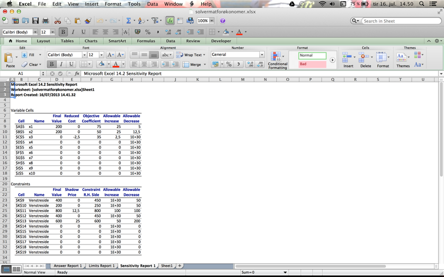{width="6.0in" height="3.75in"}

Skyggeprisen er det, vi maximalt vil give for en enhed af de knappe faktorer (her kabinetter, billedrør, højttalere, strømforsyning og elektronikdele), en af højreside begrænsningerne øges med en enhed. Skyggepriser, angiver det den ændring, der vil blive i det samlede dækningsbidrag, eller de samlede omkostninger, hvis en af de højreside begrænsningerne øges med yderligere en enhed.

Skyggeprisen beregnes hvis man som i dette eksempel maksimerer dækningsbidraget DB. Læg en enhed til en kapacitetsbegrænsning
 og beregn det nye DB ved den optimale produktsammensætning. $Skyggepris = \ DB_{\text{nu}}\ -\ DB_{for}$. Gennemfør samme beregning for de øvrige kapacitetsbegrænsninger for at finde de 5 skyggepriser.

Vi kan i anden tabel constraints se hvilke delkomponenter i produktionen der er tilbage. Vi kan i første linje f.eks. se at der er brugt 400 kabinetter ud af 450 på lager. Shadowprice/skyggeprisen angiver hvad man maksimalt vil betale for en enhed mere af den pågældende delkomponent. Det er klart at vi ikke vil betale noget for kabinetter, når vi har ubrugte liggende på lageret, derfor er skyggeprisen 0. Vi kan derfor kun bruge

I modsætning hertil vil vi gerne betale 12,5 mere for hver enhed højttalerenhed, det vil vi gøre i intervallet fra 700 til 800 enheder, det er derfor 100 er allowable decrease og increase.

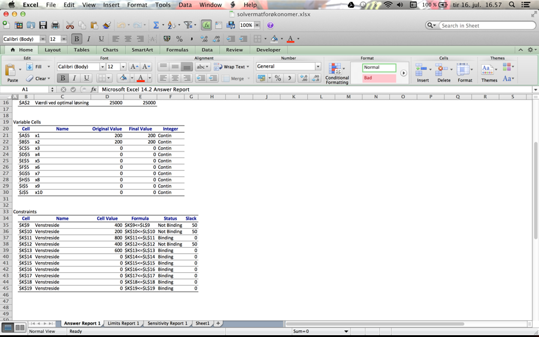{width="6.0in" height="3.75in"}

Ovenfor ses svarrapporten, bibetingelserne for højtalerenheder og elektronikdele er bindende og derfor har en slack værdi (overskydende) på 0. Alt hvad der er til rådighed af disse to delprodukter anvendes, hvorimod der ikke er varer på lager for de andre delprodukter.

Man kan give de forskellige celler navne i navnefeltet, f.eks. kan man kalde A2 for DB osv. På den måde bliver rapporterne mere overskuelige.

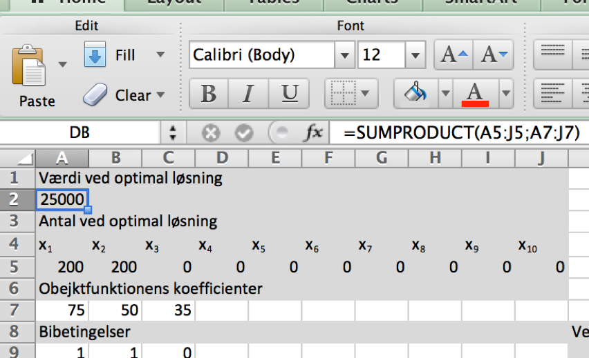{width="5.680950349956255in" height="3.4585728346456692in"}

Excel Lineær regression 
========================

### Video excel lineær regression 

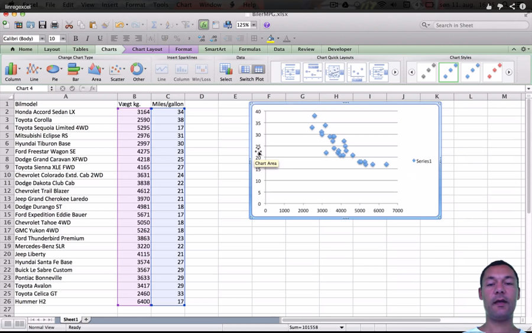{width="6.0in" height="3.75in"}

Hvis man har et observationssæt med observerede x og y værdier, kunne man have en formodning om at der er en lineær sammenhæng mellem variablene. I nedenstående eksempel[^5] har man indsamlet data om forskellige bilers vægt og benzinøkonomi. En mile er 1,6 kilometer, en gallon er 3,8 liter, dvs en Hyundai kører

$$\frac{1,6 \cdot 30}{3,78} \approx 12,7\ km/l\ $$

  Bilmodel                           Vægt kg.   Miles/gallon
  ---------------------------------- ---------- --------------
  Honda Accord Sedan LX              3164       34
  Toyota Corolla                     2590       38
  Toyota Sequoia Limited 4WD         5295       17
  Mitsubishi Eclipse RS              2976       31
  Hyundai Tiburon Base               2997       30
  Ford Freestar Wagon SE             4275       23
  Dodge Grand Caravan XFWD           4218       25
  Toyota Sienna XLE FWD              4165       27
  Chevrolet Colorado Extd. Cab 2WD   3631       24
  Dodge Dakota Club Cab              3838       22
  Chevrolet Trail Blazer             4612       21
  Jeep Grand Cherokee Laredo         3970       21
  Dodge Durango ST                   4981       18
  Ford Expedition Eddie Bauer        5671       17
  Chevrolet Tahoe 4WD                5050       18
  GMC Yukon 4WD                      5262       18
  Ford Thunderbird Premium           3863       23
  Mercedes-Benz SLR                  3220       22
  Jeep Liberty                       4115       21
  Hyundai Santa Fe Base              3574       27
  Buick Le Sabre Custom              3567       29
  Pontiac Bonneville                 3633       29
  Toyota Avalon                      3417       29
  Toyota Celica GT                   2460       33
  Hummer H2                          6400       17

Man kunne have en formodning om at jo tungere en bil var, desto færre miles kører den på en gallon. Det virker naturligt at påstå at benzinøkonomi i en eller anden grad afhænger af vægt. Derfor vil vi antage at x-værdierne skal være vægt, og at benzinøkonomien y'erne, er en funktion af vægten. Man kan klikke på billedet nedenfor og hente filen fra google docs.

Er der en lineær sammenhæng og hvor udtalt er denne?

Man sætter data ind i excel → lyser hhv. x-værdi og y-værdi søjlerne op. Husk x-værdien skal stå først. → vælger fanen Charts → vælger Scatter → nu har man et plot af punkterne → Vælg Chart Quick Layouts → Vælg Layout 9 (se billede nedenfor eller screencast )

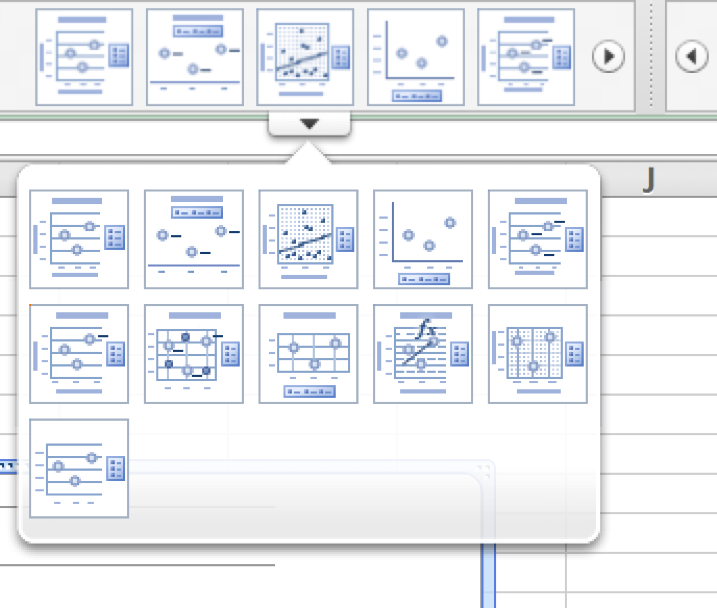{width="4.777777777777778in" height="4.055555555555555in"}

Nu skulle man gerne have en plot som nedenfor:

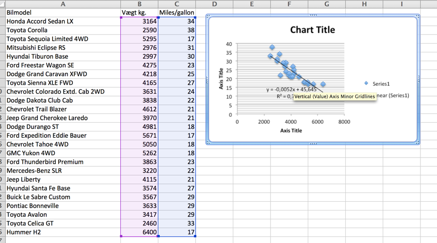{width="6.0in" height="3.3368055555555554in"}  

{width="50%" height="50%"}
Hvis man skal ændre f.eks. x-akse skalaen stiller man sig på et x-akse tal i Excel plottet → højreklikker → Format Axis → Vælg Scale → ret f.eks. minimum til 2000 → Ok

Man kan direkte copy paste plottet ind i et worddokument som nedenfor. Linjen i plottet kaldes regressionslinjen. Den viser at der er en negativ sammenhæng mellem vægt og benzinøkonomi da hældningen -0.0052 er negativ. Det fortæller os at ifølge modellen (Det kalder vi regressionslinjen), vil en forøgelse af vægten på 1 kilo betyde at man kører 0,0052 miles kortere på en gallon. Det er måske mere meningsfuldt, at gange begge størrelser med 1000, så kan man sige at for hvert ton bilvægten forøges kører bilen 5,2 miles kortere på en gallon. Interceptet hvilket betyder skæringen med y-aksen 45,645 har ikke betydning. Vi kan kun udtale os om biler indenfor det vægtspænd, vi har observeret, vi kan ikke sige noget om biler der vejer 0 kilo.

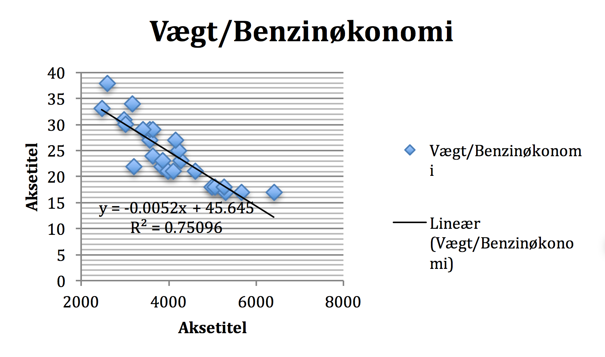

Hvordan er linjen beregnet ? Regressionslinjen er dannet på baggrund af mindste kvadraters metode, det betyder denne linje minimerer den lodrette afstand mellem punkterne og linjen ( i vil høre meget mere om dette i statistik ). Hvor godt beskriver bilvægten benzinøkonomien. Målet for dette er $R^{2} = 0,75$, det betyder at 75% af variationen i benzinøkonomien forklares ud fra bilernes vægt. Jo bedre modellen forklarer variationen i benzinøkonomien jo tættere på 1 dvs. 100% vil $R^{2}$ komme. Hvis der ingen sammenhæng mellem vægt og benzinøkonomi var, ville man bedst kunne beskrive benzinøkonomien for bilerne ved gennemsnittet af deres forbrug. Man ville altså have en regressionslinje der lå vandret.

$\text{SS}_{\text{res}}$ sums og squares residual angiver summen de lodrette kvadrerede afstande til regressionslinjen.

$\text{SS}_{\text{tot}}$ sums og squares total angiver summen de lodrette kvadrerede afstande til denne vandrette gennemsnitslinje.

I tegningen nedenfor er en regressionslinje (den røde linje), modelleret på baggrund af kun 3 observationer. For observationen (2,1) er dens bidrag til sums og squares residual arealet af den gule firkant, det er den lodrette afstand til den røde regressionslinje i anden. For observationen (2,1) er dens bidrag til sums og squares total arealet af den grønne firkant, det er den lodrette afstand til den blå y gennemsnitslinje i anden. Den blå linje ville være bedst til at beskrive y-værdierne hvis der ikke er nogen lineær sammenhæng. I denne simple tegning ville $\text{SS}_{\text{res}}$ altså være summen af 3 gule arealer, de 3 punkter vil danne. $\text{SS}_{\text{tot}}$ vil være summen af de 3 grønne arealer.

$$R^{2} = 1 - \frac{\text{SS}_{\text{res}}}{\text{SS}_{\text{tot}}} = 1 - \frac{\text{Gul\ sum}}{Gron\ sum}$$

Når $\text{SS}_{\text{res}}$ gul sum er lille i forhold $\text{SS}_{\text{tot}}$ grøn sum er $R^{2}$ tæt på 1, bemærk $\text{SS}_{\text{res}}$ kan ikke blive større end $\text{SS}_{\text{tot}},\ $dvs. $R^{2}$ kan ikke blive mindre end nul.

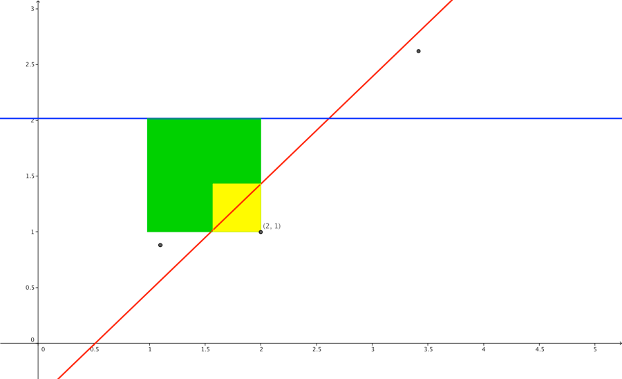{width="6.0in" height="3.6523173665791777in"}

Man kan i excel prøve at rette i observationerne, og se hvordan $R^{2}$ ændrer sig.

[[\[CHART\]]{.chart}](https://docs.google.com/file/d/0B1E7VnhxsDMlOFJnQU9PQ2JWams/edit?usp=sharing)

### Video JMP regressionseksempel

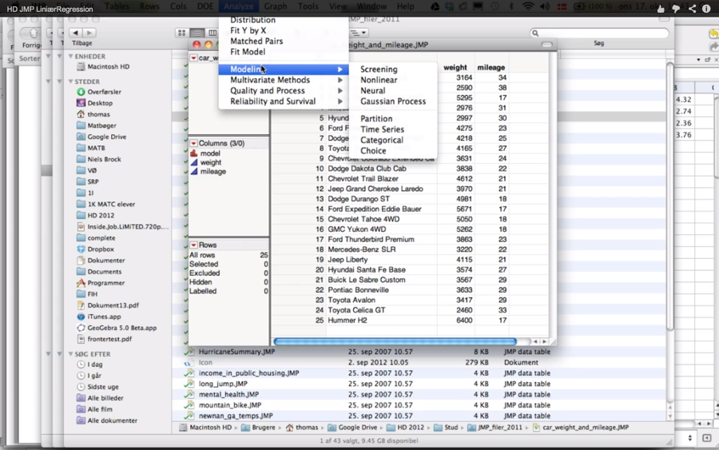{width="6.0in" height="3.75in"}

Løsning af ligningssystemer med excel
=====================================

Hvis vi f.eks. har 3 ligninger med 3 ubekendte.

$${y = x + 2 - z}{y = - 2x + 8 + 5z}$$

$$y = + 0.5z - 4$$

Kan vi omskrive problemet til :

$${- x + y + z = 2}{y + 2x - 5z = 8}$$

$$y - 0.5z = - 4$$

$$$$

Kan vi opskrive problemet på matrixform:

$$\begin{bmatrix}
 - 1 & 1 & 1 \\
1 & 2 & - 5 \\
1 & 0 & - 0.5 \\
\end{bmatrix} \cdot \begin{bmatrix}
x \\
y \\
z \\
\end{bmatrix} = \begin{bmatrix}
2 \\
8 \\
 - 4 \\
\end{bmatrix}$$

Hvilket vi kan løse i excel med MINVERSE og MMULT:

Først finder man den inverse matrix ved at invertere den oprindelige 3× 3 matrix med MINVERSE kommandoen:

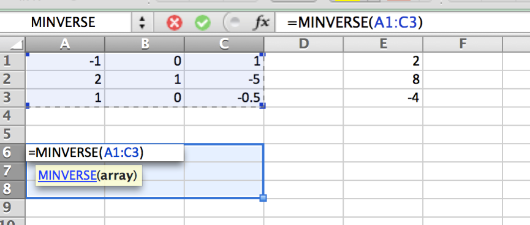{width="5.763888888888889in" height="2.4493055555555556in"}

Nu taster man (MAC: CMD ENTER) eller (Windows: CTRL SHIFT ENTER), man får så den inverse 3× 3 matrix.

Nu finder man løsningen, ved at foretage en matrix multiplikation på den nye inverse matrix med MMULT kommandoen, man lyser 3 celler op og taster =MMULT() argumenter i kommandoen er ny invers matrix og højresiden i den oprindelige ligning.

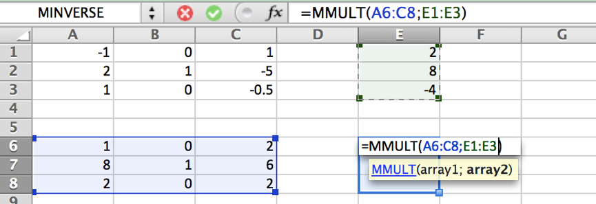{width="5.763888888888889in" height="1.9777777777777779in"}

Herefter taster man (MAC: CMD ENTER) eller (Windows: CTRL SHIFT ENTER), og får følgende løsning

$$\begin{bmatrix}
x \\
y \\
z \\
\end{bmatrix} = \begin{bmatrix}
 - 6 \\
0 \\
 - 4 \\
\end{bmatrix}$$

Man kan indse denne løsningen er korrekt, da denne løser det oprindelige ligningssystem.

Excel omkostnings-eksempel 
===========================

Her er et eksempel baseret på data leveret som punkter, dvs. ikke en funktion som i næste eksempel, man kan med fordel benytte excel som her.

Hvis en producent af karbon gedebukkestyr har leveret oplysninger om Q, FC, VC, kan man beregne de øvrige størrelser baseret på disse.

  Obs   Q/Mængde   FC/FO   VC/VO   TO      AFC/FE   AVC/VE   ATC/TE   MC/GROMK
  ----- ---------- ------- ------- ------- -------- -------- -------- ----------
  1     0          10000   0       10000                              
  2     100        10000   1000    11000   100,00   10,00    110,00   10,00
  3     200        10000   2300    12300   50,00    11,50    61,50    13,00
  4     300        10000   3000    13000   33,33    10,00    43,33    7,00
  5     400        10000   3700    13700   25,00    9,25     34,25    7,00
  6     500        10000   4633    14633   20,00    9,27     29,27    9,33
  7     600        10000   5100    15100   16,67    8,50     25,17    4,67
  8     700        10000   5600    15600   14,29    8,00     22,29    5,00
  9     800        10000   5700    15700   12,50    7,13     19,63    1,00
  10    900        10000   5900    15900   11,11    6,56     17,67    2,00
  11    1000       10000   6100    16100   10,00    6,10     16,10    2,00
  12    1100       10000   6800    16800   9,09     6,18     15,27    7,00
  13    1200       10000   7600    17600   8,33     6,33     14,67    8,00
  14    1300       10000   8500    18500   7,69     6,54     14,23    9,00
  15    1400       10000   9000    19000   7,14     6,43     13,57    5,00
  16    1500       10000   10000   20000   6,67     6,67     13,33    10,00
  17    1600       10000   11000   21000   6,25     6,88     13,13    10,00
  18    1700       10000   12000   22000   5,88     7,06     12,94    10,00
  19    1800       10000   14000   24000   5,56     7,78     13,33    20,00
  20    1900       10000   16000   26000   5,26     8,42     13,68    20,00

Når man skal tegne i excel, lyser man søjlen med x-værdier og y-værdier op (Husk x-værdi søjlen skal stå først. Flere y-værdi søjler giver flere grafer)

Charts fanen → scatterplot → Smooth Lined Scatter

Dette producerer nedenstående plots

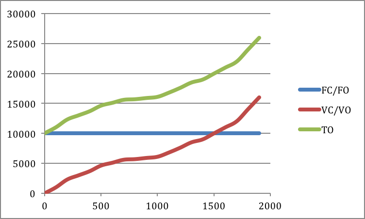{width="50%" height="50%"}

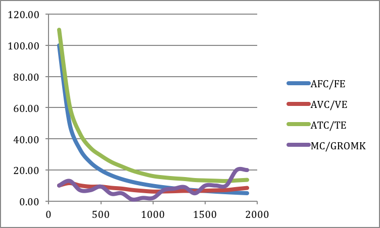{width="50%" height="50%"}

Addition af lineære funktioner
------------------------------

### Vertikal addition af lineære funktioner

Ofte vil man indenfor økonomi have behov for at addere/summere funktioner. Skal man foretage en lodret/vertikal addition af funktioner kan man blot lægge forskrifterne sammen. Hvis vi har 2 funktioner med samme definitionsmængde.

$$f\left( x \right) = - 2x + 5$$

$$g\left( x \right) = - x + 2$$

og vi ønsker at addere disse vertikalt, kan dette gøres direkte

$$h\left( x \right) = f\left( x \right) + g\left( x \right) = - 2x + 5 - x + 2 = - 3x + 7$$

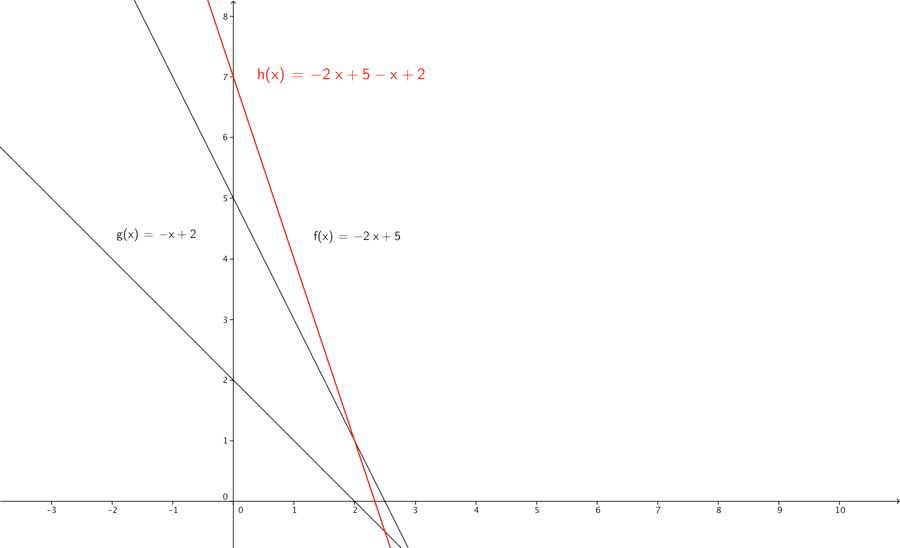{width="6.0in" height="3.651324365704287in"}

Hvis funktionerne ikke har samme definitionsmængde vil summen af disse blive en stykvis lineær funktion. Man vil da kunne opskrive funktionen som en gaffelforskrift. Hvis vi har de lineære funktioner.

$$f\left( x \right) = - x + 2,\ x \in \left\lbrack 0;2 \right\rbrack$$

$$g\left( x \right) = - 0.5x + 1,\ x \in \left\lbrack 1;4 \right\rbrack$$

Første tegning nedenfor er f(x) og g(x)

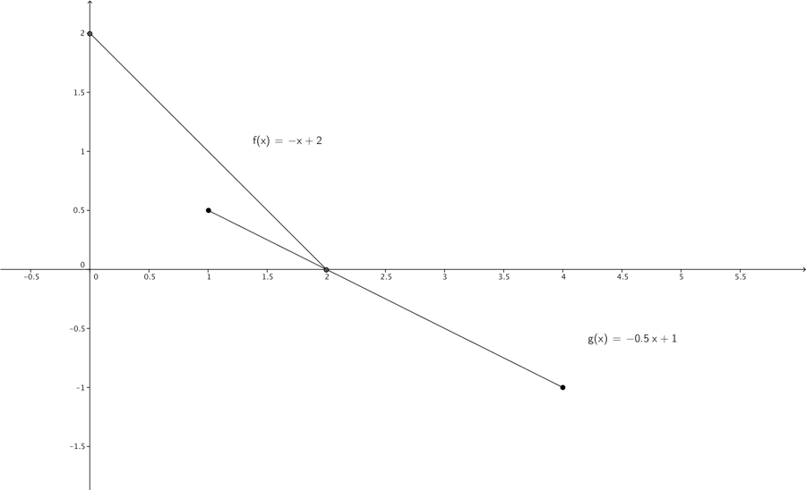{width="6.0in" height="3.651324365704287in"}

Nu bliver den vertikalt adderede funktion:

$$h\left( x \right) = \left\{ \begin{matrix}
 - x + 2,\ x \in \lbrack 0;1\lbrack \\
 - 1.5x + 3\ x \in \left\lbrack 1;2 \right\rbrack \\
 - 0.5x + 1,\ x \in \rbrack 2;4\rbrack \\
\end{matrix} \right.\ $$

Den er tegnet ind nedenfor, prikken uden fyld i punktet (1,1) indikerer at vi i dette punkt ikke ligger på funktionens graf.

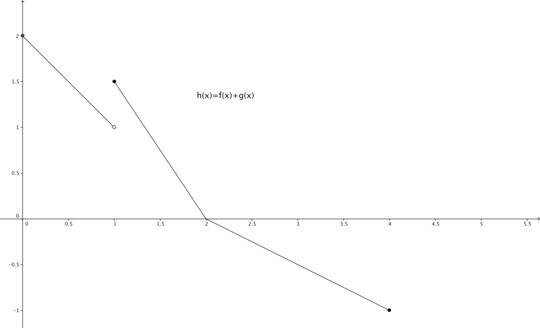{width="6.0in" height="3.651324365704287in"}

### Horisontal addition af lineære funktioner

En virksomhed kan afsætte sine varer på to markeder. På marked 1 kan man afsætte varerne allerede ved en pris på 2 pris afsætningsfunktionen er $f\left( x \right) = - 0,5x + 2$. På marked 2 kan man først afsætte varerne når prisen er 1.

Hvis man forestiller sig at man pga. frygt for parallelimport, ikke kan differentiere priserne på de 2 markeder, kan man ved horisontal addition finde en fælles pris afsætningsfunktion.

Hvis vi indtegner pris afsætningskurver for 2 markeder i samme koordinatsystem, kan man grafisk finde hvad forskriften for den vandret adderede funktion vil være. Når prisen er mellem \[1;2\], vil sumfunktionen have samme forskrift som g(x), til denne pris vil man jo kun kunne afsætte på marked 1. Når prisen er mellem 1 og 0 er det nemmest blot at bestemme 2 afsætninger i dette interval. Når man har bestemt disse kan man jo bestemme forskriften for den lineære funktion, ved at addere de 2 funktioner.

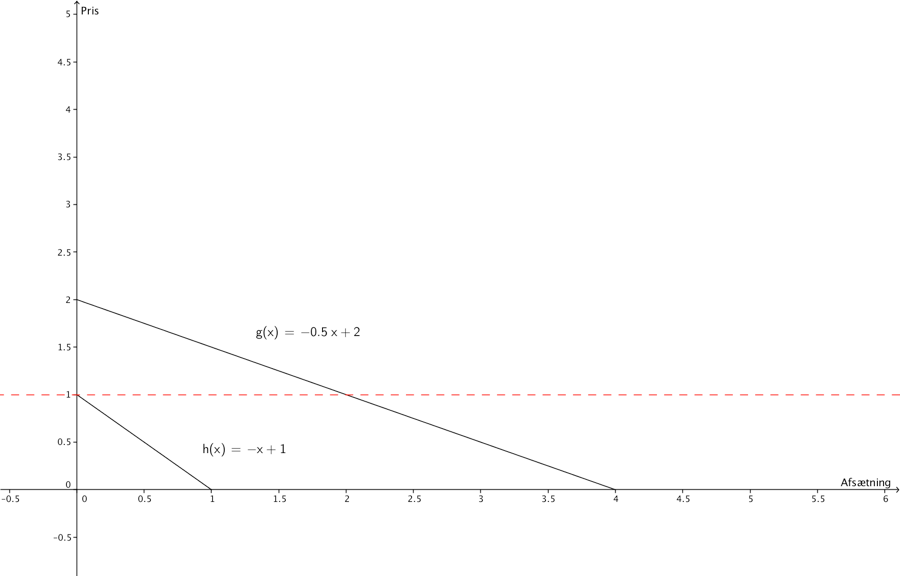{width="6.0in" height="3.8400404636920387in"}

På næste tegning ses den første del af sumfunktionen, samt 2 punkter (2,1) og (5,0) på den øvrige del af sumkurven.

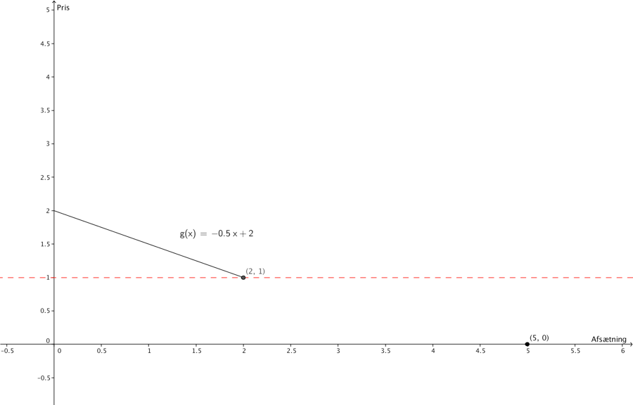{width="6.0in" height="3.8400404636920387in"}

Når vi har 2 punkter kan vi bestemme forskriften har vi set set tidligere.

$$a = \frac{y_{2} - y_{1}}{x_{2} - x_{1}} = \frac{0 - 1}{5 - 2} = - \frac{1}{3}$$

b bestemmes som den ukendte i en 2 ligning, med punktet (5,0) og a som vi fandt ovenfor:

$${y = ax + b}\Leftrightarrow {0 = - \frac{1}{3} \cdot 5 + b}\Leftrightarrow{b = \frac{5}{3} = 1\frac{2}{3}}$$

Forskriften og sumfunktionen er tegnet ind nedenfor.

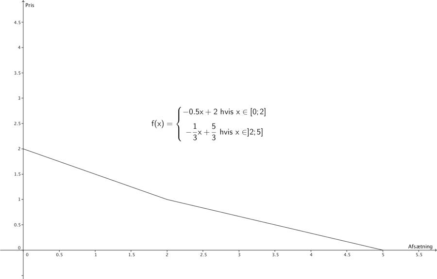{width="6.0in" height="3.8400404636920387in"}

Man kunne også løse horisontal addition af funktioner, algebraisk ved i den del af prisspændet, hvor begge markeder har positiv afsætning, at isolere x'erne og addere funktionerne. Bemærk vi skal isolere x'erne fordi vi ønsker at addere vandret, i modsætning til forrige kapitel, hvor vi gerne ville addere lodret.

$${h\left( x \right) = - x + 1 \Leftrightarrow }{y = - x + 1 \Leftrightarrow }{x = - y + 1}$$

$${g\left( x \right) = - 0,5x + 2 \Leftrightarrow }{y = - 0,5x + 2 \Leftrightarrow }{x = - 2y + 4}$$

Vi lægger nu forskrifterne sammen $- y + 1 - 2y + 4 = - 3y + 5$, og isolerer igen y i den ny forskrift.

$$x = - 3y + 5 \Leftrightarrow$$

$$y = - \frac{1}{3}\ x + \frac{5}{3} \Leftrightarrow$$

Dette er jo kun forskriften i den del af prisintervallet, hvor der på begge markeder er positiv afsætning, den samlede summerede funktion er som vi på tegningerne tidligere.

$$f\left( x \right) = \left\{ \begin{matrix}
 - \frac{1}{2}x + 2,\ x \in \lbrack 0;2\rbrack \\
 - \frac{1}{3}\ x + \frac{5}{3},x \in \lbrack 2;5\rbrack \\
\end{matrix} \right.\ $$

Priselasticitet
---------------

### Video om priselasticitet

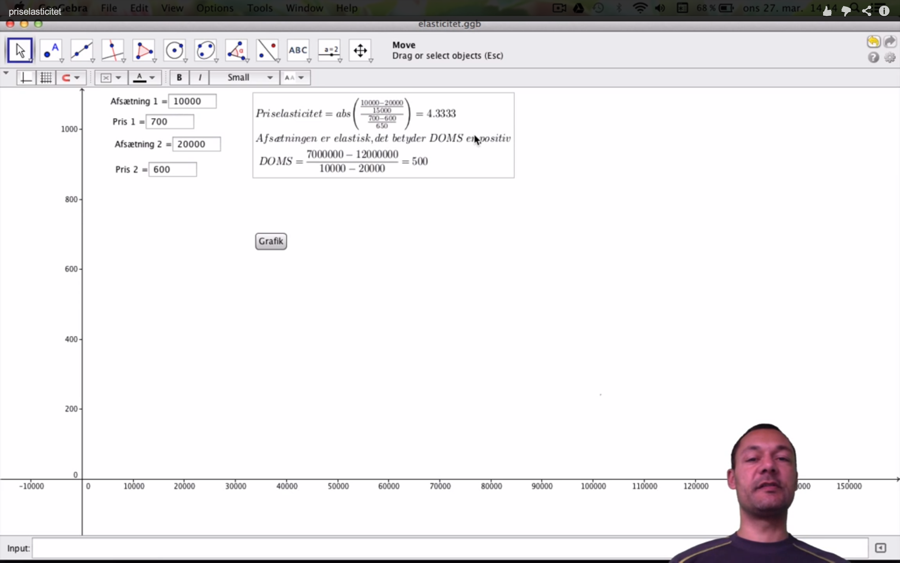{width="6.0in" height="3.75in"}

Priselasticiteten fortæller hvor mange procent afsætningen ændres, når prisen ændres med 1%. Hvis man. har en priselasticitet på 2 betyder det at afsætningen stiger/falder med 2% når prisen sænkes/hæves med 1%. Matematisk vil priselasticiteten altid være negativ, da vi jo har et modsat forhold mellem pris og afsætning, derfor angiver man ofte kun de numeriske værdier. Når man har en elasticitet mellem 0 og 1, siger vi at en vare er uelastisk. F.eks betyder en elasticitet 0,8 at en prisændring på 1% medfører en afsætningsændring på 0,8%.

Formlen er :

$$e = \frac{\frac{Q_{2} - Q_{1}}{\frac{Q_{2} + Q_{1}}{2}}}{\frac{\frac{P_{2} - P_{1}}{P_{2} + P_{1}}}{2}}$$

Hvis vi har 2 pris- afsætningspunkter f.eks. $\left( 10,\ 100 \right)\ og\ (8,\ 200)$, får vi

$$e = \frac{\frac{\frac{200 - 100}{150}}{8 - 10}}{9} = 3$$

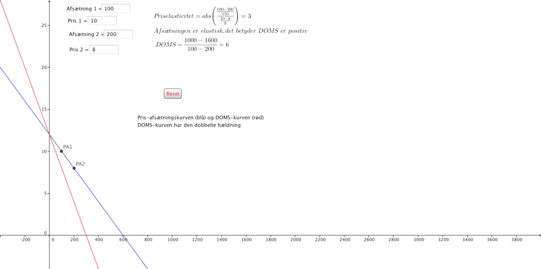{width="6.0in" height="2.9859284776902886in"}

En vare siges at være neutralelastisk hvis elasticiteten er netop en. Hvis vi har en pris/afsætnings funktion, kan vi beregne omsætningsfunktionen ved at gange med x. Vi kan herefter beregne DOMS differensomsætningsfunktionen, ved at differentiere omsætningsfunktion mht. x. Der gælder at pris- afsætnings par for afsætninger i intervallet med voksende omsætning og dermed positiv DOMS funktionsværdi har elastiske. Tilsvarende elasticiteten mindre end 1 når pris- afsætnings parrene er i intervallet med aftagende omsætning/negativ DOMS værdi.

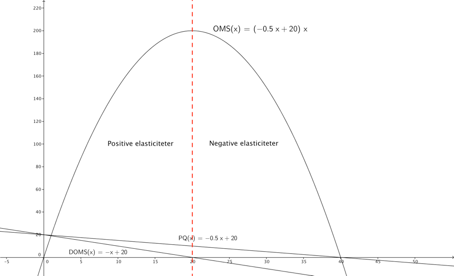{width="6.0in" height="3.651324365704287in"}

Inverse funktioner
==================

En funktion kaldes en-entydig eller injektiv hvis der for vilkårlige forskellige $x_{1}\text{og\ }x_{2} \in \text{Dm}\left( f \right)$ gælder at $f\left( x_{1} \right) \neq f(x_{2})$. Det betyder altså, at for alle forskellige par af x'er skal funktionsværdierne være forskellige. Nedenfor er et eksempel på en funktion der ikke er injektiv. Bemærk $x_{1} = - 2\ og\ x_{2} = 2\ $har samme funktionsværdi.

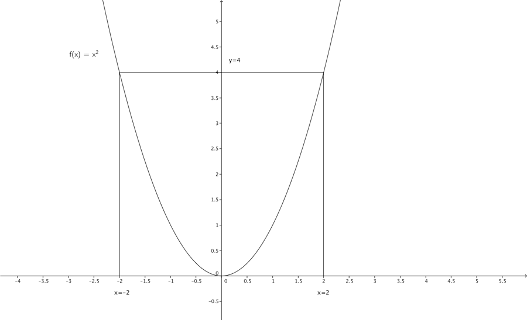{width="6.0in" height="3.651324365704287in"}

Nedenfor er et eksempel på 2 funktioner der er injektive, man kan altså ikke vælge noget par af forskellige x'er uden at de har forskellige funktionsværdier:

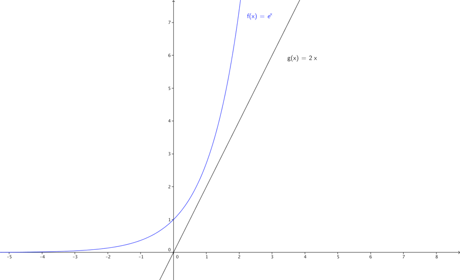{width="6.0in" height="3.651324365704287in"}

Der gælder at alle monotone funktioner[^3] er injektive. Derfor er alle eksponentielle og lineære funktioner injektive, mens f.eks funktioner der danner parabler som 2. grads polynomier ikke er injektive. Klassen af funktioner med lodret symmetriakse er f.eks. ikke-injektive.

Hvis en funktion $f\left( x \right)$ er injektiv, har den en invers/omvendt funktion $f^{- 1}(x)$, der gør det modsatte af f(x). Det betyder at $f^{- 1}\left( f\left( x \right) \right) = x$. Man kan for en lineær funktion f(x), hurtigt tegne den inverse funktion. Hvis man har 2 punkter $\left( x_{1},y_{1} \right)\text{\ og\ }\left( x_{2},y_{2} \right)$, kan man finde de 2 tilsvarende punkter på $f^{1}\left( x \right)$ , som $\left( y_{1},x_{1} \right)\text{\ og\ }\left( y_{2},x_{2} \right)$.

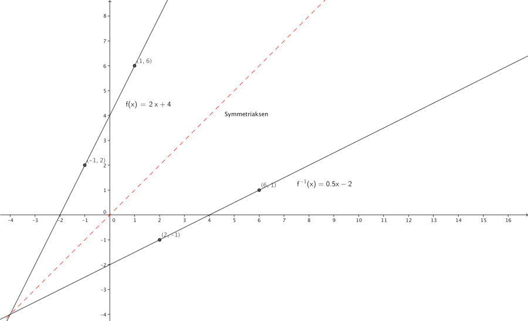{width="6.0in" height="3.651324365704287in"}

På tegningen ovenfor ses funktionen f(x) og dens inverse. Der er afsat punkter

På $f\left( x \right)\text{\ er\ afsat\ }\left( x_{1},y_{1} \right)\text{\ og\ }\left( x_{2},y_{2} \right) = \left( - 1,2 \right)\ og\ (1,6)$

På $f^{- 1}\left( x \right)\text{\ er\ afsat\ }\left( y_{1},x_{1} \right)\text{\ og\ }\left( y_{2},x_{2} \right) = \left( 2, - 1 \right)\ og\ (6,1)$

Skal man finde den inverse funktion til f(x), kan man isolere x i ligningen og derefter omdøbe x til y og y til x, i eksemplet ovenfor:

$${y = 2x + 4 \Leftrightarrow }{2x = y - 4 \Leftrightarrow \ }{x = \frac{1}{2}y - 2\ }$$

Hvilket vi omdøber:

$$y = \frac{1}{2}x - 2$$

$${f^{- 1}\left( x \right) = \frac{1}{2}x - 2}$$

Eksponentielle funktioner
=========================

Eksponentielle funktioner benyttes bl.a. i finansiel regning, som vi ser på i næste kapitel. Ved en eksponentiel funktion forstås en funktion med forskriften:

$$f\left( x \right) = b{\cdot a}^{x}\ hvor\ a>0,b \in \mathbb{R}\ $$

Tallet 𝑎 kaldes grundtallet, og tallet 𝑏 kaldes begyndelsesværdien, a er grundtallet eller væksttallet.r=a-1 er vækstraten.

$$\text{Dm}\left( f \right) = \mathbb{R}$$
$$VM(f)\in]0;\infty[$$

funktionen er monotont aftagende for 0<a<1  
funktionen er monotont voksende for a>1  
f(0)=b

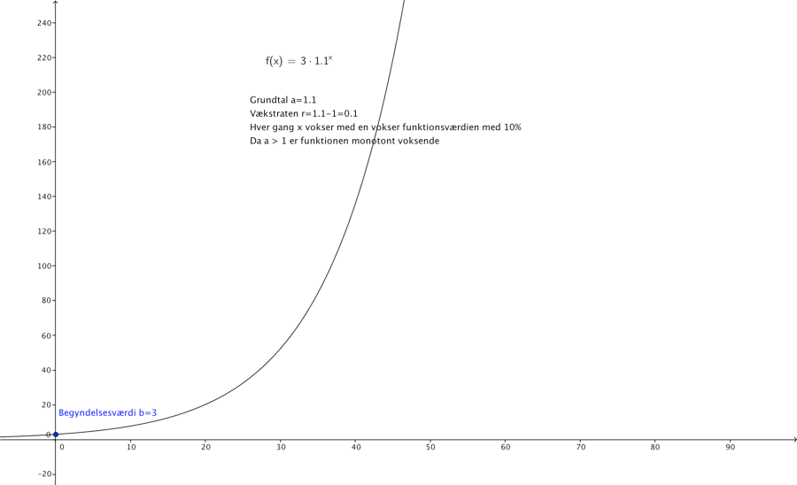{width="6.0in" height="3.6523173665791777in"}

Hvis begyndelsesværdien b er 1 dvs. $f\left( x \right) = a^{x}$, kaldes funktionen en eksponentialfunktion.

Sætning:

Hvis grafen for en eksponentiel funktion $\text{f}\left( x \right) = \ b \cdot a^{x}$ , går gennem de to forskel-

lige punkter $(x_{1}\ ,\ y_{2}\ )\ og\ (x_{2}\ \ ,\ y_{2}\ )$, kan konstanterne $a$ og $b$ bestemmes ved

$$a = \left( \frac{y_{2}}{y_{1}} \right)^{\frac{1}{x_{2} - x_{1}}},\ b = \frac{y_{1}}{a^{x_{1}}}$$

På tegningen nedenfor er afsat 2 punkter $\left( x_{1},y_{1} \right) = \left( 2,3 \right),\left( x_{2},y_{2} \right) = \left( 4,5 \right)$ , vha. denne sætning er forskriften for den eksponentielle funktion bestemt.

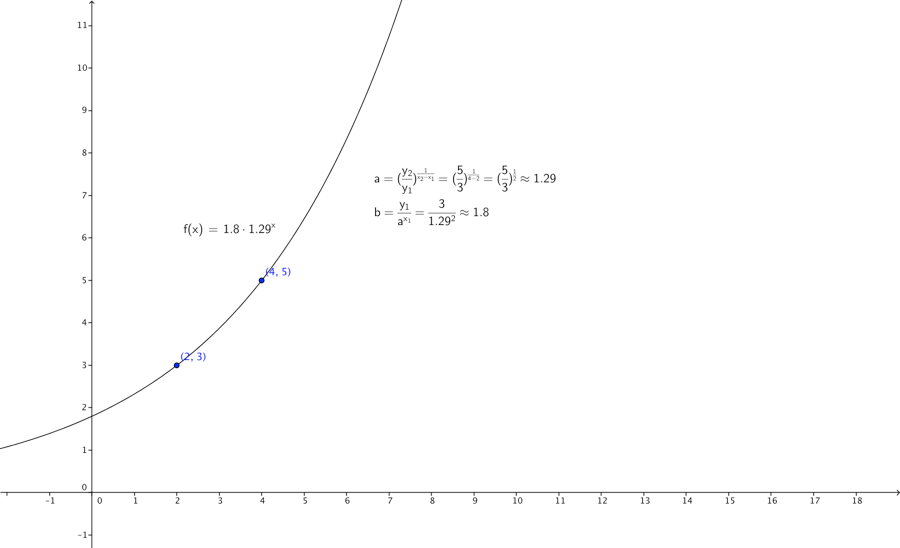{width="6.0in" height="3.6523173665791777in"}

### 

Fordoblings- og halveringskonstant.
-----------------------------------

Fordoblingskonstanten er den bestemte værdi, der hvis man tillægger værdien til et vilkårligt x, fordobler funktionsværdien. På tegningen nedenfor ses at funktionsværdien fordobles hver gang x vokser med 3.8.

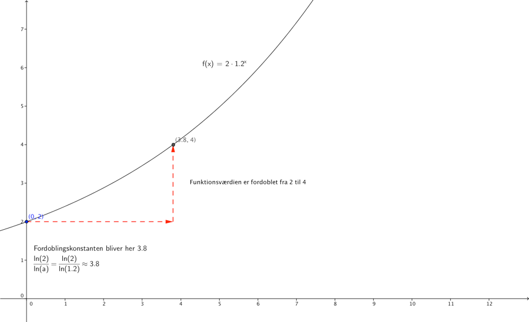{width="6.0in" height="3.651324365704287in"}

For den monotont voksende eksponentielle funktion $f(x)\  = \ ba^{x}$, hvor a \> 1 , er fordoblingskonstanten $T_{2}$ givet ved:

$$T_{2}\  = \frac{\ln\left( 2 \right)}{\ln(a)}$$

Fordi:

$$f\left( x + T_{2} \right) = 2 \cdot f\left( x \right) \Leftrightarrow$$

$$\text{ba}^{\left( x + T_{2} \right)}\  = 2 \cdot f\left( x \right) \Leftrightarrow$$

$$\text{ba}^{x} \cdot a^{T_{2}}\  = 2 \cdot \text{ba}^{x} \Leftrightarrow$$

$$a^{T_{2}}\  = 2 \Leftrightarrow$$

$$\ln{(a}^{T_{2}})\  = ln(2) \Leftrightarrow$$

$$T_{2}\ln\left( a \right) = \ln\left( 2 \right) \Leftrightarrow$$

$$T_{2} = \frac{\ln\left( 2 \right)}{\ln\left( a \right)}$$

Halveringskonstanten

Halveringskonstanten er en bestemt værdi for en monotont aftagende eksponentielfunktion . Hver gang værdien lægges til x halveres funktionsværdien.

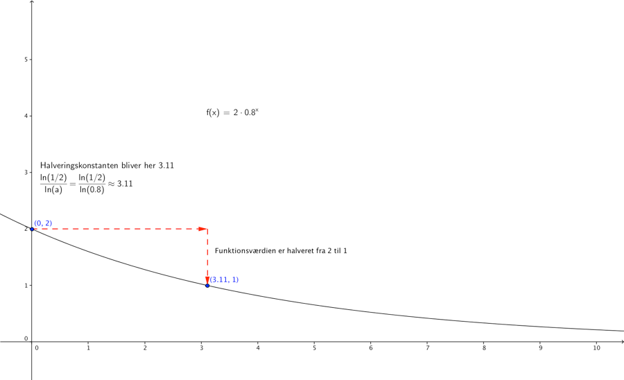{width="6.0in" height="3.6523173665791777in"}

For den monotont aftagende eksponentielle funktion $f(x)\  = \ ba^{x}$, hvor $0 < \ a\  < \ 1$ , er halveringskonstanten $T_{\frac{1}{2}}$ givet ved:

$$T_{\frac{1}{2}}\  = \frac{\ln\left( \frac{1}{2} \right)}{ln(a)}$$

Logaritmefunktioner
===================

Vi har valgt at kalde klassen af omvendte/inverse funktioner til eksponentielle funktioner for logaritmefunktioner. Det betyder at logaritme funktioner lever kun fordi vi har eksponentielle funktioner. Der gælder at $\text{Vm}\left( f \right) = \mathbb{R}_{+} = Dm(f^{- 1})$, det vil sige $\ln\left( x \right)$ er kun defineret for positive værdier. Da Den naturlige eksponential funktion $e^{x}$ har som invers funktion den naturlige logaritme funktion $ln(x)$.

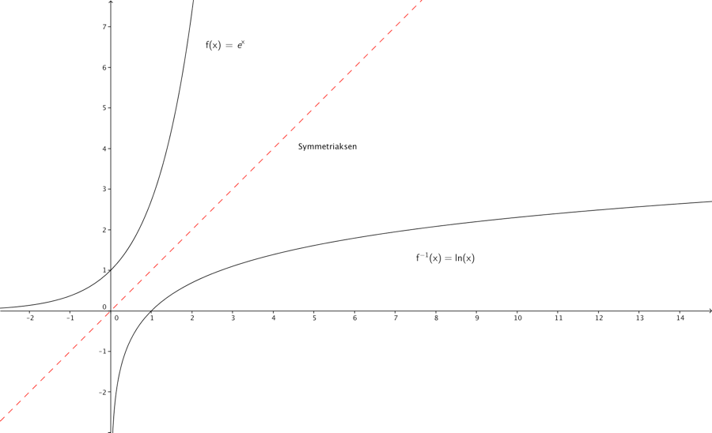{width="6.0in" height="3.651324365704287in"}

Eksponentialfunktionen med grundtal 5 $f\left( x \right) = 5^{x}$, har logaritmen med grundtal 5 $f^{- 1}\left( x \right) = \operatorname{}{(x)}$ som invers funktion.

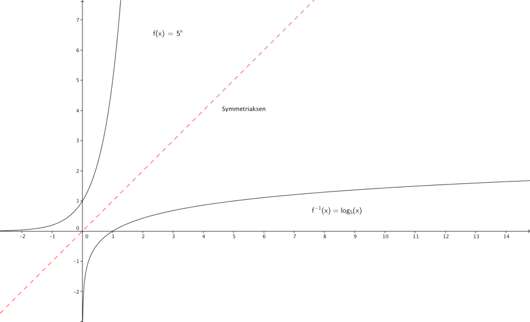{width="6.0in" height="3.651324365704287in"}

Eksponentialfunktionen med grundtal 10 $f\left( x \right) = 10^{x}$, har logaritmen med grundtal 10, som vi kalder titalslogaritmen som $f^{- 1}\left( x \right) = \log{(x)}$ som invers funktion. Pas på nogen softwarepakker kalder log(x) titalslogaritmen f.eks. texas og excel, mens andre R og Geogebra kalder log(x) for den naturlige logaritme mens log(10,x) er titalslogaritmen. Hvis du er i tvivl skal logaritmen af grundtallet altid blive 1. Det betyder excel har log(10)=1 mens R har log(10,10)=1.

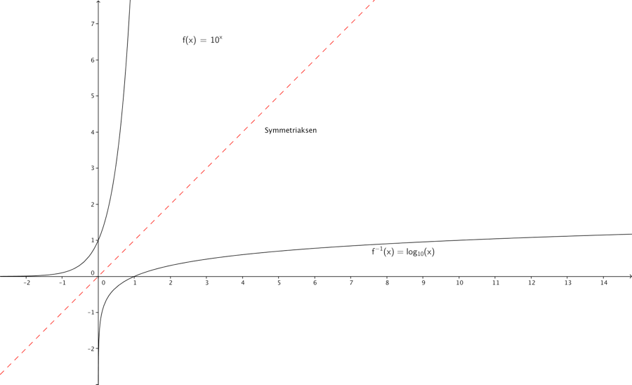{width="6.0in" height="3.651324365704287in"}

Der er nogle nyttige regneregler for logaritmer $a,b \in \mathbb{R}_{+}$

$$\ln\left( a \cdot b \right) = \ln\left( a \right) + \ln\left( b \right)$$

$$\ln\left( \frac{a}{b} \right) = \ln\left( a \right) - \ln\left( b \right)$$

$${\ln\left( a^{x} \right) = x \cdot ln(a)}$$

F.eks gælder:

$${\ln\left( 2*3 \right) \approx 1.791759}{\ln\left( 2 \right) + \ln\left( 3 \right) \approx 0.6931472 + 1.098612 \approx 1.791759}{\ln\left( 3^{2} \right) = 2 \cdot ln(3)}$$

Der gælder altid at en funktionsværdi for en eksponentiel funktion, bringes tilbage til x. hvis man tager logaritmen med samme grundtal som den eksponentielle funktion. F.eks. gælder

$$\operatorname{}{\left( 4^{x} \right) = x}$$

$$\operatorname{}{\left( 7^{x} \right) = x}$$

$$\ln\left( e^{x} \right) = x$$

Hvorfor ? fordi vi netop definerer logaritme funktionen med grundtallet k, som den inverse funktion til ${f\left( x \right) = k}^{x}$. Nedenfor er vist et eksempel, hvis man tager funktionsværdien af $f\left( g\left( 2 \right) \right) = 2$, dette gælder ligegyldigt hvilken x-værdi vi indsætter. Der gælder også $g\left( f\left( x \right) \right) = x$.

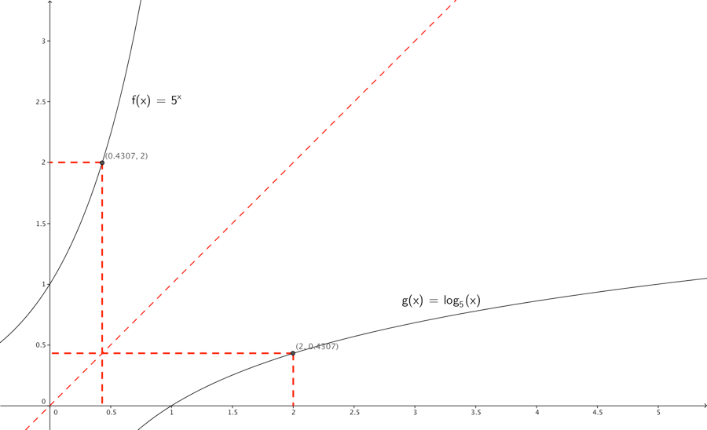{width="6.0in" height="3.651324365704287in"}
