Partielle afledede og gradienten
================================

### Video om partielle afledede og gradienten

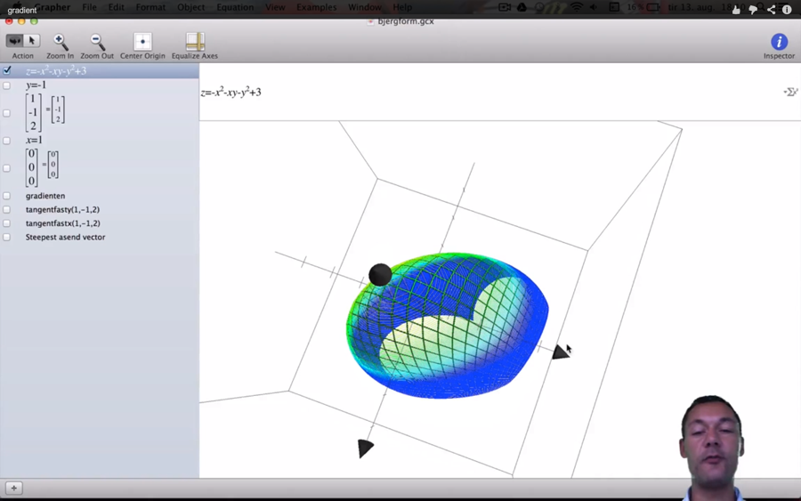{width="6.0in" height="3.75in"}

Hvis vi har en funktion af 2 variable $f\left( x,y \right) = - x^{2} - xy - y^{2} + 3$, har vi svært ved at tegne den i planen. Man kan skitsere grafen i rummet med 3d software, som f.eks. i billedet nedenfor. Normalt beskriver man funktionsværdien med z, i stedet for y som for funktioner af en variabel. På billedet vises x- og y-aksens retninger ved de 2 sorte pilespidser til hhv. venstre og mod læseren, mens pilen op viser z-aksens retning. Der er udover $f(x,y)$, altså den grønne bjergform, et snit i y-aksen med forskriften y=-1. Hvis man vælger et punkt på grafen (altså bjergformen), kan man godt indse at man ikke i dette punkt, kan bestemme en tangent. Det svarer til hvis tangenten var en tændstik, på f.eks. en bold, man kan i et punkt på bolden vende tændstikken i mange retninger, derfor kan man ikke bestemme en tangent. Hvis man derimod skærer en plade lodret ned igennem bjerget hvor y=-1, danner snittet en kurve (bjerget er hult). På alle punkter i snittet er $y = - 1$, vi vælger nu x=1. Da vi kender forskriften for $f\left( x,y \right)$, kan vi bestemme z som $f\left( 1, - 1 \right) = - 1^{2} - 1 \cdot - 1 - \left( - 1 \right)^{2} = 2$. Det blå punkt på tegningen nedenfor er netop $(1, - 1,2)$.

Man differentierer partielt mht. til f.eks. x og betragter y som en konstant, man skriver den partielle afledede mht. x som $f_{x}\left( x,y \right)$. Når vi differentierer funktionen af flere variable mht. til x betragter vi de øvrige variable som konstanter. Derfor bliver de partielle afledede.

$$f_{x}\left( x,y \right) = - 2x - y$$

Bemærk $-y^{2} + 3$ leddene forsvinder, de er jo konstanter.

Tilsvarende:

$$f_{y}\left( x,y \right) = - x - 2y$$

Vi finder nu hældningen for tangenten der ligger i planen $y = - 1$, der gennemskærer bjerget og har røringspunkt i (1,-1,2) det blå punkt som

$$f_{x}\left( 1, - 1 \right) = - 2 \cdot 1 - - 1 = - 1$$

Det betyder at når x vokser med 1 fra dette punkt aftager z-værdien (funktionsværdien) med 1, det lyder jo intuitivt fornuftigt eftersom bjerget har top $z = 3\ $ når $x = 0,\ y = 0$. Når x-koordinaten er 1 vil z-værdien aftage når x-værdien vokser.

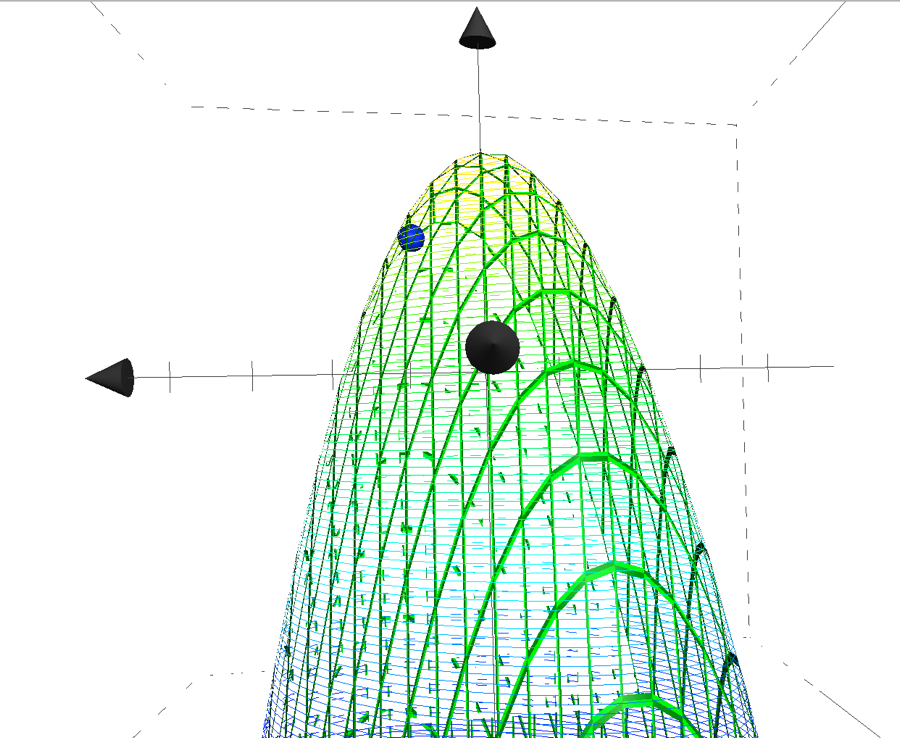{width="6.0in" height="4.918055555555555in"}

Man kunne lave en tilsvarende tegning hvor man satte en plan gennem $x = 1\ $dvs holdt x konstant og fandt den tilsvarende hældning for y i det blå punkt. Denne hældning kan vi udregne vha. den partielle afledede mht. y.

$$f_{y}\left( x,y \right) = - 1 - 2 \cdot - 1 = 1$$

Her har vi en positiv tangenthældning, det skyldes at y koordinaten i punktet er $- 1$, når y vokser fra dette punkt vil den nærme sig $\left( 0,0,0 \right)$ det eneste globale maksimum for kurven. På tegningen nedenfor er figuren drejet og tangenten for y fast lig -1 er tegnet ind det er den blå linie der ligger i den grå skæring $y = - 1$. Bemærk nu er det x-aksen der peger mod læseren, og y-aksen mod højre. Man kan godt fornemme at når vi lægger et snit i keglen, får vi en gammeldags 2-dimensional parabel vi så finder tangent for i punktet $(1, - 1,2)$.

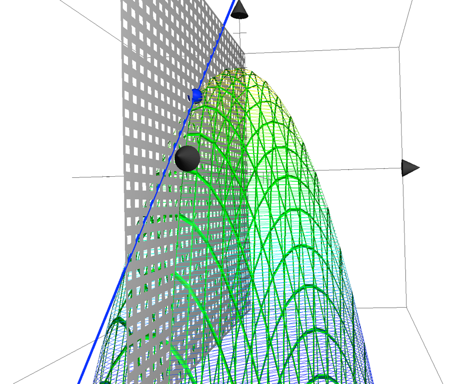{width="6.0in" height="5.128472222222222in"}

På den næste tegning er tangenten for x fast lig 1 i punktet $\left( 1, - 1,2 \right)$ den røde linje lagt ind i den orange-røde skæring er lagt hvor x er lig med 1. Bemærk den blå tangent har negativ hældning -1 når x vokser og den røde tangent har hældning 1 når y vokser. Bemærk nu peger x-aksen mest mod læseren.

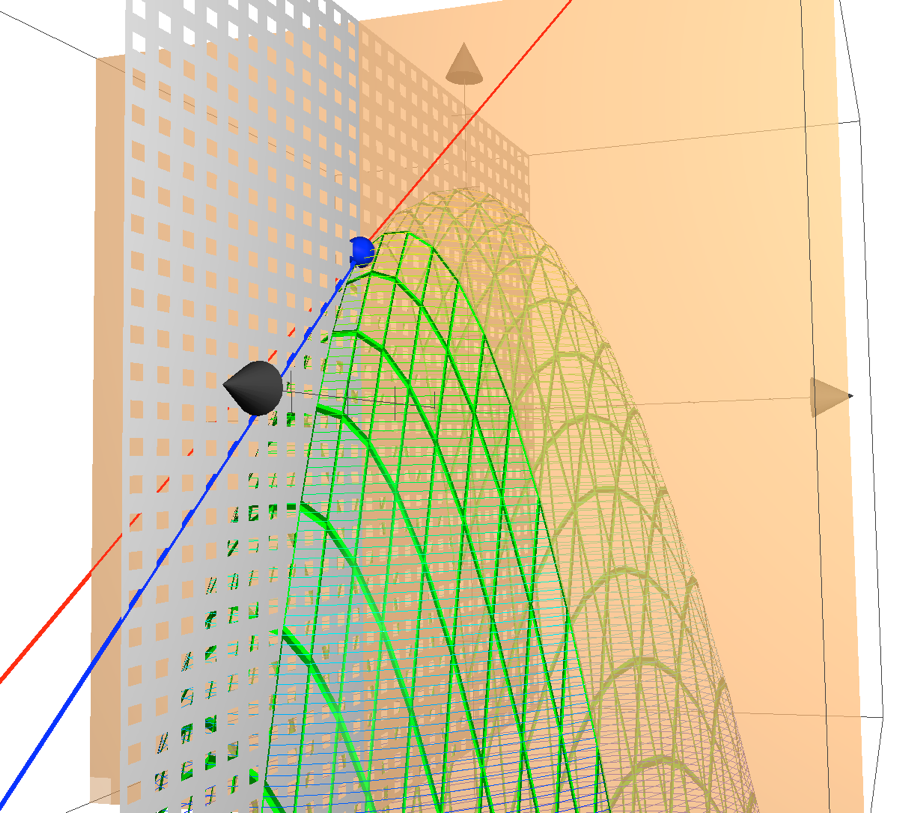{width="6.0in" height="5.420833333333333in"}

Vi definerer nu gradienten

$$\nabla f(x,y) = \left\langle - 2x - y, - x - 2y \right\rangle$$

Denne består altså af de partielle aflede mht. x og y. Gradienten for et punkt angiver i hvilken retning den største tilvækst er. For vort blå punkt får man altså ved indsættelse.

$$\nabla f(1, - 1) = \left\langle - 2,1 \right\rangle$$

Hvis det var en bjergbestiger der stod i blå punkt på bjerget og ville hurtigst op til toppen, skal han altså bevæge 2 enheder tilbage ad x-aksen og 1 enhed frem ad y-aksen. Husk på at pilen ud mod læseren er x-aksen, så han går 2 enheder væk fra læseren og 1 endheder til højre. Det betyder også at hvis bjergbestigeren har fået iltmangel og skal skynde sig ned af bjerget, er retningen med hurtigst nedstigning den modsatte retning $\left\langle 2, - 1 \right\rangle$.

Vi kender retningen i hvilken bjergbestigeren skal klatre, vi kan nu beregne hvor meget hældningen vil være når han bevæger sig en enhed i den optimale retning, der vil bringe ham hurtigst til toppen af bjerget. Det gøres ved at finde længden af vektoren $\left\langle - 2,1 \right\rangle$.

$$\left\| \nabla f(1, - 1) \right\| = \sqrt{\left( - 2 \right)^{2} + 1^{2}} = \sqrt{5} \approx 2.24$$

Nedenfor er bjerget tegnet set oppefra, den store blå kugle er punktet $(1, - 1,2)$, x-aksen er mod højre her og y-aksen er opad. Z-aksen bjergtoppen er ud mod læseren. Den blå streg angiver gradient-vektoren $\left\langle - 2,1 \right\rangle$. Bjergbestigeren går altså -2 i x-aksens retning (mod venstre det er jo minus) og 1 op i y-aksens retning.

Bemærk at når man indsætter punktet $\left( 0,0,3 \right)$ i gradienten får man $\nabla f(0,0) = \left\langle 0,0 \right\rangle$

Man er da på toppen af bjerget og skal ikke flytte sig for at forøge funktionsværdien.

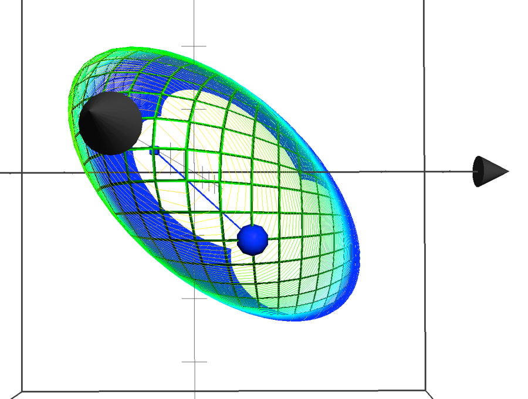{width="6.0in" height="4.531944444444444in"}

Indenfor økonomi bruger man partiel differentiation f.eks. til at maximere profitfunktioner af 2 eller flere variable. I vores eksempel kunne vi have fundet ekstremumspunkter ved at differentiere partielt og sætte lig nul, og herefter løse ligningerne ved f.eks. substitutionsmetoden.

$${- 2x - y = 0}{- x - 2y = 0}$$

Af første ligning får vi:

$$y = - 2x$$

Ved indsættelse i anden ligning får vi:

$${- x - 2 \cdot - 2x = 0 \Leftrightarrow }{x = 0}$$

Og derefter:

$$y = 0$$

Cobb-Douglas funktioner
-----------------------

### Video produktionsfunktioner

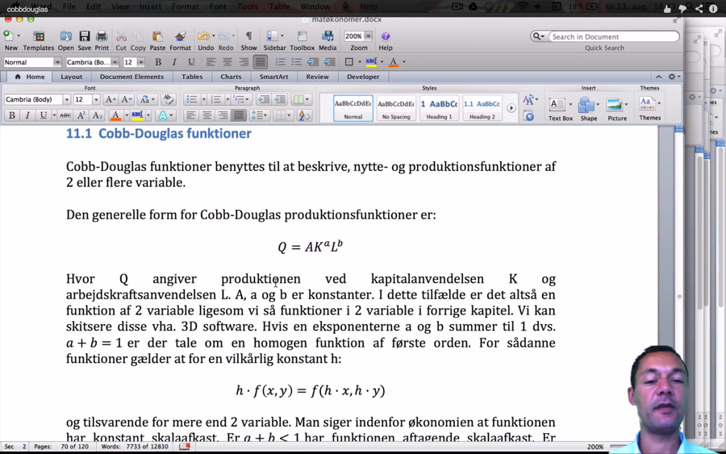{width="6.0in" height="3.75in"}

Cobb-Douglas funktioner benyttes til at beskrive, nytte- og produktionsfunktioner af 2 eller flere variable.

Den generelle form for Cobb-Douglas produktionsfunktioner er:

$$Q = AK^{a}L^{b}$$

Hvor Q angiver produktionen ved kapitalanvendelsen K og arbejdskraftsanvendelsen L. A, a og b er konstanter. I dette tilfælde er det altså en funktion af 2 variable ligesom vi så funktioner i 2 variable i forrige kapitel. Vi kan skitsere disse vha. 3D software. Hvis en eksponenterne a og b summer til 1 dvs. $a + b = 1$ er der tale om en homogen funktion af første orden. For sådanne funktioner gælder at for en vilkårlig konstant h:

$$h \cdot f\left( x,y \right) = f(h \cdot x,h \cdot y)$$

og tilsvarende for mere end 2 variable. Man siger indenfor økonomien at funktionen har konstant skalaafkast. Er $a + b < 1$ har funktionen aftagende skalaafkast. Er $a + b > 1$ har funktionen voksende skalaafkast. I tegningen nedenfor er indtegnet:

-   en rød aftagende skalaafkast funktion $f\left( x,y \right) = 2 \cdot x^{0,25} \cdot y^{0,25}$ med økonomisk notation $Q\left( L,K \right) = 2 \cdot L^{0,25} \cdot K^{0,25}$.

-   En grå konstant skalaafkast funktion $f\left( x,y \right) = 2 \cdot x^{0,5} \cdot y^{0,5}$ med økonomisk notation $Q\left( L,K \right) = 2 \cdot L^{0,5} \cdot K^{0,5}$.

-   en grøn voksende skalaafkast funktion $f\left( x,y \right) = 2 \cdot x^{0,75} \cdot y^{0,75}$ med økonomisk notation $Q\left( L,K \right) = 2 \cdot L^{0,75} \cdot K^{0,75}$. Den grønne funktion er den der forsvinder ud af billedet.

> Man har x-aksen (L altså arbejdskraft), ud mod læseren y-aksen (K kapital) til højre. Output altså produktionen er angivet op af z-aksen. Man kan godt se at tegningen at når man øger forbruget af L og K vil man få et højere output på den grønne afbildning fremfor hhv. den grå og røde.

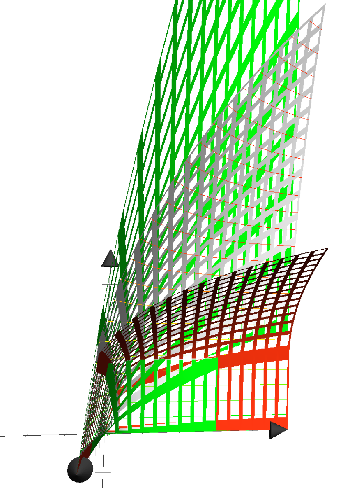{width="5.680950349956255in" height="7.903326771653544in"}

Isoquant/isokvant kurver
------------------------

Vi betragter nu funktionen

$$Q = 2K^{0,5} \cdot L^{0,5}$$

Vi kan tegne funktionen, aksen mod læseren er x-aksen K Kapital, y-aksen der løber mød højre er L arbejdskraft og z-aksen er produktionsoutput. Der er lagt en plan med et fast niveau $z = 1\ $ind i tegningen, skæringen mellem produktionskurven og planen danne isokvant kurven hvor output er 1 i planen

$$\ $$

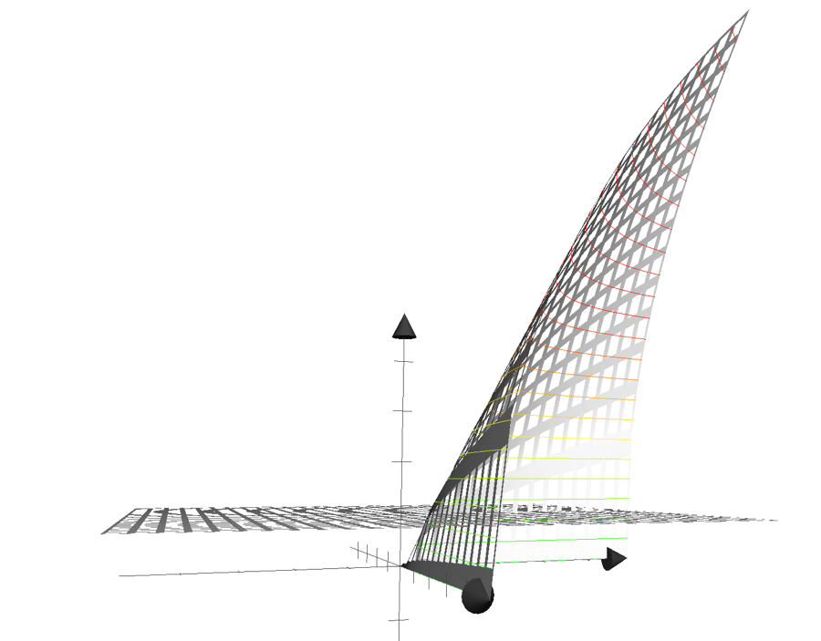{width="6.0in" height="4.684027777777778in"}

Isokvant-funktion er indtegnet nedenfor, den er fundet ved:

$$Q = 2K^{0,5} \cdot L^{0,5}$$

$${1 = 2K^{0,5} \cdot L^{0,5}\ }$$

$${\frac{1}{L^{0,5}} = 2K^{0,5}}$$

$${\frac{1}{2 \cdot L^{0,5}} = K^{0,5}}$$

$$\frac{1}{2 \cdot L^{0,5}} = K^{0,5}$$

$${K = \left( \frac{1}{2 \cdot L^{0,5}} \right)^{2}}$$

$${K = \frac{1}{\left( 2 \cdot L^{0,5} \right)^{2}}}{K = \frac{1}{4L}}$$

$$$$
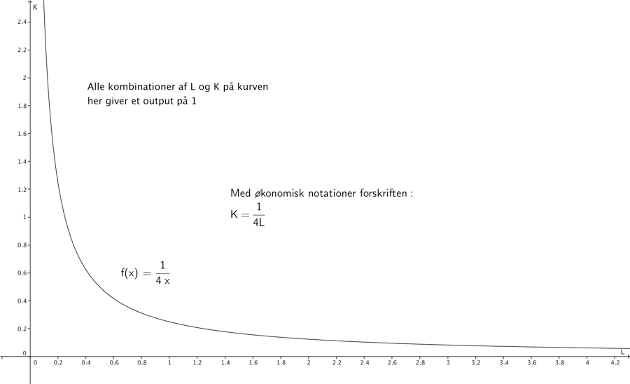{width="6.0in" height="4.684027777777778in"}  

Når man skal finde tangenthældninger til en isokvant kurve skal man bruge normal differentiation for en funktion af en variabel, for nu er vi har vi jo låst z til en fast størrelse. Man skal altså ikke finde partielle afledede til isokvant funktionen, som vi kan opfatte som en funktion af en variabel nemlig L.

Vi får derfor for ovennævnte eksempel følgende afledede:

$$\left( \frac{1}{4L} \right)^{'} = \left( \frac{1}{4}L^{- 1} \right)^{'} = - 1 \cdot \frac{1}{4}L^{- 1 - 1} = - \frac{1}{4}L^{- 2} = - \frac{1}{4 \cdot L^{2}}$$

Den aflede angiver altså tangenthældninger i forskellige punkter $(L,K)$ på isokvant kurven. Hvis vi f.eks. vælger punktet $(0.5,f\left( 0.5 \right) = \left( 0.5,\frac{1}{4 \cdot 0,5}\  \right) = (0.5,0.5)$

Får vi tangenthældningen i dette punkt som $- \frac{1}{4 \cdot L^{2}} = = - \frac{1}{4 \cdot {0.5}^{2}} = - \frac{1}{4 \cdot \frac{1}{4}} = - \frac{1}{1} = - 1$

Denne tangent er indtegnet nedenfor.

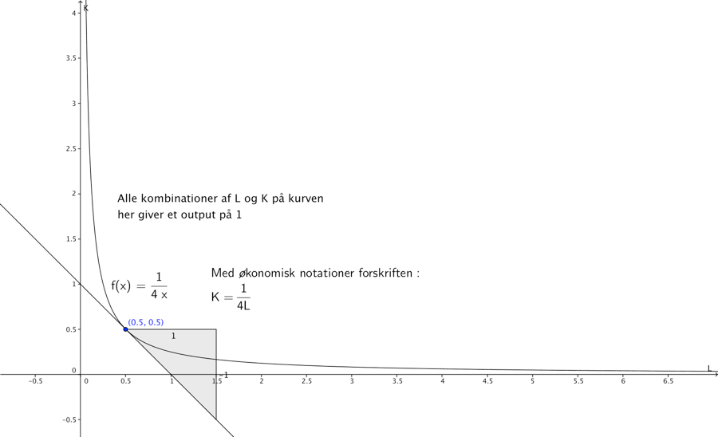{width="6.0in" height="3.651324365704287in"}

Isocost/Isokost kurver
----------------------

### Video isocost kurver

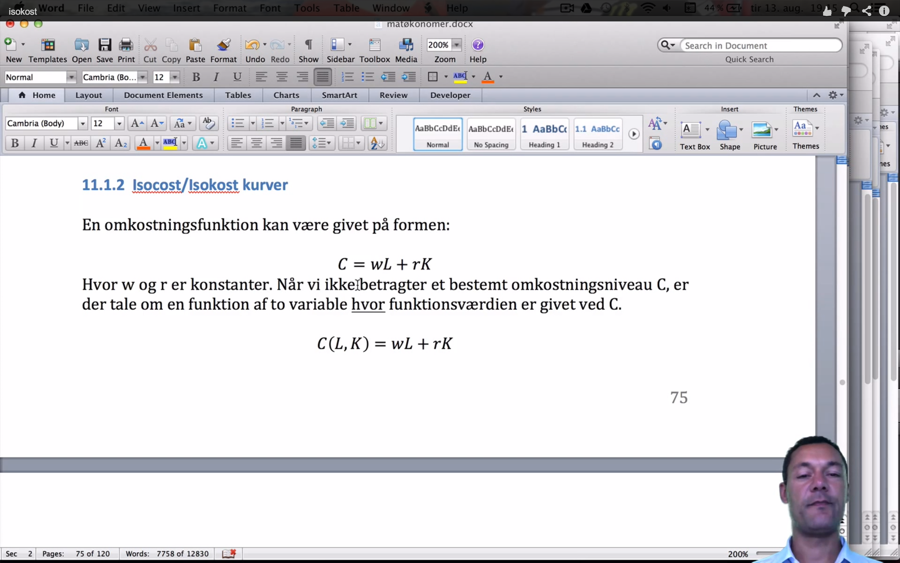{width="6.0in" height="3.75in"}

En omkostningsfunktion kan være givet på formen:

$$C = wL + rK$$

Hvor w og r er konstanter. Når vi ikke betragter et bestemt omkostningsniveau C, er der tale om en funktion af to variable hvor funktionsværdien er givet ved C.

$$C\left( L,K \right) = wL + rK$$

Eller med matematisk notation:

$$z = f\left( x,y \right) = wx + ry$$

Hvis vi f.eks. har givet

$$C = 0.5L + 1K$$

Vil funktionen give en plan i rummet, dette er tegnet nedenfor. x-aksen L ud mod læseren, y-aksen til højre. Hvis man opfatter x-y planen hvor $z = 0\ ,$ som gulvet ligger den røde kugle på gulvet, den ligger i punktet (2,1,0). Den blå kugle svæver lodret over den røde kugle i punktet $(2,1,2)$. Den blå kugle ligger præcis i planen i rummet, dannet af omkostningsfunktionen. Det kan man se af at.

$$C = 0.5 \cdot 2 + 1 \cdot 1 = 2$$

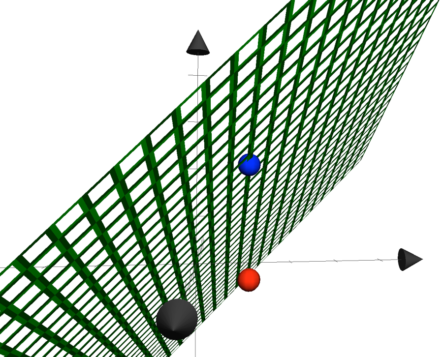{width="6.0in" height="4.8381944444444445in"}

Når man danner isokost linjer fastholder man et bestemt omkostningsniveau for C. Nedenfor er en funktion $C = 1$ indtegnet i rummet. Det giver den grå flade, bemærk den svæver som et bord uden ben, mellem den røde bold på gulvet (C=0) og den blå bold. Isokost linjen, ligger der hvor den grå flade skærer den grønne flade, forskriften for isokostlinjen bliver

$$1 = 0,5L + K$$

Omskrevet får vi

$$K = - 0,5L + 1$$

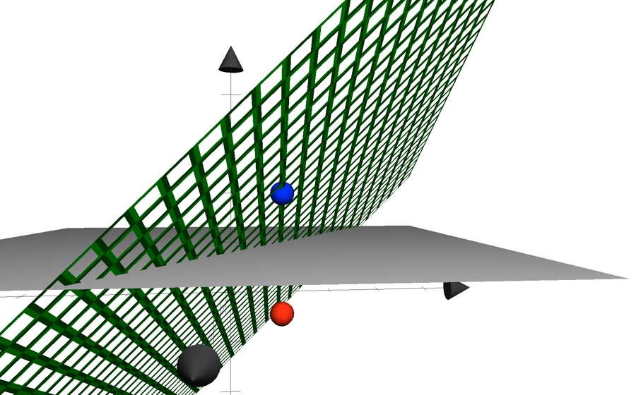{width="6.0in" height="3.734027777777778in"}

I planen ser isokost kurven ud som nedenfor, man kan forestille sig man kigger på skæringen i rummet mellem fladerne præcis ovenfra.

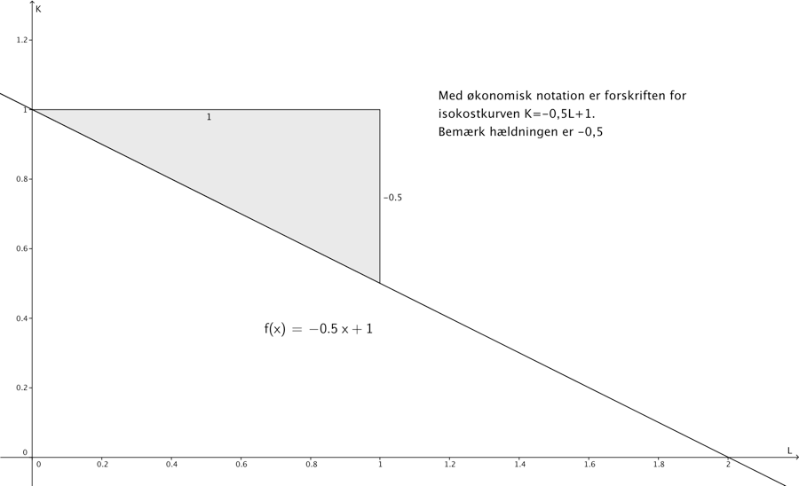{width="6.0in" height="3.651324365704287in"}

###  

### Eksempel på optimering af produktionsoutput for fast omkostningsniveau

### Video optimering af produktionsoutput for fast omkostningsniveau

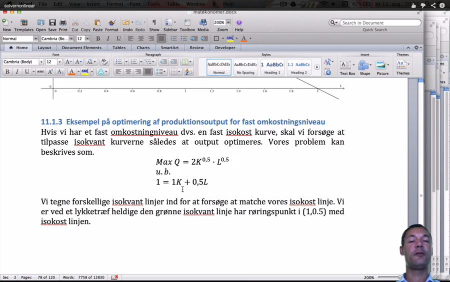{width="6.0in" height="3.75in"}

Hvis vi har et fast omkostningsniveau dvs. en fast isokost kurve, skal vi forsøge at tilpasse isokvant kurverne således at output optimeres. Vores problem kan beskrives som.

$${Max\ Q = 2K^{0,5} \cdot L^{0,5}}{\text{u.b.}}{1 = 1K + 0,5L}$$

Vi tegner forskellige isokvant linjer ind for at forsøge at matche vores isokost linje. Vi er ved et lykketræf heldige den grønne isokvant linje har røringspunkt i (1,0.5) med isokost linjen.

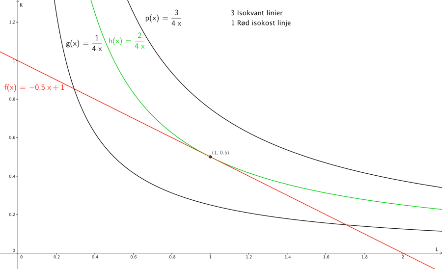{width="6.0in" height="3.651324365704287in"}

Vi var heldige hurtigt at ramme den rigtige isokost kurve, så vi kan bestemme den optimale sammensætning af $L\ og\ K\ (L = 1,\ K = 0.5)$ for et forudbestemt omkostningsniveau. Ved indsættelse i produktionsfunktionen får vi:

$$Q = 2 \cdot 1^{0,5} \cdot {0,5}^{0,5} = 2 \cdot {0,5}^{0,5} = \sqrt{2} \approx 1,4142$$

Vi kender hældningen på isokost-kurven her $- 0,5$, den absolutte værdi 0,5 kaldes i økonomien for MRTS (marginal rate og technical substitution)

Vi har tidligere beregnet den afledede til omkostningsfunktionen Q, for en fast værdi af Q=1.

$$K' = - \frac{1}{4L^{2}}$$

Vi fandt produktionsniveauet Q=2 (værdien i tælleren), når vi indsætter L=1 som jo var den optimale arbejdsmængde får vi

$$K^{'} = - \frac{2}{4{\cdot 1}^{2}} = - \frac{1}{2}$$

Heraf ser man at hældningen på isokvant kurven i punktet $\left( L,K \right) = (1,0.5)$, svarer til hældningen af isokostkurven.

Det er problematisk at løse problemet eksplicit algebraisk, fordi vi får 2 ligninger med 3 ubekendte (L,K,Q), problemet er.

$${Max\ Q = 2K^{0,5} \cdot L^{0,5}}{\text{u.b.}}{1 = 1K + 0,5L}$$

Vi kan løse dette problem hurtigt i solver, den kan håndtere ikke lineære objektfunktioner og bibetingelser. Nedenfor er et billede med løsningen samt Solver promten.

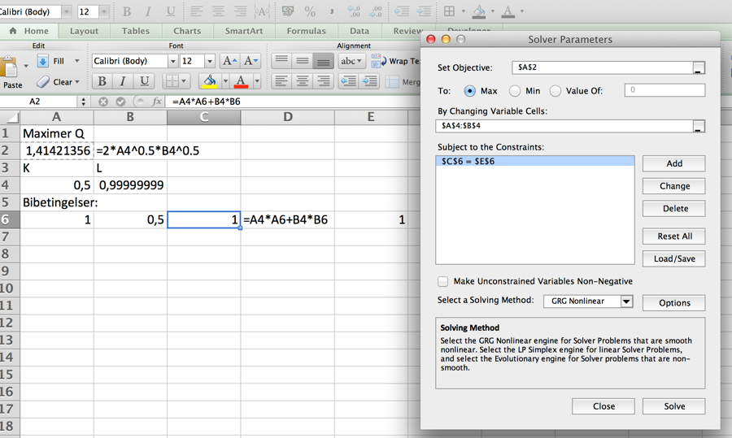{width="6.0in" height="3.59375in"}

Vi kan se at solver har fundet samme optimale løsning som vi fandt grafisk, bemærk solver metoden står til GRG Nonlinear, fordi vi har en ikke lineær objektfunktion. Man kan hente excelfilen ved at klikke på vinduet.

Vi kunne også løse problemet ved at opskrive Lagrange funktionen

$$Z = 2K^{0,5} \cdot L^{0,5} + \lambda(1 - 1K - 0,5L)$$

Finde partielle afledede mht. K, L og $\lambda$ og sætter disse lig med 0

$$\frac{\partial Z}{\partial L} = \sqrt{\frac{K}{L}} - 0,5\lambda = 0$$

$$\frac{\partial Z}{\partial K} = \sqrt{\frac{L}{K}} - \lambda = 0$$

$$\frac{\partial Z}{\partial\lambda} = 1 - 0.5L - 1K = 0$$

Vi dividerer første ligning med anden ligning og reducerer:

$$\frac{K}{L} = \frac{0,5}{1} = 0,5$$

$$1 - 0.5L - 1K = 0$$

$${1 - 0.5L - 1 \cdot 0,5L = 0 \Leftrightarrow }{L = 1}$$

Ved at indsætte værdien af L i første ligning får vi:

$$\frac{K}{1} = K = 0,5$$

Vi kunne altså løse problemet på flere måder.

### Eksempel på optimering af omkostningsniveauet for fast produktionsniveau

Et problem hvor man skal ud fra et fast produktionsniveau, skal finde den optimale L og K kombination kan derimod løses eksplicit, det er fordi vi i denne opgave har en simpel omkostningsfunktion, der giver isokost linjer med samme hældning $- 0,5$. Vores problem kan beskrives som.

$$Min\ C = 1K + 0,5L$$

$${\text{u.b.}}{3 = 2K^{0,5} \cdot L^{0,5}}$$

Her har vi valgt har et fast produktionsoutput $Q = 3$. Vi kan her undlade solver og Lagrange optimering, vi skal bare bestemme for hvilket L og K isokvant kurven $3 = 2K^{0,5} \cdot L^{0,5}$ har hældning $- 0,5$. Vi isolerer K, så funktionen har den sædvanlige forskrift med y/K på venstresiden

$$2K^{0,5} = \frac{3}{L^{0,5}} \Leftrightarrow$$

$$K^{0,5} = \frac{3}{2}L^{- 0,5} \Leftrightarrow$$

$$K = \frac{3^{2}}{2^{2}}L^{- {0,5}^{2}} \Leftrightarrow$$

$$K = \frac{9}{4}L^{- 1}$$

$${\ K' = - \frac{9}{4}L^{- 2}}$$

Vi ved at hældningen $MRTS = - 0,5$ , hvilket netop er venstresiden, og vi kender Q. Vi ender med en ligning med en ubekendt:

$$- 0,5 = - \frac{9}{4L^{2}}$$

$$- 4L^{2} \cdot - 0,5 = 9$$

$${L^{2} = \frac{9}{2}}$$

$$L = \sqrt{\frac{9}{2}\ } \approx 2,1213$$

Vi kan bestemme K ved at indsætte værdien af L, i isoquant funktionen.

$$K = \frac{9}{4 \cdot \sqrt{\frac{9}{2}\ }} = \frac{9}{\sqrt{4} \cdot \sqrt{4} \cdot \sqrt{\frac{9}{2}\ }} = \frac{9}{\sqrt{72\ }} = \ 1,06066$$

Den billigste K, L sammensætning ved et fast produktionsoutput på 3, er altså (2.1213, 1.06066). Omkostningen bliver:

$$C = 1 \cdot 2.1213 + 0.5 \cdot 1.06066 = 2.65163$$

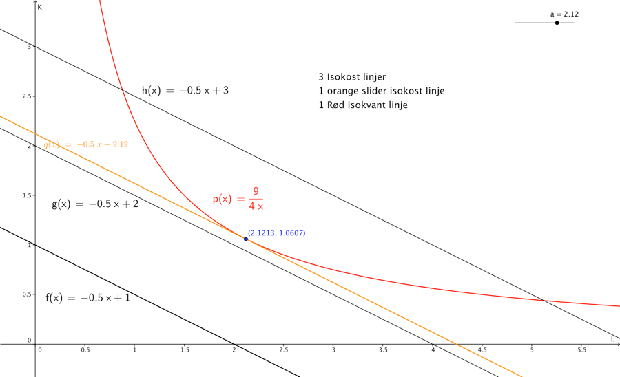{width="6.0in" height="3.6523173665791777in"}

Bemærk i øvrigt de partielle aflede af produktionsfunktionen i vores eksempel $Q = 2L^{0,5} \cdot K^{0,5}$, kaldes med økonomiske termer marginalproduktet af kapital $MP_{k}$

$${MP_{K} = \frac{\partial Q}{\partial K} = 0,5 \cdot 2L^{0,5}K^{0,5 - 1} = L^{0,5} \cdot K^{- 0,5} = }{\frac{L^{0,5}}{K^{0,5}} = \left( \frac{L}{K} \right)^{0,5} = \sqrt{\frac{L}{K}}}$$

Med synonyme udregninger fås $MP_{L}$

$$MP_{L} = \frac{\partial Q}{\partial L} = \sqrt{\frac{K}{L}}$$

Der gælder i et $(L,K)$ optimum

$$MRTS = \frac{MP_{L}}{MP_{K}}$$

Så for vort optimum skal altså gælde at:

$$\frac{MP_{L}}{MP_{K}} = 0,5$$

Udregningen bliver noget lang men det ender godt.

$$\frac{MP_{L}}{MP_{K}} = \sqrt{\frac{\frac{\frac{3}{\sqrt{24}}}{\sqrt{\frac{3}{2}\ }}}{\frac{\sqrt{\frac{3}{2}\ }}{\frac{3}{\sqrt{24}}}} =}\left( \frac{\frac{\frac{\sqrt{9}}{\sqrt{24}}}{\sqrt{\frac{3}{2}\ }}}{\frac{\sqrt{\frac{3}{2}\ }}{\frac{\sqrt{9}}{\sqrt{24}}}} \right)^{0,5} = \left( \frac{\frac{\frac{9}{24}}{\frac{3}{2}}}{\frac{\frac{3}{2}}{\frac{9}{24}}} \right)^{0,5 \cdot 0,5} = \left( \frac{\frac{9}{24} \cdot \frac{2}{3}}{\frac{3}{2} \cdot \frac{24}{9}} \right)^{0,25} = \left( \frac{\frac{18}{72}}{\frac{72}{18}} \right)^{0,25} = \left( \frac{2}{8} \cdot \frac{2}{8} \right)^{0,25} = \left( \frac{1}{16} \right)^{0.25} = \left( \frac{1}{2} \cdot \frac{1}{2} \cdot \frac{1}{2} \cdot \frac{1}{2} \right)^{0,25} = \frac{1}{2}$$
