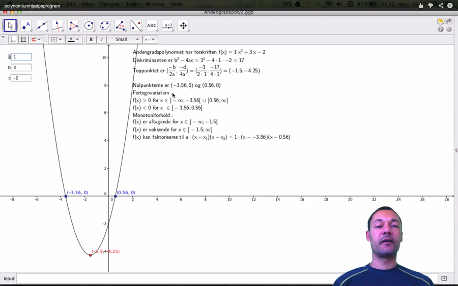
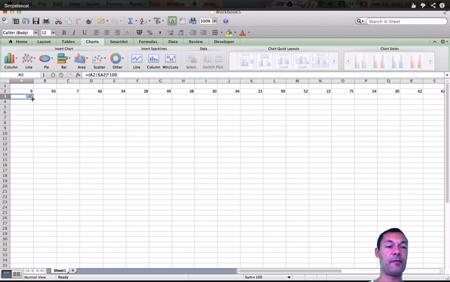
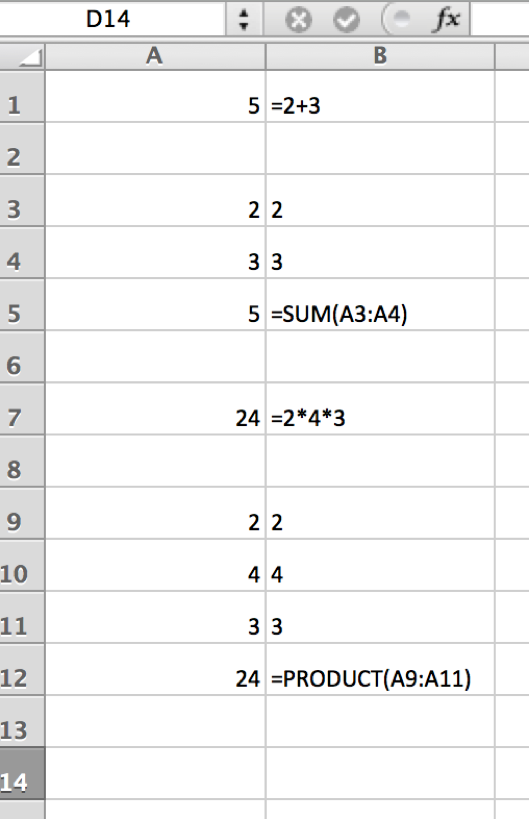
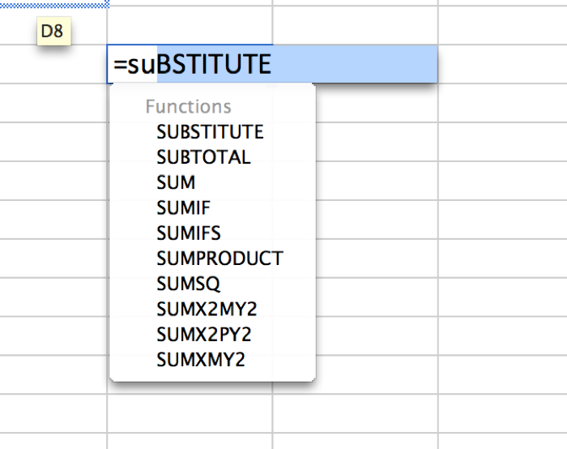
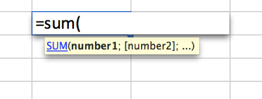
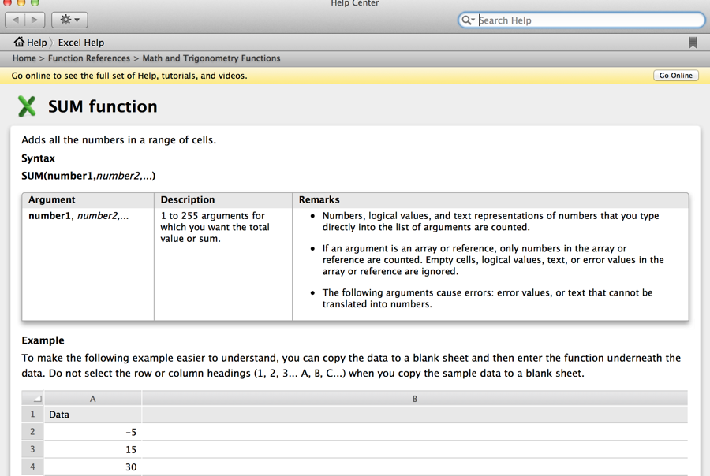
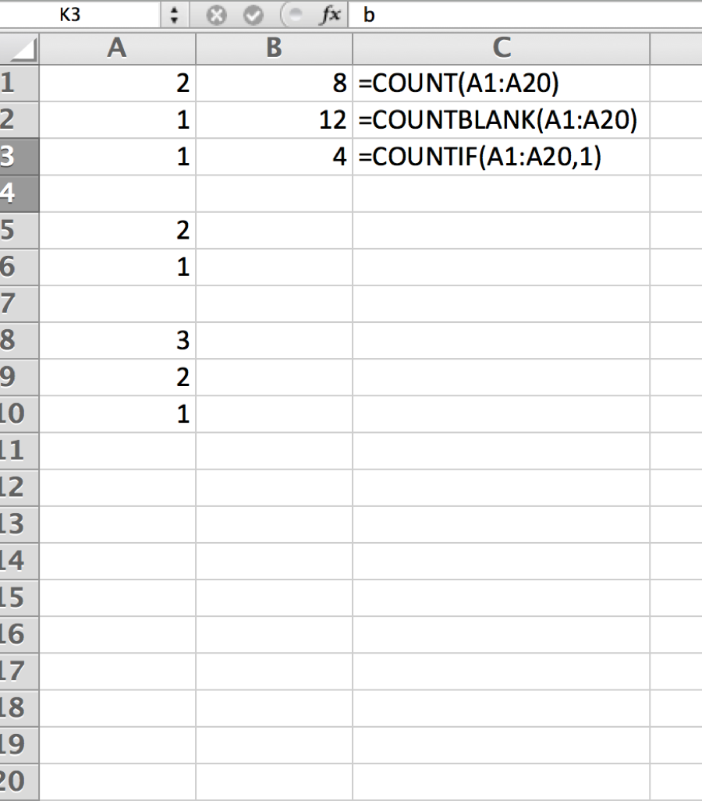
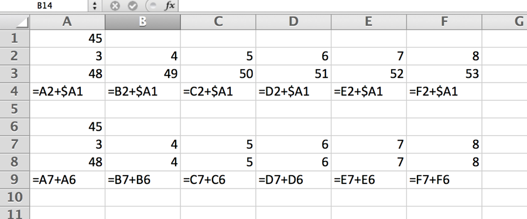
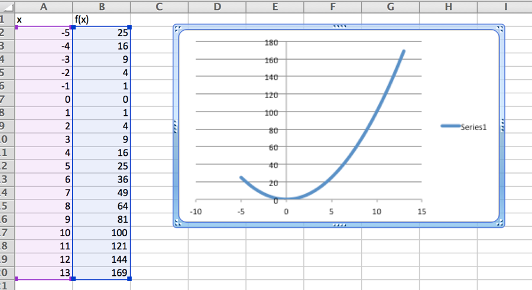
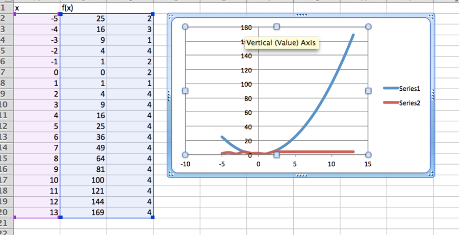

{width="6.370833333333334in" height="0.7527777777777778in"}{width="6.0in" height="0.6892585301837271in"}{width="8.5in" height="12.697222222222223in"}

Table of Contents {#table-of-contents .Overskrift}
=================

[[2] [Indledning] 3](#indledning)

[[3] [Grundlæggende regneregler](#grundlæggende-regneregler)

[[3.1] [Reduktions regneregler](#reduktions-regneregler)

[[3.2] [Brøkregneregler](#brøkregneregler)

[[3.3] [Procentregneregler](#procentregneregler)

[[3.4] [Indekstal](#indekstal)

[[3.5] [Procentpoint](#procentpoint)

[[3.6] [Potensregneregler](#potensregneregler)

[[4] [Lineære funktioner](#lineære-funktioner)

[[4.1] [Generel Forskift](#generel-forskift)

[[4.2] [Bestemmelse af forskrift baseret på 2 punkter](#bestemmelse-af-forskrift-baseret-på-2-punkter)

[[4.3] [Løsning af ligninger](#løsning-af-ligninger)

[[4.4] [2 ligninger med 2 ubekendte.](#ligninger-med-2-ubekendte.)

[[4.5] [Udbuds- og efterspørgselskurver](#udbuds--og-efterspørgselskurver)

[[4.6] [Addition af lineære funktioner](#addition-af-lineære-funktioner)

[[4.6.1] [Vertikal addition af lineære funktioner](#vertikal-addition-af-lineære-funktioner)

[[4.6.2] [Horisontal addition af lineære funktioner](#horisontal-addition-af-lineære-funktioner)

[[4.7] [Priselasticitet](#priselasticitet)

[[4.7.1] [Video om priselasticitet](#video-om-priselasticitet)

[[5] [Polynomier](#polynomier)

[[5.1] [2. Gradspolynomier](#gradspolynomier)

[[5.1.1] [Video 2. Gradspolynomier](#video-2.-gradspolynomier)

[[6] [Eksponentielle funktioner](#eksponentielle-funktioner)

[[6.1] [Fordoblings- og halveringskonstant.](#fordoblings--og-halveringskonstant.)

[[7] [Finansiel regning](#finansiel-regning)

[[7.1.1] [Nutidsværdi og fremtidsværdi af en kapital](#nutidsværdi-og-fremtidsværdi-af-en-kapital)

[[7.2] [Annuiteter](#annuiteter)

[[7.2.1] [Fremtidsværdi af en annuitet](#fremtidsværdi-af-en-annuitet)

[[7.2.2] [Nutidsværdi af en annuitet] 49](#nutidsværdi-af-en-annuitet)

[[8] [Inverse funktioner] 52](#inverse-funktioner)

[[9] [Logaritmefunktioner] 54](#logaritmefunktioner)

[[10] [Differentialregning] 58](#differentialregning)

[[10.1] [Regneregler differentiation] 60](#regneregler-differentiation)

[[10.2] [Differentiation af sammensatte funktioner.] 61](#differentiation-af-sammensatte-funktioner.)

[[10.3] [Ekstremumspunkter] 62](#ekstremumspunkter)

[[10.4] [Lokale og globale ekstremumspunkter] 64](#lokale-og-globale-ekstremumspunkter)

[[10.5] [Konveksitet og konkavitet] 65](#konveksitet-og-konkavitet)

[[10.6] [Sammenhænge AVC, ATC, TC, TR, MC, MR og] 66](#sammenhænge-avc-atc-tc-tr-mc-mr-og-mathbfpi)

[[10.7] [Optimeringseksempel] 68](#optimeringseksempel)

[[11] [Partielle afledede og gradienten] 72](#partielle-afledede-og-gradienten)

[[11.1.1] [Video om partielle afledede og gradienten] 72](#video-om-partielle-afledede-og-gradienten)

[[11.2] [Cobb-Douglas funktioner] 77](#cobb-douglas-funktioner)

[[11.2.1] [Video produktionsfunktioner] 77](#video-produktionsfunktioner)

[[11.3] [Isoquant/isokvant kurver] 80](#isoquantisokvant-kurver)

[[11.4] [Isocost/Isokost kurver] 83](#isocostisokost-kurver)

[[11.4.1] [Video isocost kurver] 83](#video-isocost-kurver)

[[11.4.3] [Eksempel på optimering af produktionsoutput for fast omkostningsniveau] 86](#eksempel-på-optimering-af-produktionsoutput-for-fast-omkostningsniveau)

[[11.4.4] [Video optimering af produktionsoutput for fast omkostningsniveau] 86](#video-optimering-af-produktionsoutput-for-fast-omkostningsniveau)

[[11.4.5] [Eksempel på optimering af omkostningsniveauet for fast produktionsniveau] 89](#eksempel-på-optimering-af-omkostningsniveauet-for-fast-produktionsniveau)

[[12] [Integralregning] 93](#integralregning)

[[12.1] [Partiel integration] 94](#partiel-integration)

[[12.2] [Arealberegning] 94](#arealberegning)

[[13] [Excel simpel brug] 96](#excel-simpel-brug)

[[13.1.1] [Video excel simpel brug] 96](#video-excel-simpel-brug)

[[14] [Excel Investering] 103](#excel-investering)

[[14.1.1] [Video om investering med excel] 103](#video-om-investering-med-excel)

[[14.2] [Investeringer med ikke-periodiske varierende betalingsstrømme i excel] 104](#investeringer-med-ikke-periodiske-varierende-betalingsstrømme-i-excel)

[[15] [Excel målsøgning] 105](#excel-målsøgning)

[[16] [Excel lineær programmering] 107](#excel-lineær-programmering)

[[17] [Excel Lineær regression] 114](#excel-lineær-regression)

[[17.1.1] [Video excel lineær regression] 114](#video-excel-lineær-regression)

[[17.1.2] [Video JMP regressionseksempel](#video-jmp-regressionseksempel)

[[18] [Løsning af ligningssystemer med excel](#løsning-af-ligningssystemer-med-excel)

[[19] [Excel omkostnings-eksempel](#excel-omkostnings-eksempel)

[[20] [Excel oversættelser](#excel-oversættelser)

Indledning
==========

Noterne her omhandler matematik, man som økonom vil få brug for under sit studie. Der findes en del bøger og videoer, der kan være til yderligere hjælp.

Man gratis hente Troels Troelsen's bog og andre matematik og statistikbøger på bookboon:

[["Grundlæggende Matematik for økonomer"]](http://bookboon.com/dk/grundlaeggende-matematik-for-oekonomer-ebook#download)

Jeg har selv lavet nogle video screencasts om diverse emner indenfor matematik og statistik de findes på:

[[http://www.youtube.com/ThomasPetersenMat]](http://www.youtube.com/ThomasPetersenMat)

Der er en matematik kanal på youtube, med mange gode videoer fra ingeniøren

[[http://www.youtube.com/user/matematikkanalen]](http://www.youtube.com/user/matematikkanalen)

Der er en god hjemmeside med mange danske gratis matematikvideoer:

[[http://www.frividen.dk/default.aspx]](http://www.frividen.dk/default.aspx)

En HA-studerende har lavet en hjemmeside med excel kursus.

[[www.excelkursus.com]](http://www.excelkursus.com/)

Jeg også anbefale Kahn Akademy's matematikvideoer, disse videoer er på engelsk.

[[http://www.youtube.com/user/khanacademy]](http://www.youtube.com/user/khanacademy)

Ofte vil de man kunne finde gode videoer på engelsk på Youtube om de lidt sværere emner.

Jeg kan anbefale at man benytter f.eks. [[http://www.wolframalpha.com/]](http://www.wolframalpha.com/) som facitliste når man løser opgaver.

Grundlæggende regneregler 
==========================

Reduktions regneregler
----------------------

Når a, b og c d er reelle tal gælder:

$a + b = b + a$

$$2 + 4 = 4 + 2$$

$a + (b + c) = (a + b) + c = a + b + \text{c\ }$

$$3 + \left( 4 + 5 \right) = \left( 3 + 4 \right) + 5 = 3 + 4 + 5 = 12$$

$$a + \left( b + c - d \right) = a + b + c - \text{d\ }$$

$$3 + \left( 4 + 5 - 6 \right) = 3 + 4 + 5 - 6 = 6$$

$a - \left( b + c - d \right) = a - b - c + \text{d\ }$

$3 - \left( 4 + 5 - 6 \right) = 3 - 4 - 5 + 6 = 0$

Husk reglen om at ændre fortegn på alle led når man hæver en negativ parentes.

$$a \cdot b\  = b \cdot a\ $$

$$3 \cdot 4 = 4 \cdot 3 = 12$$
---
$$a \cdot \left( b \cdot c \right) = \left( a \cdot b \right) \cdot c\  = a \cdot b \cdot c\ $$

$$3 \cdot \left( 4 \cdot 5 \right) = \left( 3 \cdot 4 \right) \cdot 5 = 3 \cdot 4 \cdot 5 = 60$$

$$a \cdot \left( b + c \right) = a \cdot b + a \cdot c\ $$

$$3 \cdot \left( 4 + 5 \right) = 3 \cdot 4 + 3 \cdot 5 = 27$$

Bemærk faktoren skal ganges på alle led i parentesen

$$a \cdot \left( b - c \right) = a \cdot b - a \cdot c\ $$

$$3 \cdot \left( 4 - 5 \right) = 3 \cdot 4 - 3 \cdot 5 = - 3$$

$\left( a + b \right) \cdot \left( c + d \right) = a \cdot \left( c + d \right) + b \cdot (c + d) = a \cdot c + a \cdot d + b \cdot c + b \cdot d\ $

$\left( 3 + 4 \right) \cdot \left( 5 + 6 \right) = 3 \cdot 5 + 3 \cdot 6 + 4 \cdot 5 + 4 \cdot 6$

$\left( a + b \right)^{2} = \left( a + b \right) \cdot \left( a + b \right) = a^{2} + b^{2} + 2ab$

$$\left( 2x + 3y \right)^{2} = 4x^{2} + 9y^{2} + 12xy$$

Kvadratet af en toleddet størrelse, er kvadratet på første led + kvadratet på andet led plus det dobbelte produkt

$\left( a - b \right)^{2} = \left( a - b \right) \cdot \left( a - b \right) = a^{2} + b^{2} - 2ab$

$$\left( 2x + 3y \right)^{2} = 4x^{2} + 9y^{2} + 12xy$$

Kvadratet af en toleddet størrelse, er kvadratet på første led + kvadratet på andet led minus det dobbelte produkt

$\left( a + b \right) \cdot \left( a - b \right) = a^{2} - b^{2}$

$$\left( 2x + 3y \right) \cdot \left( 2x - 3y \right) = 4x^{2} - 9y^{2}$$

Brøkregneregler
---------------

En brøk består af en tæller øverst og en nævner nederst$.$ Hvis man tænker på tælleren som hvor mange stykker lagkage der er, og nævneren som hvor store stykkerne er. En brøk repræsenterer det præcise tal man får ved at dividere tælleren med nævneren. $\frac{1}{3}$repræsenterer således $1:3$, der udtrykt som [decimalbrøk](https://da.wikipedia.org/w/index.php?title=Decimalbr%C3%B8k&action=edit&redlink=1) er ca. 0,6667, dette tal kan faktisk ikke skrives helt præcist som et [decimaltal](https://da.wikipedia.org/wiki/Decimaltal), så brøker er fine hvis man ønsker at beregne noget helt eksakt. Der gælder at hvis både tæller og nævner er et [heltal](https://da.wikipedia.org/wiki/Heltal) $\mathbb{Z}$, så er brøken et [rationalt tal](https://da.wikipedia.org/wiki/Rationale_tal).

Man kan forlænge brøker ved at gange med samme tal i tæller og nævner:

$$\frac{a}{b} = \frac{a \cdot c}{b \cdot c}$$

Man kan forkorte brøker ved at dividere med samme tal i tæller og nævner, det er god stil når man rapporterer et brøktal som slutresultat, at dette er mest muligt forkortet:

$$\frac{a}{b} = \frac{\frac{a}{c}}{\frac{b}{c}}$$

Hvis 2 brøker har samme nævner kan man addere eller subtrahere dem direkte.

$$\frac{a}{c} + \frac{b}{c} = \frac{a + b}{c}$$

$$\frac{a}{c} - \frac{b}{c} = \frac{a - b}{c}$$

Har 2 brøker ikke samme nævner, må man først skaffe fællesnævner ved at forlænge den ene eller begge. Er man i tvivl kan man altid forlænge begge brøker, med den anden brøks nævner således er man sikker på at de har fællesnævner.

$$\frac{a}{c} + \frac{b}{d} = \frac{a \cdot d}{c \cdot d} + \frac{b \cdot c}{c \cdot d} = \frac{a \cdot d + b \cdot c}{c \cdot d}$$

$$\frac{a}{c} - \frac{b}{d} = \frac{a \cdot d}{c \cdot d} - \frac{b \cdot c}{c \cdot d} = \frac{a \cdot d - b \cdot c}{c \cdot d}$$

Man ganger en brøk med et tal, ved at gange tallet med tælleren.

$$\frac{a}{b} \cdot c = \frac{a \cdot c}{b}$$

Brøk gange brøk er tæller gange tæller og nævner gange nævner.

$$\frac{a}{b} \cdot \frac{c}{d} = \frac{a \cdot c}{b \cdot d}$$

Man dividerer en brøk med et tal, ved at gange tallet ind i nævneren.

$$\frac{a}{b}:c = \frac{a}{b \cdot c}$$

Man dividerer et tal med en brøk, ved at gange tallet med den omvendte brøk.

$$c:\frac{a}{b} = \frac{c \cdot b}{a}$$

Man dividerer en brøk med en anden, ved at gange den første med den omvendte brøk.

$$\frac{a}{b}:\frac{c}{d} = \frac{a \cdot d}{b \cdot c}$$

Procentregneregler
------------------

Procent betyder hundrededele, vi angiver procent med symbolet %.

Har man 200 kr. er 1% af 200 kr., altså en hundrededel af 200 kr. dvs. $\frac{200\ kr.}{100} = 2\ kr.\ $

Af de 200 kr. er 100% af 200 kr., altså hundrede hundrededele af 200 kr. dvs. $\frac{200\ kr.}{100} \cdot 100 = 200\ kr.\ $ altså hele beløbet.

Af de 200 kr. er 40% af 200 kr., altså hundrede hundrededele af 200 kr. dvs. $\frac{200\ kr.}{100} \cdot 40 = 80\ kr.$

Af de 200 kr. er 120% af 200 kr., altså hundrede hundrededele af 200 kr. dvs. $\frac{200\ kr.}{100} \cdot 120 = 240\ kr.$

Vi dividerer altså med 100, når vi skal finde 1 %, og ganger med antallet af procent vi skal bestemme.

Hvor mange procent udgør 10 kr. af 100 kr.?

Dette kan vi finde ud af ved at bestemme andelen af 10 kr. ud af 100 kr., og derefter gange med 100:

$$\frac{10}{100} \cdot 100\% = 10\%$$

Hvor mange procent udgør 20 kr. af 400 kr.?

$$\frac{20}{400} \cdot 100\% = 5\%$$

Hvad er 50 + 10%

$$50 + \frac{50}{100} \cdot 10 = 55$$

Eller mere generelt og lidt nemmere, de 50 kr. er 100% + 10% er 110%, når vi omskriver dette til decimaltal får vi $\frac{110\%}{100} = 1,1$

Dvs. vi kan finde 50 + 10% som $50 \cdot 1,1 = 55$

Tilsvarende kan vi hurtigt finde 50 kr. - 10% som 100%-10%=90%=0.9

$$50*0.9 = 45$$

Et beløb er faldet fra 400 kr. til 250 kr. Hvor mange % er beløbet faldet?

$$\frac{400 - 250}{400} \cdot 100\% = 37.5\%$$

Efter at have lagt momsen 25% til et beløb, er beløbet vokset til 1000 kr. hvad var beløbet før vi lagde 25% til. Det betyder vi har lagt 25% til det ukendte beløb X, altså ganget det med 1.25.

Her kan vi tænke på udregningen som en ligning, dvs. et udsagn der skal være sandt.

$$X \cdot 1.25 = 1000\ kr.$$

Vi skal nu bestemme/isolere X, ved at dividere med 1.25 på begge sider:

$$\frac{X \cdot 1.25}{1.25} = 1000\ kr.\frac{1}{1.25} \rightarrow X = 1000\ kr.\  \cdot 0.8 \rightarrow X = 800\ kr.$$

Vi kan når man skal finde et beløb uden moms 25%, gange med $\frac{1}{1.25} = 0.8\ $

 Indekstal
----------

Tal omregnes til indekstal, ved at lade indekstallene være procentværdier i forhold til en bestemt værdi kaldet basis der har indeks 100.

$$Indeks = \frac{Vaerdi}{\text{basis}} \cdot 100$$

Hvis fx en aktie er steget fra kurs 133 til kurs 180, kan vi indeksere ved at sætte kurs 133 til basis og bestemme, den indekserede værdi af den nye kurs 180.

$$Indeks = \frac{180}{133} \cdot 100 = 135.34$$

Dette er smart hvis vi skal sammenligne, hvordan forskellige værdier udvikler sig over tiden.

Herunder har vi kurserne for Danske Bank og Nordea på udvalgte dage.

  Dato          31/12/2016   31/01/2017   28/02/2017   31/03/2017   30/04/2017   31/05/2017   30/06/2017   31/07/2017   31/08/2017   30/09/2017   31/10/2017   30/11/2017
  ------------- ------------ ------------ ------------ ------------ ------------ ------------ ------------ ------------ ------------ ------------ ------------ ------------
  Danske Bank   220.94       225.66       228.84       248.00       248.70       250.40       254.50       242.80       251.80       243.70       233.60       245.00
  Nordea        82.36        81.47        79.29        84.05        85.70        83.15        79.65        84.05        85.15        77.05        73.80        76.50

Herunder ses udviklingen grafisk:

[\[CHART\]]{.chart}

Vi kan sammenligne udviklingerne i aktiekursen ved at indeksere kurserne for de to banker.

  Dato          31/12/2016   31/01/2017   28/02/2017   31/03/2017   30/04/2017   31/05/2017   30/06/2017   31/07/2017   31/08/2017   30/09/2017   31/10/2017   30/11/2017
  ------------- ------------ ------------ ------------ ------------ ------------ ------------ ------------ ------------ ------------ ------------ ------------ ------------
  Danske Bank   100.00       102.14       103.58       112.25       112.56       113.33       115.19       109.89       113.97       110.30       105.73       110.89
  Nordea        100.00       98.92        96.27        102.05       104.05       100.96       96.71        102.05       103.38       93.55        89.60        92.88

Fx er Danske bank 30/6 indekseret ved $\frac{254.5}{220.94} \cdot 100 = 115.19$.

[\[CHART\]]{.chart}

Vi kan se det er nemmere at sammenligne de 2 indekserede aktiekurser. I hele perioden har Danske Bank været en bedre investering end Nordea aktien.

Du kan se i videoen [[https://youtu.be/aHqd7CJOwTw]](https://youtu.be/aHqd7CJOwTw) hvordan man indekserer hurtigt i Excel.

Hvordan kommer man fra indekstal til det oprindelige beløb, hvis man forestiller sig at Danske Bank aktien i næste periode 31/12 2017, har indeks 115. Hvad er da prisen i denne periode?

Nu kan man opstille en ligning for beregning af indekstal, med en ubekendt værdi kursen 31/12 2017 nemlig:

$$\frac{X}{220.94}*100 = 115 \rightarrow X = 115*\frac{220.94}{100} \rightarrow X = 254.08$$

Det betyder kursen 31/12 vil være 254.08.

Procentpoint
------------

Procentpoint angiver hvor meget ændringen er i indekstallene. Hvis fx en indekseret kurs er ændret fra 110 til 130 er ændringen: 130-110=20 procentpoint. Vi kan udregne den procentvise ændring som:

$\frac{130 - 110}{110} \cdot 100 = 18,18\%$

Modtager en kandidat til kommunalvalget 4% af stemmerne, mod 2% forrige periode, er stigningen 2 procentpoint. Stigningen i procent er imidlertid:

$$\frac{4 - 2}{2} \cdot 100 = 100\%$$

Potensregneregler
-----------------

Lad a, b være reelle tal og m og n naturlige tal, der gælder følgende regler for potensregneregler.

$$a^{n} \cdot a^{m} = a^{n + m}$$

$$3^{2} \cdot 3^{4} = 3 \cdot 3 \cdot 3 \cdot 3 \cdot 3 \cdot 3 = 3^{6}$$

$$\frac{a^{n}}{a^{m}} = a^{n - m}$$

$$\frac{3^{4}}{3^{2}} = \frac{3 \cdot 3 \cdot 3 \cdot 3}{3 \cdot 3} = 3 \cdot 3 = 3^{2}$$

$$a^{n^{m}} = a^{n \cdot m}$$

$$4^{2^{3}} = 4^{2} \cdot 4^{2} \cdot 4^{2} = 4^{2 \cdot 3}$$

$$a^{n} \cdot b^{n} = \left( a \cdot b \right)^{n}$$

$$4^{3} \cdot 7^{3} = 4 \cdot 4 \cdot 4 \cdot 7 \cdot 7 \cdot 7 = 4 \cdot 7 \cdot 4 \cdot 7 \cdot 4 \cdot 7 = 28^{3} = \left( 4 \cdot 7 \right)^{3}$$

$$\frac{a^{n}}{b^{n}} = \left( \frac{a}{b} \right)^{n}$$

$$\frac{3^{3}}{4^{3}} = \frac{3 \cdot 3 \cdot 3}{4 \cdot 4 \cdot 4} = \frac{3}{4} \cdot \frac{3}{4} \cdot \frac{3}{4} = \left( \frac{3}{4} \right)^{3}$$

$$\frac{1}{a^{n}} = a^{- n}$$

$$\frac{1}{4^{3}} = \frac{4^{0}}{4^{3}} = 4^{0 - 3} = 4^{- 3}$$

$$a^{0} = 1$$

$$37^{0} = 1$$

Resultatet af kvadratroden af 16, $\sqrt{16}$, er det tal der gange med sig selv giver 16

$$\sqrt{16} \cdot \sqrt{16} = 16 = 4 \cdot 4$$

dvs.

$$\sqrt{16} = 4$$

Bemærk her noget helt fantastisk ‼!

$$\sqrt{16} \cdot \sqrt{16} = 16 = 16^{1} = 16^{\frac{1}{2} + \frac{1}{2}} = 16^{\frac{1}{2}} \cdot 16^{\frac{1}{2}}$$

Vi kan altså skrive $\sqrt{16}$ som $16^{\frac{1}{2}}$

Tilsvarende betyder f.eks. 4 roden af 256, $\sqrt[4]{256}\ $, at man skal finde det tal der gange med sig selv 4 gange giver 256.

$$\sqrt[4]{256} = 4$$

Fordi

$$4 \cdot 4 \cdot 4 \cdot 4 = 256$$

Det kan vi skrive som

$$\sqrt[4]{256} = 256^{\frac{1}{4}}$$

Husk et par nyttige regler eksemplificeret nedenfor:

$$\frac{1}{x} = x^{- 1}$$

$$\frac{1}{x^{17}} = x^{- 17}$$

$$\sqrt{x} = \sqrt[2]{x} = x^{\frac{1}{2}}$$

$$\sqrt[7]{x^{3}} = x^{\frac{3}{7}}$$

$$x^{0} = 1$$

$$2 \cdot \sqrt{2} = \sqrt{2} \cdot \sqrt{2} \cdot \sqrt{2} = \sqrt{8}$$

Lineære funktioner
==================

Generel Forskift
----------------

{width="6.0in" height="3.651324365704287in"}

Figure 1

En funktion er et redskab, der beskriver sammenhængen mellem en uafhængig variabel x og en afhængig variabel y = f(x). Formen for en lineær funktionsforskrift skrives som:

$$f\left( x \right) = ax + b$$

$$hvor\ a,\ b\  \in \mathbb{R}$$

Vi kalder a for hældningskoefficienten, dette tal fortæller hvor meget y ændrer sig når x vokser med 1. Det vil sige hvor meget ændres funktionsværdien, når vi går en til højre på x-aksen. b er skæringen med y-aksen. Punktet hvor linjen skærer y-aksen har altid første-koordinat 0, dvs. punktet hedder (0,b).

På figuren ovenfor er $f\left( x \right) = 0,5x + 2$ tegnet ind. Her ses som nævnt, at linjen skærer y-aksen i (0,2), og hældningskoefficienten er 0,5.

Når man indsætter en x-værdi i funktionsforskriften får man funktionsværdien eller y-værdien. F.eks. vil x=2 give en y-værdi $f\left( 2 \right) = 0,5 \cdot 2 + 2 = 3$, det betyder punktet $\left( 2,\ 3 \right)$ ligger på den rette linje.

En lineær funktion med positiv hældning $\left( her\ a = 0,5 \right)$ er en monotont voksende funktion, en sådan funktion ligner en bakke der går opad. Jo større a er des stejlere er bakken. En lineær funktion med negativ hældning, er en funktion der er monotont aftagende, det er en funktion der går nedad.

Bestemmelse af forskrift baseret på 2 punkter
---------------------------------------------

Hvis vi kender 2 punkter $\left( x_{1},y_{1} \right)\ og\ (x_{2},y_{2})$ på en ligning kan vi bestemme funktionsforskriften, $f(x) = ax + b$

$$a = \frac{y_{1} - y_{2}}{x_{1} - x_{2}}$$

$$b = y_{1} - ax_{1}$$

Hvorfor ? Fordi vi kan skrive opskrive 2 ligninger med 2 ubekendte (a og b), når vi kender den generelle funktionsforskrift og de to punkter:

$$y_{1} = ax_{1} + b$$

$${y_{2} = ax_{2} + b}$$

Se i senere afsnit hvordan man kan løse 2 ligninger med 2 ubekendte, her er de ubekendte jo a og b alle andre størrelser i ligningerne er kendte. Man kan så trække den ene ligning fra den anden, så forsvinder b, og man har en ligning med en ubekendt tilbage.

Hvis vi kender 2 punkter (2,3) og (4,1) på en lineær funktion og ønsker at bestemme forskriften, kan vi altså først finde a:

$$a = \frac{y_{1} - y_{2}}{x_{1} - x_{2}} = \frac{4 - 2}{1 - 3} = - \frac{2}{2} = - 1$$

Bemærk det er ligegyldigt hvilket punkt man vælger som $(x_{1},y_{1})$ og $(x_{2},y_{2})$, men rækkefølgen i brøken, når man har valgt, er vigtig.

Man bestemmer nemt b, da det nu er den eneste ukendte i de 2 ligninger, behøver vi blot indsætte de øvrige kendte værdier i den ene ligning.

$$b = y_{1} - ax_{1} = 3 - \left( - 1 \right) \cdot 2 = 5$$

Så forskriften bliver altså

$$y = - x + 5$$

{width="6.0in" height="3.6523173665791777in"}

Løsning af ligninger
--------------------

Vi har følgende regneregler for ligninger:

Man må addere og subtrahere med en konstant c, når man gør det på både højre og venstresiden.

$$Nar\ a = b\ er\ a + c = b + c$$

$$Nar\ a = b\ er\ a - c = b - c$$

$$$$

Man må multiplicere og dividere med en konstant c forskellig fra 0, f.eks:

$$Nar\ a = b\ er\ a*c = b*c$$

$$Nar\ a = b\ er\frac{a}{c} = \frac{b}{c}$$

At løse en ligning betyder: bestem de variabelværdier for hvilken ligningen er sand, vi kalder mængden af disse værdier løsningsmængden L. Hvis vi betragter 1. Grads ligningen:

$$3x + 2 = 4$$

Her tilhører x=3 f.eks. ikke løsningsmængden L. for

$$3*3 + 2 \neq 4$$

Man kan hurtigt bestemme løsningsmængden ved at isolere x.

$$3x + 2 = 4 \Leftrightarrow$$

$$3x + 2 - 2 = 4 - 2 \Leftrightarrow$$

$$3x = 2 \Leftrightarrow$$

$$\frac{3x}{3} = \frac{2}{3} \Leftrightarrow$$

$$x = \frac{2}{3}$$

$$L = \{\frac{2}{3}\}$$

Der findes specialtilfælde af ligninger hvor $L = O\ $

$${5x = 7 + 5x}{0x = 7}{\ L = O}$$

Eller $L\mathbb{= R}$

$${5x + 3 = 7 + 5x - 4}{0x = 0}{\text{\ L}\mathbb{= R}}$$

Man kan måske få en bedre forståelse ved at løse 1. Gradsligningen, ved at indtegne hhv. højre- og venstreside som funktioner i et koordinatsystem.

{width="6.0in" height="3.651324365704287in"}

2 ligninger med 2 ubekendte.
----------------------------

En ligning med 2 ubekendte kan f.eks. være:

$$3x = 2y + 6$$

Denne ligning kan vi omskrive til:

$${y = 1\frac{1}{2}x - 3}$$

I koordinatsystemet vil denne ligning kunne afbilledes som nedenfor:

{width="6.0in" height="3.6523173665791777in"}

Hvis man skal løse 2 ligninger med 2 ubekendte, skal man gøre det samme, som når man løser en ligning med en ubekendt. Man skal altså finde de værdier af de 2 ubekendte der gør begge ligninger sande samtidigt. Vi kalder også 2 ligninger med 2 ubekendte for et ligningssystem. Sådanne ligninger med 2 ubekendte kan tegnes som rette linjer i et koordinatsystem, og derefter løses grafisk. Det betyder ikke noget at de ubekendte hedder noget andet end x og y, man navngiver dem blot som hhv. x og y. Hvis man tegner ligningerne med de 2 ubekendte ind i koordinatsystemet, er skæringspunktet mellem de to rette linjer, netop der hvor begge ligninger er sande.

Hvis vi f.eks. skal løse de 2 ligninger:

$$3x = 2y + 6$$

$$y = \frac{1}{2}x + 1$$

Kan vi omskrive dem dvs. isolere y'erne på venstresiden:

$$y = 1\frac{1}{2}x - 3$$

$$y = \frac{1}{2}x + 1$$

Og vi indtegner disse og finder skæringspunktet:

$$3x = 2y + 6$$

$$y = 2x + 1$$

{width="6.0in" height="3.6523173665791777in"}

Ligesom med en ligning kan løsningsmængden være tom (hvis de 2 linjer de 2 ligninger danner er parallelle) eller $\mathbb{R}^{2}$, (hvis ligningerne der dannes er identiske ). Men oftest vil linjerne skære hinanden.

{width="6.0in" height="3.6523173665791777in"}

Der findes flere metoder til løsning af 2 ligninger med 2 ubekendte bl.a. substitutionsmetoden. Når vi benytter substitutionsmetoden, isolerer vi y i begge ligninger:

$$y = 1\frac{1}{2}x - 3$$

$$y = \frac{1}{2}x + 1$$

Vi ved at y i første og anden ligning skal have samme værdi når vi finder en løsning. Derfor ved vi også at venstresiderne skal være ens. Vi sætter så venstresiderne lig med hinanden og isolerer x:

$$1\frac{1}{2}x - 3 = \frac{1}{2}x + 1$$

$$1\frac{1}{2}x - \frac{1}{2}x = 3 + 1$$

$$x = 4$$

Vi ved nu at når x er lig med 4, har vi en løsning. Så kan vi bare indsætte x=4, i en af de oprindelige ligninger og finde værdien af y.

$$y = 1\frac{1}{2}x - 3$$

$$y = 1\frac{1}{2} \cdot 4 - 3$$

$$y = 3$$

og vi ser at vi får samme løsning som da vi benyttede den grafiske metode.

$$(4,3)$$

Man kan løse ligningssystemer med flere end 2 ubekendte med matrix kommandoerne mmult og minverse i excel, men dette når vi ikke at gennemgå på dette kursus.

Udbuds- og efterspørgselskurver
-------------------------------

En vares prissætning er afgørende for hvor meget man kan afsætte af den pågældende vare. Jo højere pris desto færre varer kan man afsætte. Tilsvarende vil prissætningen være afgørende for, hvor meget producenterne vil udbyde, jo højere pris des flere varer udbydes. Vi forudsætter her at sammenhængen mellem pris og afsætning er lineær. Vi kan tegne efterspørgselskurver i et koordinatsystem med pris på y-aksen og afsætning på x-aksen. Dette er omvendt af hvordan vi normalt i matematik ville tegne en lineær funktion, idet vores forklarende variabel pris der styrer afsætningen er y.

{width="6.0in" height="3.651324365704287in"}

Efterspørgselskurven har negativ hældning og udbudskurven har positiv hældning.

Et marked er i ligevægt hvor udbuds- og efterspørgselskurven skærer hinanden.

{width="6.0in" height="3.651324365704287in"}

Hvordan finder vi ligevægtspris og afsætning ?

Det gør vi ved [[substitutionsmetoden]](#ligninger-med-2-ubekendte.), som vi så tidligere.

Addition af lineære funktioner
------------------------------

### Vertikal addition af lineære funktioner

Ofte vil man indenfor økonomi have behov for at addere/summere funktioner. Skal man foretage en lodret/vertikal addition af funktioner kan man blot lægge forskrifterne sammen. Hvis vi har 2 funktioner med samme definitionsmængde.

$$f\left( x \right) = - 2x + 5$$

$$g\left( x \right) = - x + 2$$

og vi ønsker at addere disse vertikalt, kan dette gøres direkte

$$h\left( x \right) = f\left( x \right) + g\left( x \right) = - 2x + 5 - x + 2 = - 3x + 7$$

{width="6.0in" height="3.651324365704287in"}

Hvis funktionerne ikke har samme definitionsmængde vil summen af disse blive en stykvis lineær funktion. Man vil da kunne opskrive funktionen som en gaffelforskrift. Hvis vi har de lineære funktioner.

$$f\left( x \right) = - x + 2,\ x \in \left\lbrack 0;2 \right\rbrack$$

$$g\left( x \right) = - 0.5x + 1,\ x \in \left\lbrack 1;4 \right\rbrack$$

Første tegning nedenfor er f(x) og g(x)

{width="6.0in" height="3.651324365704287in"}

Nu bliver den vertikalt adderede funktion:

$$h\left( x \right) = \left\{ \begin{matrix}
 - x + 2,\ x \in \lbrack 0;1\lbrack \\
 - 1.5x + 3\ x \in \left\lbrack 1;2 \right\rbrack \\
 - 0.5x + 1,\ x \in \rbrack 2;4\rbrack \\
\end{matrix} \right.\ $$

Den er tegnet ind nedenfor, prikken uden fyld i punktet (1,1) indikerer at vi i dette punkt ikke ligger på funktionens graf.

{width="6.0in" height="3.651324365704287in"}

### Horisontal addition af lineære funktioner

En virksomhed kan afsætte sine varer på to markeder. På marked 1 kan man afsætte varerne allerede ved en pris på 2 pris afsætningsfunktionen er $f\left( x \right) = - 0,5x + 2$. På marked 2 kan man først afsætte varerne når prisen er 1.

Hvis man forestiller sig at man pga. frygt for parallelimport, ikke kan differentiere priserne på de 2 markeder, kan man ved horisontal addition finde en fælles pris afsætningsfunktion.

Hvis vi indtegner pris afsætningskurver for 2 markeder i samme koordinatsystem, kan man grafisk finde hvad forskriften for den vandret adderede funktion vil være. Når prisen er mellem \[1;2\], vil sumfunktionen have samme forskrift som g(x), til denne pris vil man jo kun kunne afsætte på marked 1. Når prisen er mellem 1 og 0 er det nemmest blot at bestemme 2 afsætninger i dette interval. Når man har bestemt disse kan man jo bestemme forskriften for den lineære funktion, ved at addere de 2 funktioner.

{width="6.0in" height="3.8400404636920387in"}

På næste tegning ses den første del af sumfunktionen, samt 2 punkter (2,1) og (5,0) på den øvrige del af sumkurven.

{width="6.0in" height="3.8400404636920387in"}

Når vi har 2 punkter kan vi bestemme forskriften har vi set set tidligere.

$$a = \frac{y_{2} - y_{1}}{x_{2} - x_{1}} = \frac{0 - 1}{5 - 2} = - \frac{1}{3}$$

b bestemmes som den ukendte i en af de 2 ligninger basereret på funktionsforskrifterne

$${y = ax + b}{0 = - \frac{1}{3} \cdot 5 + b}{b = \frac{5}{3} = 1\frac{2}{3}}$$

Forskriften og sumfunktionen er tegnet ind nedenfor.

{width="6.0in" height="3.8400404636920387in"}

Man kunne også løse horisontal addition af funktioner, algebraisk ved i den del af prisspændet, hvor begge markeder har positiv afsætning, at isolere x'erne og addere funktionerne. Bemærk vi skal isolere x'erne fordi vi ønsker at addere vandret, i modsætning til forrige kapitel, hvor vi gerne ville addere lodret.

$${h\left( x \right) = - x + 1 \Leftrightarrow }{y = - x + 1 \Leftrightarrow }{x = - y + 1}$$

$${g\left( x \right) = - 0,5x + 2 \Leftrightarrow }{y = - 0,5x + 2 \Leftrightarrow }{x = - 2y + 4}$$

Vi lægger nu forskrifterne sammen $- y + 1 - 2y + 4 = - 3y + 5$, og isolerer igen y i den ny forskrift.

$$x = - 3y + 5 \Leftrightarrow$$

$$y = - \frac{1}{3}\ x + \frac{5}{3} \Leftrightarrow$$

Dette er jo kun forskriften i den del af prisintervallet, hvor der på begge markeder er positiv afsætning, den samlede summerede funktion er som vi på tegningerne tidligere.

$$f\left( x \right) = \left\{ \begin{matrix}
 - \frac{1}{2}x + 2,\ x \in \lbrack 0;2\rbrack \\
 - \frac{1}{3}\ x + \frac{5}{3},x \in \lbrack 2;5\rbrack \\
\end{matrix} \right.\ $$

Priselasticitet
---------------

### Video om priselasticitet

{width="6.0in" height="3.75in"}

Priselasticiteten fortæller hvor mange procent afsætningen ændres, når prisen ændres med 1%. Hvis man. har en priselasticitet på 2 betyder det at afsætningen stiger/falder med 2% når prisen sænkes/hæves med 1%. Matematisk vil priselasticiteten altid være negativ, da vi jo har et modsat forhold mellem pris og afsætning, derfor angiver man ofte kun de numeriske værdier. Når man har en elasticitet mellem 0 og 1, siger vi at en vare er uelastisk. F.eks betyder en elasticitet 0,8 at en prisændring på 1% medfører en afsætningsændring på 0,8%.

Formlen er :

$$e = \frac{\frac{Q_{2} - Q_{1}}{\frac{Q_{2} + Q_{1}}{2}}}{\frac{\frac{P_{2} - P_{1}}{P_{2} + P_{1}}}{2}}$$

Hvis vi har 2 pris- afsætningspunkter f.eks. $\left( 10,\ 100 \right)\ og\ (8,\ 200)$, får vi

$$e = \frac{\frac{\frac{200 - 100}{150}}{8 - 10}}{9} = 3$$

{width="6.0in" height="2.9859284776902886in"}

En vare siges at være neutralelastisk hvis elasticiteten er netop en. Hvis vi har en pris/afsætnings funktion, kan vi beregne omsætningsfunktionen ved at gange med x. Vi kan herefter beregne DOMS differensomsætningsfunktionen, ved at differentiere omsætningsfunktion mht. x. Der gælder at pris- afsætnings par for afsætninger i intervallet med voksende omsætning og dermed positiv DOMS funktionsværdi har elastiske. Tilsvarende elasticiteten mindre end 1 når pris- afsætnings parrene er i intervallet med aftagende omsætning/negativ DOMS værdi.

{width="6.0in" height="3.651324365704287in"}

Polynomier
==========

Polynomium betyder mange led. Grundformen for et n. gradspolynomium er:

$$f\left( x \right) = a_{n}x^{n} + a_{n - 1}x^{n - 1} + \ldots + a_{1}x + a_{0}$$

$$a_{0},\ldots a_{n} \in \mathbb{R,\ }n \in \mathbb{N,\ }a_{n} \neq 0\ \ $$

Hvor a-erne kaldes koefficienterne, og n angiver graden af polynomiet. Bemærk alle eksponenterne tilhører de naturlige tal.

En lineær funktion f.eks. $f(x) = 3x + 4$ kan også beskrives som et 1. gradspolynomium. Så er $a_{1} = 3,a_{0} = 4.$

$$f\left( x \right) = 4x^{3} + 3x^{2} + 2x + 2$$

{width="6.0in" height="3.651324365704287in"}

Er et 3. gradspolynomium eller en 3. gradsfunktion, polynomiet har navn efter første leds eksponent, der er den største eksponent.

2. Gradspolynomier
------------------

### Video 2. Gradspolynomier

{width="6.0in" height="3.75in"}

Programmet til videoen ligger under videoen på Youtube.

Vi benytter indenfor økonomi gerne 2. gradsfunktioner til at beskrive f.eks. omsætningsfunktioner.

$$f\left( x \right) = - x^{2} + 3x + 4$$

Er et 2. gradspolynomium/gradsfunktion. Kurven vi kan tegne i koordinatsystemet, kalder vi en parabel.

{width="6.0in" height="3.651324365704287in"}

Specielt for 2. gradsfunktioner navngiver vi ofte koefficienterne med a, b og c i stedet for $a_{2},a_{1}\text{\ og\ }a_{0}$, dvs grundformen er:

$$f\left( x \right) = ax^{2} + bx + c$$

Der gælder at når a som i eksemplet ovenfor er mindre end 0 nemlig -1, siger vi at parablen konkav, eller at grenene/benene vender nedad. Man kan sige grafen krummer nedad. Har 2 gradsfunktionen koefficient $a$ større end 0, siger vi at parablen konveks eller at grenene vender opad.

Vi definerer diskriminanten som $d = b^{2} - 4ac$

For $f\left( x \right) = 2x^{2} + 3x + 4$ er a=-2, b=3 og c=4. Således bliver diskriminanten $3^{2} - 4 \cdot - 1 \cdot 4 = 9 + 16 = 25$

Rødder er de x-værdier for hvilke $ax^{2} + bx + c = 0$. Nulpunkterne er de punkter hvor polynomiets kurve skærer x-aksen. Antallet af rødder for et 2. gradspolynomium bestemmes af værdien af diskriminanten. Hvis:

$${d < 0,\ er\ der\ ingen\ rodder}{d = 0,\ er\ der\ 1\ rod\ \left( \text{dobbeltrod} \right)}{d > 0,\ er\ 2\ rodder}$$

I vores eksempel har vi en positiv diskriminant, man ved derfor at der er 2 rødder, dvs. man ved kurven krydser x-aksen to gange.

Man kan også hurtigt afgøre præcis hvor kurven skærer y-aksen, da er x jo 0. Man ved derfor at leddene $ax^{2}\text{\ og\ bx}$ vil være 0. Kurven vil derfor skære i y-aksen i c, i vores eksempel (0,4).

Man kan uden at tegne 2. gradsfunktionens kurve afgøre at grenene vender nedad, hvor mange rødder der er, samt hvor på y aksen kurven skærer.

Når vi skal bestemme rødderne og dermed nulpunkterne[^1], kan man benytte følgende formel:

$$x = \frac{- b \pm \sqrt{d}}{2a}$$

I vores eksempel får vi:

$$x = \frac{- 3 \pm \sqrt{25}}{2 \cdot - 2} = \left\{ \begin{matrix}
\frac{- 3 + 5}{- 2} = - 1 \\
\frac{- 3 - 5}{- 2} = - \frac{- 8}{- 2} = 4 \\
\end{matrix} \right.\ $$

Det betyder altså at vi har nulpunkterne $\left( - 1,0 \right)\ og\ (4,0)$.

Vi kan bestemme toppunktet (der hvor parablen vender) ud fra formlen:

$$T = \left( - \frac{b}{2a}; - \frac{d}{4a} \right)$$

I eksemplet får vi:

$$T = \left( - \frac{3}{2 \cdot - 1}; - \frac{25}{4 \cdot - 1} \right) = \left( \frac{3}{2};6\frac{1}{4} \right)$$

{width="6.0in" height="3.651324365704287in"}

Hvis vi ser på 2. gradspolynomiet, $2x^{2} + 4x + 2$, er diskriminanten $d = 4^{2} - 4 \cdot 2 \cdot 2$=0. Derfor har vi dobbeltrod, parablens toppunkt berører (krydser ikke) x-aksen, vi har derfor sammenfald mellem toppunkt og nulpunkt.

{width="6.0in" height="3.651324365704287in"}

Hvis 2. gradspolynomiet, er $- 2x^{2} - 3x - 2$, har vi diskriminant $d = - 7$. Derfor har funktionen ingen rødder.

{width="6.0in" height="3.651324365704287in"}

Eksponentielle funktioner
=========================

Eksponentielle funktioner benyttes bl.a. i finansiel regning, som vi ser på i næste kapitel. Ved en eksponentiel funktion forstås en funktion med forskriften:

$$f\left( x \right) = b{\cdot a}^{x}\text{\ \ \ \ }a,b \in \mathbb{R}\ $$

Tallet 𝑎 kaldes grundtallet, og tallet 𝑏 kaldes begyndelsesværdien.

$$b\ \text{er}\ \text{begyndelsesv}ae\text{rdien}$$

$$a\ \text{er}\ \text{grundtallet}\ vae\text{ksttallet}$$

$$r\  = \ a\  - \ 1\ er\ vae\text{kstraten}$$

$$\text{Dm}\left( f \right) = \mathbb{R}$$

𝑉𝑚(𝑓)=\]0;∞\[

$$f\left( 0 \right) = b\ $$

𝑓𝑢𝑛𝑘𝑡𝑖𝑜𝑛𝑒𝑛 𝑒𝑟 𝑚𝑜𝑛𝑜𝑡𝑜𝑛𝑡 𝑎𝑓𝑡𝑎𝑔𝑒𝑛𝑑𝑒, 𝑓𝑜𝑟 0 \< 𝑎 \< 1

𝑓𝑢𝑛𝑘𝑡𝑖𝑜𝑛𝑒𝑛 𝑒𝑟 𝑚𝑜𝑛𝑜𝑡𝑜𝑛𝑡 𝑣𝑜𝑘𝑠𝑒𝑛𝑑𝑒, 𝑛𝑎̊𝑟 𝑎 \> 1

{width="6.0in" height="3.6523173665791777in"}

Hvis begyndelsesværdien b er 1 dvs. $f\left( x \right) = a^{x}$, kaldes funktionen en eksponentialfunktion.

Sætning:

Hvis grafen for en eksponentiel funktion $\text{f\ }\left( x \right) = \ b \cdot a^{x}$ , går gennem de to forskel-

lige punkter $(x_{1}\ ,\ y_{2}\ )\ og\ (x_{2}\ \ ,\ y_{2}\ )$, kan konstanterne $a$ og $b$ bestemmes ved

$$a = \left( \frac{y_{2}}{y_{1}} \right)^{\frac{1}{x_{2} - x_{1}}},\ b = \frac{y_{1}}{a^{x_{1}}}$$

På tegningen nedenfor er afsat 2 punkter $\left( x_{1},y_{1} \right) = \left( 2,3 \right),\left( x_{2},y_{2} \right) = \left( 4,5 \right)$ , vha. denne sætning er forskriften for den eksponentielle funktion bestemt.

{width="6.0in" height="3.6523173665791777in"}

### 

Fordoblings- og halveringskonstant.
-----------------------------------

Fordoblingskonstanten er den bestemte værdi, der hvis man tillægger værdien til et vilkårligt x, fordobler funktionsværdien. På tegningen nedenfor ses at funktionsværdien fordobles hver gang x vokser med 3.8.

{width="6.0in" height="3.651324365704287in"}

For den monotont voksende eksponentielle funktion $f(x)\  = \ ba^{x}$, hvor a \> 1 , er fordoblingskonstanten $T_{2}$ givet ved:

$$T_{2}\  = \frac{\ln\left( 2 \right)}{\ln(a)}$$

Fordi:

$$f\left( x + T_{2} \right) = 2 \cdot f\left( x \right) \Leftrightarrow$$

$$\text{ba}^{\left( x + T_{2} \right)}\  = 2 \cdot f\left( x \right) \Leftrightarrow$$

$$\text{ba}^{x} \cdot a^{T_{2}}\  = 2 \cdot \text{ba}^{x} \Leftrightarrow$$

$$a^{T_{2}}\  = 2 \Leftrightarrow$$

$$\ln{(a}^{T_{2}})\  = ln(2) \Leftrightarrow$$

$$T_{2}\ln\left( a \right) = \ln\left( 2 \right) \Leftrightarrow$$

$$T_{2} = \frac{\ln\left( 2 \right)}{\ln\left( a \right)}$$

Halveringskonstanten

Halveringskonstanten er en bestemt værdi for en monotont aftagende eksponentielfunktion . Hver gang værdien lægges til x halveres funktionsværdien.

{width="6.0in" height="3.6523173665791777in"}

For den monotont aftagende eksponentielle funktion $f(x)\  = \ ba^{x}$, hvor $0 < \ a\  < \ 1$ , er halveringskonstanten $T_{\frac{1}{2}}$ givet ved:

$$T_{\frac{1}{2}}\  = \frac{\ln\left( \frac{1}{2} \right)}{ln(a)}$$

Finansiel regning
=================

### Nutidsværdi og fremtidsværdi af en kapital

Vi benytter i finansiel regning vor viden fra eksponentielle funktioner, nedenstående eksempel viser hvordan sammenhængen er:

En kapital på K~0~ = 10.000 kr. sættes ind på en bankkonto, hvor der hvert år tilskrives en rente på 10%. Betegner vi kapitalens værdi efter 1 år med K~1~ , er denne:

K~1~ =10.000⋅1,10=11.000 kr.

da vi lægger 10 % til et tal ved at gange tallet med 1,10.

Efter 2 år er kapitalens værdi vokset til

K~2~ =11.000⋅1,10=12.100 kr.

og efter 3 år står der følgende beløb på bankkontoen

K~3~ =12.100⋅ 1,10=13.310 kr.

Der gælder altså at:

K~1~ =K~0~ ⋅ (1+r)

K~2~ =K~1~ ⋅ (1+r)

K~3~ =K~2~ ⋅ (1+r)

Osv.

Men dette kan vi skrive som:

K~1~ =K~0~ ⋅ (1+r)

K~2~ =K~0~ ⋅ (1+r)⋅(1+r)

K~3~ =K~0~ ⋅ (1+r)⋅(1+r)⋅(1+r)

Osv.

Eller vha. Potensregnereglerne:

K~1~ =K~0~ ⋅ (1+r)

K~2~ =K~0~ ⋅ (1+r)^2^

K~3~ =K~0~ ⋅ (1+r)^3^

^.^

^.^

^.^

K~n~ =K~0~ ⋅ (1+r)^n^

En mand sætter 10.000 ind på en konto med årlig rentetilskrivning 5%, hvad har han på kontoen efter 3, 13 og 30 år ?

$$K_{3} = 10.000 \cdot {1,05}^{3} = 11.576,25$$

$$K_{13} = 10.000 \cdot {1,05}^{13} = 18.856,49$$

$$K_{30} = 10.000 \cdot {1,05}^{30} = 43.219,42$$

I excel den engelske version, kan man enten skrive ovenstående formler ud, eller benytte fv kommandoen, fv betyder future value. I den danske version skriver man også fv for fremtidsværdi. I første søjle nedenfor står resultaterne, i anden søjle formlen i gåseøjne. Bemærk der er forskel på hvad man separerer argumenter med i forskellige excel-versioner, nogle versioner bruger komma "," , andre versioner bruger semikolon ";". Man kan se hvad man skal bruge i den hjælpetekst der kommer op med gult.

De forskellige argumenter er:

FV(terminsrenten som decimaltal; antal terminer, ydelsen[^2]; nutidsværdi/pv/present value; type angiver man ikke da den står default korrekt)

I B2 cellen nedenfor står der derfor:

=FV(0,05;3;0;-10000)

Vi har altså 5% terminsrente, 3 terminer, ydelser 0 og -10.000,- i nutidsværdi. Bemærk excel angiver nutidsværdien med negativ værdi, man indsætter jo et beløb i dag, man kan tænke på det som man tager penge op af lommen i dag (derfor minus) og sætter dem ind på sin konto. Resultatet fremtidsværdien, bliver positivt, man angiver jo beløbet, man kan hæve og putte i lommen igen.

{width="5.139245406824147in" height="6.833807961504812in"}

Vi kan opfatte fremtidsværdien K~n~ af en kapital K~0~ på et vilkårligt tidspunkt n ude i fremtiden som en funktion af antallet af år/terminer. Dvs. kapitalen er en konstant, (1+r) er en konstant.

Men potensen n er den variable.

K~n~ =K~0~ ⋅ (1+r)^n^

Kaldes fremskrivningsformlen, vi kalder

K~0~ kapitalen/ nutidsværdien/begyndelsesværdien

K~n~ fremtidsværdien

r renten/vækstraten

a = 1 + r fremskrivningsfaktoren/grundtallet

Vi har altså den generelle formel for fremtidsværdien af en kapital.

$$K_{n} = K_{0}\  \cdot \ \left( 1 + r \right)^{n}\text{\ \ }$$

Ved at isolere $K_{0}$ får vi formlen for nutidsværdien af en kapital.

$$K_{0}\  = K_{n}\ \left( 1 + r \right)^{- n}\text{\ \ }$$

Tilsvarende kan vi isolere antallet af terminer vha. logaritmefunktionen ln.

$$K_{n} = K_{0}\  \cdot \ \left( 1 + r \right)^{n}\text{\ \ }$$

$${\frac{K_{n}}{K_{0}} = \ \left( 1 + r \right)^{n}\ }$$

$${\ln\left( \frac{K_{n}}{K_{0}} \right) = n \cdot \ln\left( 1 + r \right)}$$

$${n = \frac{\ln\left( \frac{K_{n}}{K_{0}} \right)}{\ln\left( 1 + r \right)}\ \text{\ \ }}$$

Vi kan ligeledes isolere renten r.

$$K_{n} = K_{0}\  \cdot \ \left( 1 + r \right)^{n}$$

$${\frac{K_{n}}{K_{0}} = \left( 1 + r \right)^{n}}$$

$${\sqrt[n]{\frac{K_{n}}{K_{0}}} = 1 + r}$$

$${r = \sqrt[n]{\frac{K_{n}}{K_{0}}} - 1}$$

Annuiteter
----------

En annuitet er en række lige store betalinger/ydelser betalt ved starten af tidintervaller/terminer, af samme længde, renten er ens og tilskrives efter hver termin.

### Fremtidsværdi af en annuitet

{width="6.0in" height="1.398611111111111in"}

Hvis man indbetaler ydelsen y på en konto n gange til en fast terminsrente r, vil man kunne hæve $A_{n}$, på tidspunkt n. Man kalder denne formel opsparingsformlen, fordi man sparer et beløb op det opsparede beløb på tidspunkt n er $A_{n}$. Dette er illustreret på tidslinjen ovenfor, formlen for fremtidsværdien af annuiteten bliver:

$$A_{n} = y \cdot \frac{\left( 1 + r \right)^{n} - 1}{r}$$

En person indbetaler hvert halve år 1.000,- på en konto med halvårlig rentetilskrivning $r = \ 0,02$, der foretages 10 indbetalinger, hvad er saldoen på kontoen efter sidste indbetaling.

{width="6.0in" height="2.4881944444444444in"}

Her benytter vi i B2 cellen igen FV kommandoen. Bemærk ydelse/pmt argumentet der før var 0 er nu -1000, mens pv/nutidsværdi nu er 0. De -1000 er det beløb personen skal indbetale, i starten af hver termin.

Man kan komme ud for at man ikke kender en af de andre størrelser r, n eller y, men derimod kender $A_{n}$. Hvis y eller n er ukendte, kan man udfra ovenstående formel isolere den ukendte størrelse ved reduktionsregnereglerne.

$$y = A_{n} \cdot \frac{r}{\left( 1 + r \right)^{n} - 1}$$

Excelformlen er PMT (YDELSE dansk version) denne bruger følgende argumenter

PMT(rate, nper, pv, fv, type), bemærk denne formel kan bruges til at finde ydelsen for både opsparings- og gældsformlen. Opsparingsformlens fv-værdi skal være 0.

Hvis man skal finde n, kan man isolere n i opsparingsformlen, man får da:

$$A_{n} = y \cdot \frac{\left( 1 + r \right)^{n} - 1}{r} \Leftrightarrow$$

$$n = \frac{\ln\left( \frac{A_{n} \cdot r}{y} + 1 \right)}{\ln\left( 1 + r \right)}$$

Eller bruge NPER(rate,pmt,pv,fv,type) funktionen i excel, her skal man huske at pv present value skal være 0. Hvis Öztürk ønsker at have $A_{n} =$15.000,- til rådighed, og kan betale terminsydelser på $y = 500, -$ og terminsrenten er r=0,01, hvor mange ydelser skal der da betales.

{width="6.0in" height="1.24375in"}

Hvis renten er ukendt kan vi ikke opskrive en entydig formel hvor r isoleres. Vi kan benytte excels RATE(nper,pmt,pv,fv,type,guess) funktion. Hvis Sørensen indsætter 2000 hvert 12 gange, og han lige efter sidste indsættelse har 25340,- på kontoen, har terminsrenten været:

{width="6.0in" height="1.2569444444444444in"}

### Nutidsværdi af en annuitet

{width="6.0in" height="1.1493055555555556in"}

Nutidsværdien af en annuitet fortæller os hvad en person kan låne på tidspunkt 0, hvis han i n terminer afdrager samme beløb y, og renten tilskrives terminsvis. Bemærk tidslinjen har tidpunkt 0 med, i modsætning til fremtidsværdien af en annuitet, det er på dette tidspunkt man låner beløbet $A_{0}$. Man kalder formlen for nutidsværdien af en annuitet gældsformlen fordi, man stifter gæld på tidspunkt 0. Hvorfor starter man ikke ved 1 ligesom i forrige formel, det skyldes at når man ønsker at låne penge nu, låner man ikke penge man betaler tilbage med det samme, dem ville man jo så alligevel ikke have glæde af.

$$A_{0} = y \cdot \frac{1 - \left( 1 + r \right)^{- n}}{r}$$

Hvis en person kan afdrage y/pmt. kr. 1.000,- på et lån over n=10 terminer, og der på restgælden tilskrives en fast terminsrente r=0,02, ved begyndelsen af hver termin, kan han i alt låne kr. 8.982,50 kr nu. Den første linje i udskriften fra excel, viser hvordan formlen bruges. Den anden linje viser hvorledes den indbyggede excelfunktion beregner nutidsværdien, bemærk PV (present value) er den engelske formel den danske hedder NV (nutidsværdien).

{width="5.653170384951881in" height="2.889089020122485in"}

Der er en tæt sammenhæng mellem fremtids- og nutidsværdien af en annuitet. Nutidsværdien af annuiteten er fremtidsværdien $A_{n}$ på tidspunkt n tilbagediskonteret til tidspunkt 0.

$$A_{n} \cdot \left( 1 + r \right)^{- n} = y \cdot \frac{\left( 1 + r \right)^{n} - 1}{r} \cdot \left( 1 + r \right)^{- n} = A_{0}$$

Tilsvarende er $A_{0}\ $ fremskrevet til tidspunkt n ved at gange med faktoren $\left( 1 + r \right)^{n}$ det samme som $A_{n}$.

$$A_{0} \cdot \left( 1 + r \right)^{n} = y \cdot \frac{1 - \left( 1 + r \right)^{- n}}{r} \cdot \left( 1 + r \right)^{n} = A_{n}$$

Man kan komme ud for at man ikke kender en af de andre størrelser r, n eller y, men derimod kender $A_{0}$. Hvis y eller n er ukendte, kan man ud fra ovenstående formel isolere den ukendte størrelse ved reduktionsregnereglerne. Er y ukendt får vi:

$$y = A_{0} \cdot \frac{r}{1 - \left( 1 + r \right)^{- n}}$$

Hvis Jensen gerne vil låne 20.000,- og kender terminsrenten 4%, og skal betale gælden af over 12 terminer, kan man vha. ovenstående formel beregne hans ydelse.

{width="6.0in" height="2.859027777777778in"}

Er n antallet af ydelser ukendt kan vi omskrive formlen til

$$n = - \frac{\ln\left( 1 - \frac{\left( A_{0} \cdot r \right)}{y} \right)}{\ln\left( 1 + r \right)}\ $$

Hansen betaler 1.000,- i ydelse, på et lån på 10.000,- med en terminsrente på 3%, antallet af ydelser n bliver:

{width="6.0in" height="1.9777777777777779in"}

Hansen skal altså betale 13 ydelser, den sidste ydelse bliver mindre end de første 12.

Hvis der er ukendt terminsrente r, kan man ikke opstille et eksplicit udtryk for renten, ligningen bliver et polynomium af grad n. Der findes ikke altid en entydig løsning til et polynomium, hvorfor excel og anden software benytter en algoritme til at finde en løsning.

Hvis Larsen låner 10.000,- der afdrages ved 12 ydelser af 1.500,-, vil vi kunne benytte rate-kommandoen. Vi vil få en terminsrente på 10,45.

{width="6.0in" height="1.8354166666666667in"}

Inverse funktioner
==================

En funktion kaldes en-entydig eller injektiv hvis der for vilkårlige forskellige $x_{1}\text{og\ }x_{2} \in \text{Dm}\left( f \right)$ gælder at $f\left( x_{1} \right) \neq f(x_{2})$. Det betyder altså, at for alle forskellige par af x'er skal funktionsværdierne være forskellige. Nedenfor er et eksempel på en funktion der ikke er injektiv. Bemærk $x_{1} = - 2\ og\ x_{2} = 2\ $har samme funktionsværdi.

{width="6.0in" height="3.651324365704287in"}

Nedenfor er et eksempel på 2 funktioner der er injektive, man kan altså ikke vælge noget par af forskellige x'er uden at de har forskellige funktionsværdier:

{width="6.0in" height="3.651324365704287in"}

Der gælder at alle monotone funktioner[^3] er injektive. Derfor er alle eksponentielle og lineære funktioner injektive, mens f.eks funktioner der danner parabler som 2. grads polynomier ikke er injektive. Klassen af funktioner med lodret symmetriakse er f.eks. ikke-injektive.

Hvis en funktion $f\left( x \right)$ er injektiv, har den en invers/omvendt funktion $f^{- 1}(x)$, der gør det modsatte af f(x). Det betyder at $f^{- 1}\left( f\left( x \right) \right) = x$. Man kan for en lineær funktion f(x), hurtigt tegne den inverse funktion. Hvis man har 2 punkter $\left( x_{1},y_{1} \right)\text{\ og\ }\left( x_{2},y_{2} \right)$, kan man finde de 2 tilsvarende punkter på $f^{1}\left( x \right)$ , som $\left( y_{1},x_{1} \right)\text{\ og\ }\left( y_{2},x_{2} \right)$.

{width="6.0in" height="3.651324365704287in"}

På tegningen ovenfor ses funktionen f(x) og dens inverse. Der er afsat punkter

På $f\left( x \right)\text{\ er\ afsat\ }\left( x_{1},y_{1} \right)\text{\ og\ }\left( x_{2},y_{2} \right) = \left( - 1,2 \right)\ og\ (1,6)$

På $f^{- 1}\left( x \right)\text{\ er\ afsat\ }\left( y_{1},x_{1} \right)\text{\ og\ }\left( y_{2},x_{2} \right) = \left( 2, - 1 \right)\ og\ (6,1)$

Skal man finde den inverse funktion til f(x), kan man isolere x i ligningen og derefter omdøbe x til y og y til x, i eksemplet ovenfor:

$${y = 2x + 4 \Leftrightarrow }{2x = y - 4 \Leftrightarrow \ }{x = \frac{1}{2}y - 2\ }$$

Hvilket vi omdøber:

$$y = \frac{1}{2}x - 2$$

$${f^{- 1}\left( x \right) = \frac{1}{2}x - 2}$$

Logaritmefunktioner
===================

Vi har valgt at kalde klassen af omvendte/inverse funktioner til eksponentielle funktioner for logaritmefunktioner. Det betyder at logaritme funktioner lever kun fordi vi har eksponentielle funktioner. Der gælder at $\text{Vm}\left( f \right) = \mathbb{R}_{+} = Dm(f^{- 1})$, det vil sige $\ln\left( x \right)$ er kun defineret for positive værdier. Da Den naturlige eksponential funktion $e^{x}$ har som invers funktion den naturlige logaritme funktion $ln(x)$.

{width="6.0in" height="3.651324365704287in"}

Eksponentialfunktionen med grundtal 5 $f\left( x \right) = 5^{x}$, har logaritmen med grundtal 5 $f^{- 1}\left( x \right) = \operatorname{}{(x)}$ som invers funktion.

{width="6.0in" height="3.651324365704287in"}

Eksponentialfunktionen med grundtal 10 $f\left( x \right) = 10^{x}$, har logaritmen med grundtal 10, som vi kalder titalslogaritmen som $f^{- 1}\left( x \right) = \log{(x)}$ som invers funktion. Pas på nogen softwarepakker kalder log(x) titalslogaritmen f.eks. texas og excel, mens andre R og Geogebra kalder log(x) for den naturlige logaritme mens log(10,x) er titalslogaritmen. Hvis du er i tvivl skal logaritmen af grundtallet altid blive 1. Det betyder excel har log(10)=1 mens R har log(10,10)=1.

{width="6.0in" height="3.651324365704287in"}

Der er nogle nyttige regneregler for logaritmer $a,b \in \mathbb{R}_{+}$

$$\ln\left( a \cdot b \right) = \ln\left( a \right) + \ln\left( b \right)$$

$$\ln\left( \frac{a}{b} \right) = \ln\left( a \right) - \ln\left( b \right)$$

$${\ln\left( a^{x} \right) = x \cdot ln(a)}$$

F.eks gælder:

$${\ln\left( 2*3 \right) \approx 1.791759}{\ln\left( 2 \right) + \ln\left( 3 \right) \approx 0.6931472 + 1.098612 \approx 1.791759}{\ln\left( 3^{2} \right) = 2 \cdot ln(3)}$$

Der gælder altid at en funktionsværdi for en eksponentiel funktion, bringes tilbage til x. hvis man tager logaritmen med samme grundtal som den eksponentielle funktion. F.eks. gælder

$$\operatorname{}{\left( 4^{x} \right) = x}$$

$$\operatorname{}{\left( 7^{x} \right) = x}$$

$$\ln\left( e^{x} \right) = x$$

Hvorfor ? fordi vi netop definerer logaritme funktionen med grundtallet k, som den inverse funktion til ${f\left( x \right) = k}^{x}$. Nedenfor er vist et eksempel, hvis man tager funktionsværdien af $f\left( g\left( 2 \right) \right) = 2$, dette gælder ligegyldigt hvilken x-værdi vi indsætter. Der gælder også $g\left( f\left( x \right) \right) = x$.

{width="6.0in" height="3.651324365704287in"}

Differentialregning
===================

Når man differentierer en funktion f, kaldes resultatet " den afledede af f mht. x " eller "f mærke af x ". At differentiere en funktion mht. til x, er en operation, hvor vi finder en ny funktion, vi skriver $f^{'}\left( x \right)$, der er en del teori og beviser omkring dette, som vi ikke gennemgår her.

Hvis vi ser på grafen nedenfor, kan man se at funktionsværdien falder fra 0 til -1, når x ændres fra 0,5 til 1. Når x ændres fra 1 til 1,5 falder funktionsværdien fra -1 til -10,125.

{width="6.0in" height="3.651324365704287in"}

En funktion kan altså vokse eller aftage med forskellig hastighed i forskellige punkter. Denne punktvise hastighed kan vi beskrive ved hjælp differentialregning,

Vi kan beskrive denne hastighed af funktionsværdien i et punkt $\left( f\left( x \right),x \right)\ $vha. tangentens hældning i punktet. En tangent er en ret linje, der berører en kurve i et punkt, og har samme hældning som kurven i punktet. Vi kan se nedenfor, at i punktet (1,-1), har tangenten hældning -6. Denne hældning finder vi ved at differentiere funktionen f(x), vi kalder som nævnt den differentierede funktion " f mærke af x " og skriver $f'(x)$.

$$f\left( x \right) = - 2x^{5} + x^{4}$$

$$f^{'}\left( x \right) = 5 \cdot - 2x^{5 - 1} + 4 \cdot x^{4 - 1} = - 10x^{4} + 4x^{3}$$

Her er benyttet en del regler som vi vender tilbage til om et øjeblik.

Når vi har fundet f mærke af x, indsætter vi x værdien, fra punktet vi søger at finde hastigheden for. Da punktet er (1,-1), indsætter i altså 1 i $f'(x)$

$$f^{'}\left( 1 \right) = - 10 \cdot 1^{4} + 4 \cdot 1^{3} = - 10 + 4 = - 6$$

Det betyder at tangentens hældning i punktet (1,-1)[^4] -6, eller løst formuleret hastigheden i punktet er -6. Dette er tegnet ind nedenfor.

{width="6.0in" height="3.651324365704287in"}

Regneregler differentiation 
----------------------------

Nedenstående skema giver en oversigt over gængse differentiationsregneregler, samt eksempler, k er en konstant $a,b \in \mathbb{R,\ }n \in \mathbb{N}$.

+-----------------------------------+-------------------------------------------------------------------+
| $$f(x)$$                          | $$f'(x)$$                                                         |
+===================================+===================================================================+
| $$k$$                             | $$0$$                                                             |
+-----------------------------------+-------------------------------------------------------------------+
| $$x$$                             | $$1$$                                                             |
+-----------------------------------+-------------------------------------------------------------------+
| $$\text{ax}$$                     | $$a$$                                                             |
|                                   |                                                                   |
| $$3x$$                            | $$3$$                                                             |
+-----------------------------------+-------------------------------------------------------------------+
| $$x^{n}$$                         | $$n \cdot x^{n - 1}$$                                             |
|                                   |                                                                   |
| $$x^{3}$$                         | $$3x^{2}$$                                                        |
+-----------------------------------+-------------------------------------------------------------------+
| $$e^{x}$$                         | $$e^{x}$$                                                         |
+-----------------------------------+-------------------------------------------------------------------+
| $$\ln\left( x \right)$$           | $$\frac{1}{x}$$                                                   |
+-----------------------------------+-------------------------------------------------------------------+
| $$\frac{1}{x^{n}} = x^{- n}$$     | $$- nx^{n - 1}$$                                                  |
|                                   |                                                                   |
| $$\frac{1}{x^{2}} = x^{- 2}$$     | $$- 2x^{- 3}$$                                                    |
+-----------------------------------+-------------------------------------------------------------------+
| $$\sqrt[n]{x} = x^{\frac{1}{n}}$$ | $$\frac{1}{n}x^{\frac{1}{n} - 1}$$                                |
|                                   |                                                                   |
| $$\sqrt[3]{x} = x^{\frac{1}{3}}$$ | $$\frac{1}{3}x^{\frac{1}{3} - 1} = \frac{1}{3}x^{- \frac{2}{3}}$$ |
+-----------------------------------+-------------------------------------------------------------------+

Vi har herudover følgende vigtige regneregler:

$$\left( f\left( x \right) \pm g\left( x \right) \right)^{'} = f^{'}\left( x \right) \pm g'(x)$$

f.eks.

$$\left( 3x^{2} - 2x \right)^{'} = 6x - 2$$

Produktreglen:

$$\left( f\left( x \right) \cdot g\left( x \right) \right)^{'} = f^{'}\left( x \right) \cdot g\left( x \right) + f\left( x \right) \cdot g'(x)$$

f.eks.

$$\left( 3x^{4} \cdot \ln\left( x \right) \right)^{'} = 12x^{3} \cdot \ln\left( x \right) + 3x^{4} \cdot \frac{1}{x} = 12x^{3} \cdot \ln\left( x \right) + 3x^{3}$$

Kvotientregnereglen:

$$\left( \frac{f\left( x \right)}{g\left( x \right)} \right)^{'} = \frac{f^{'}\left( x \right) \cdot g\left( x \right) - f\left( x \right) \cdot g^{'}\left( x \right)}{\left( g\left( x \right) \right)^{2}}$$

f.eks.

$${\left( \frac{2x^{2} - 3x + 3}{x + 5} \right)^{'} = \frac{\left( 4x - 3 \right) \cdot \left( x + 5 \right) - \left( 2x^{2} - 3x + 3 \right) \cdot 1}{\left( x - 5 \right)^{2}} = }{\frac{4x^{2} + 20x - 3x - 15 - 2x^{2} + 3x - 3}{\left( x - 5 \right)^{2}} = \frac{2x^{2} + 20x - 18}{\left( x - 5 \right)^{2}}}$$

Differentiation af sammensatte funktioner.
------------------------------------------

En funktion f.eks. $h\left( x \right) = \sqrt{3x^{2} + x},\ $kaldes en sammensat funktion af de to funktioner den ydre $f\left( x \right) = \sqrt{\ldots}\ $og den indre $g\left( x \right) = 3x^{2} + x$. Man skriver det som $h\left( x \right) = f\left( g\left( x \right) \right)\ og\ siger\ "f\ af\ g\ af\ x"$, eller $h\left( x \right) = \left( f \circ g \right)\left( x \right)\ "f\ bolle\ g$".

Man kan finde den afledte af en sammensat funktion som:

$$\left( h\left( x \right) \right)^{'} = f^{'}\left( g\left( x \right) \right) \cdot g'(x)$$

I vores eksempel får vi altså:

$$\left( \sqrt{3x^{2} + x} \right)^{'} = \left( \left( 3x^{2} + x \right)^{\frac{1}{2}} \right)^{'} =$$

$${\frac{1}{2}\left( 3x^{2} + x \right)^{\frac{1}{2} - 1} \cdot (6x + 1) = \frac{12x + 2}{\sqrt{3x^{2} + x}}}$$

Funktionen

$$e^{3x^{2}}$$

$$g\left( x \right) = 3x^{2},\ f\left( x \right) = e^{\ldots}$$

Så den afledede bliver:

$$e^{3x^{2}} \cdot 6x$$

Man kan også med fordel benytte differentiation af sammensatte funktioner i forbindelse med differentiationen andre udtryk f.eks. brøker.

$$\frac{2x^{2} + 3x + 3}{\sqrt{4x^{3} + 2x^{2}}}$$

Her kan man særskilt afgøre hvad den afledte til nævneren i brøken bliver, og herefter fortsætte med at finde den afledte til brøken.

Man kan med fordel kontrollere sine resultater på [[http://www.wolframalpha.com/]](http://www.wolframalpha.com/) det er gratis at bruge internetversionen der naturligvis ikke fungerer offline.

Husk hvis man kan huske potensregnereglerne kan man spare sig selv for bøvl, f.eks. kan man finde den afledede til $f\left( x \right) = \frac{1}{9}\left( 3x^{2} \right)^{3}$ nemmere ved at reducere før man differentierer.

$$\frac{1}{9}\left( 3x^{2} \right)^{3} = \frac{1}{9} \cdot 27 \cdot x^{6} = 3x^{6}$$

Dette udtryk kan jo differentieres direkte til$\ 18x^{5}$.

Ekstremumspunkter
-----------------

Indenfor økonomi er det vigtigt at kunne finde den afledede, når $f^{'}\left( x \right) = 0\ $, har vi et globalt eller lokalt, minimum eller maksimum. Man vil således være i stand til at bestemme, f.eks. maksimal omsætning for en omsætningsfunktion vha. differentialregning. Antag vi har en pris/afsætningsfunktion $f\left( x \right) = - 0.25x + 10$. Udfra denne kan vi danne omsætningsfunktionen, omsætning er jo per definition:

$$Omsaetning = pris \cdot afsaetning$$

Afsætningen er vores x-værdi, og den tilsvarende pris er jo vores funktionsværdi f(x). Derfor kan vi bestemme omsætningsfunktionen som

$$\text{Oms}\left( x \right) = x \cdot f\left( x \right) = x\left( - 0.25x + 10 \right) = - 0.25x^{2} + 10x$$

Vi kan nu bestemme den afledte til omsætningsfunktionen som:

$$\text{Om}s^{'}\left( x \right) = - 0.5x + 10$$

Man kalder også den afledte til omsætningsfunktionen for DOMS differensomsætningen, funktionsværdierne for $\text{Om}s^{'}\left( x \right)$, angiver hældningerne for tangenterne på $Oms(x)$ kurven for forskellige afsætningsværdier.

{width="6.0in" height="3.651324365704287in"}

Tangentens hældninger angiver funktionens fart, når tangentens hældning er 0, vokser omsætningen ikke. Nedenfor er indtegnet 3 tangenter med de tilsvarende hældninger. Ved en afsætning $x = 5$ er tangenthældningen 7,5, omsætningen vokser altså. Ved en afsætning $x = 20$ er tangenthældningen 0, omsætningen har altså nået et ekstremum i dette tilfælde et globalt maksimum. Ved en afsætning $x = 30$ er tangenthældningen -5, omsætningen er altså aftagende. Man kan også se på $Oms'(x)/DOMS$ kurven, at denne er lig med 0, netop når x er 20.

{width="6.0in" height="3.651324365704287in"}

Normalt vil man for at bestemme ekstremumspunkter for en funktion blot, differentiere denne og sætte den afledte funktion lig med 0, så kan man bestemme de x'er for hvilket ligningen er sand. I vores eksempel, ville vi altså bestemme $\text{Om}s^{'}\left( x \right).$

$$- 0,5x + 10$$

Og sætte udtrykket lig med 0 og løse mht. x

$$- 0,5x + 10 = 0$$

$$x = 20$$

Lokale og globale ekstremumspunkter
-----------------------------------

Hvis vi har funktioner med flere ekstremaer, må man for at afgøre om der er tale om lokale/globale ekstremaer bestemme funktionsværdierne for x-værdi kandidaterne. I tegningen nedenfor har vi et 4-gradspolynomium $f\left( x \right) = x^{4} - 3x^{3} + 2x^{2} + 3$, her kan man se at den afledede $f^{'}\left( x \right) = \ 4x^{3} - 9x^{2} + 4x\ \ $ er tegnet ind med rødt, det fremgår at $f'(x)$ har 3 nulpunkter, hvorfor vi kan konkludere at $f\left( x \right)$ har 3 ekstremaer, lokalt minimum i $(0;3),\ $lokalt maksimum i $(0.6069;3.2017)$ og globalt minimum i (1.6404; 2.3803). Et globalt ekstremum er altså funktionens største eller mindste værdi i hele definitionsmængden. Et lokalt ekstremum er altså funktionens største eller mindste værdi i en omegn omkring punktet.

{width="6.0in" height="3.651324365704287in"}

Konveksitet og konkavitet
-------------------------

Vi kan ved finde den dobbeltaflede (dvs. differentiere 2 gange) for en funktion , afgøre hvornår en funktion er konkav eller konveks. Dette kan direkte fortælle os om en funktion har maksimum eller minimum i et ekstremumspunkt. I intervaller hvor en funktion er konveks dvs. krummer opad vil ekstremumspunkter være minima, i disse intervaller vil den dobbeltafledede være positiv. I intervaller hvor en funktion er konkav dvs. krummer nedad vil ekstremumspunkter være maksima, i disse intervaller vil den dobbeltafledede være negativ. Når $f^{''}\left( x \right) = 0\ $ skifter grafen mellem konveks og konkav eller omvendt, vi siger grafen har vendetanget. I eksemplet nedenfor kan man se $f\left( x \right)$ er blå når den er konkav, og rød når den er konveks, hvilket stemmer overens med $f''(x)$, der er hhv. negativ for $x \in \rbrack - \infty;1\lbrack$ og positiv for $x \in \rbrack 1;\infty\lbrack$.

{width="6.0in" height="3.651324365704287in"}

Sammenhænge AVC, ATC, TC, TR, MC, MR og $\mathbf{\pi}$
------------------------------------------------------

Vi kan ud fra pris- afsætningskurven P(Q), altså kurven der angiver hvilken mængde man kan afsætte, finde TR(Q) ved at gange med Q.

{width="6.0in" height="3.774410542432196in"}

Q er quantity/mængde, der produceres og afsættes ud af x-aksen denne uafhængige variabel styrer værdien af de nedenstående størrelser:

FC fixed costs (dansk FO faste omkostninger)

VC total variable costs (dansk VO variable omkostninger).

TC total costs, kan beregnes som VC + FC

AVC average variable costs (dansk VE variable enhedsomkostninger) betyder den gennemsnitlige variable omkostning pr. stk., denne kan beregnes som $AVC = \frac{\text{VC}}{Q}$

ATC average total costs kan beregnes som $ATC = \frac{\text{TC}}{Q}$

MC marginal cost (dansk GROMK grænseomkostninger) betyder hvad koster det at producere en enhed mere. $MC = \frac{\text{dTC}}{\text{dQ}} = \frac{\text{dVC}}{\text{dQ}}$, grafisk er MC hældningen af tangenten i et punkt på TC kurven.

Nedenfor er ovenstående sammenhænge illustreret, bemærk bl.a. at for en afsætning Q på 8, er tangenten med hældning MC indtegnet på både TC og VC kurverne. Her kan man se hvordan vi vil beregne MC ud fra både TC og VC som nævnt ovenfor.

{width="6.0in" height="3.7853937007874014in"}

I nedenstående plot er ATC og AVC tegnet ind sammen med TC og VC.

{width="6.0in" height="3.7853937007874014in"}

Optimeringseksempel
-------------------

TR total revenue er omsætningen total

MR marginal revenue (dansk Groms grænseomsætningen ) betyder hvad øges med det at afsætte en enhed mere. $MR = \frac{\text{dTR}}{\text{dQ}}$ , grafisk er MR hældningen af tangenten i et punkt på TR kurven.

I tegningen nedenfor er indtegnet en blå TR kurve og en rød MR kurve og 2 sorte tangenter, hvor MR er hhv. 25 og 0. X-aksen angiver afsætningen Q, y-aksen omsætningen. Man kan se at der hvor MR kurven skærer x-aksen (dvs er 0), har TR-kurven maksimum, for denne afsætning Q=45 er hældningen på tangenten 0. Bemærk MR er den afledte af TR. Den maksimale omsætning bliver $\text{TR}\left( 45 \right) = - 0,5{\cdot 45}^{2} + 45 \cdot 45 = 1012,5$.

{width="6.0in" height="3.651943350831146in"}

Hvis vi også har en TC total costs funktion f.eks. $TC = 0,25Q^{3} - 6Q^{2} + 60Q$, kan vi udfra denne beregne profitfunktion π som.

$$\pi = TR - TC = - 0,5Q^{2} + 45Q - \left( 0,25Q^{3} - 6Q^{2} + 60Q \right) =$$

$$- 0,25Q^{3} + 5,5Q^{2} - 15Q$$

{width="6.0in" height="3.6523173665791777in"}

Når vi skal finde den optimale profit, skal vi altså finde maximum for π --funktionen, kan vi differentiere denne, og bestemme hvor den afledede π' er 0. Der hvor π' er 0 ligger tangenten vandret, her har π ekstremumspunkter. For at afgøre om der er tale om maksimum eller minimum kan man tage den dobbeltafledede π'', for intervaller hvor den π'' er negativ, er π konkav (krummer nedad) i disse intervaller vil der være et maksimum.

{width="6.0in" height="3.75167760279965in"}

Hvis vi skal finde maksimum ved udregning, finder vi π' og finder nulpunkter for denne, herefter π'' bestemmer fortegn for nulpunkter, nulpunkt med negativ dobbeltafledet er et maksimum.

$$\pi^{'} = 3 \cdot - 0,25Q^{3 - 1} + 2 \cdot 5,5Q^{2 - 1} - 15 = - 0,75Q^{2} + 11Q - 15$$

$$rodder = \left\{ \begin{matrix}
\frac{- 11 + \sqrt{11^{2} - 4 \cdot - 0,75 \cdot - 15}}{2 \cdot - 0,75} = \frac{- 11 + \sqrt{121 - 45}}{- 1,5} \approx 1,52 \\
\frac{- 11 - \sqrt{11^{2} - 4 \cdot - 0,75 \cdot - 15}}{2 \cdot - 0,75} = \frac{- 11 - \sqrt{121 - 45}}{- 1,5} \approx 13,15 \\
\end{matrix} \right.\ $$

Vi kan se på tegningen ovenfor, at rødderne stemmer overens med nulpunkterne. Vi udregner nu $\pi''$.

$$\pi^{''} = 2 \cdot - 0,75Q^{2 - 1} + 11 = - 1,5Q + 11$$

Vi ser at $\pi''\left( 1,52 \right) = - 1,5 \cdot 1,52 + 11 = 8.72$ dvs. π er konveks for $Q = 1,52$, dette punkt er altså et minimum.

Vi ser at $\pi''\left( 13,15 \right) = - 1,5 \cdot 13,15 + 11 = - 8,73$ dvs. π er konkav for $Q = - 8.725$, dette punkt er altså et maksimum.

Man kan nu udregne den maksimale profit som $\pi\left( 13,15 \right) \approx 185,34$.

Bemærk at man kan også bestemme den optimale afsætning Q, ved at bestemme MC og MR, og sætte disse lig med hinanden, se nedenstående tegning.

{width="6.0in" height="3.75167760279965in"}

Partielle afledede og gradienten
================================

### Video om partielle afledede og gradienten

{width="6.0in" height="3.75in"}

Hvis vi har en funktion af 2 variable $f\left( x,y \right) = - x^{2} - xy - y^{2} + 3$, har vi svært ved at tegne den i planen. Man kan skitsere grafen i rummet med 3d software, som f.eks. i billedet nedenfor. Normalt beskriver man funktionsværdien med z, i stedet for y som for funktioner af en variabel. På billedet vises x- og y-aksens retninger ved de 2 sorte pilespidser til hhv. venstre og mod læseren, mens pilen op viser z-aksens retning. Der er udover $f(x,y)$, altså den grønne bjergform, et snit i y-aksen med forskriften y=-1. Hvis man vælger et punkt på grafen (altså bjergformen), kan man godt indse at man ikke i dette punkt, kan bestemme en tangent. Det svarer til hvis tangenten var en tændstik, på f.eks. en bold, man kan i et punkt på bolden vende tændstikken i mange retninger, derfor kan man ikke bestemme en tangent. Hvis man derimod skærer en plade lodret ned igennem bjerget hvor y=-1, danner snittet en kurve (bjerget er hult). På alle punkter i snittet er $y = - 1$, vi vælger nu x=1. Da vi kender forskriften for $f\left( x,y \right)$, kan vi bestemme z som $f\left( 1, - 1 \right) = - 1^{2} - 1 \cdot - 1 - \left( - 1 \right)^{2} = 2$. Det blå punkt på tegningen nedenfor er netop $(1, - 1,2)$.

Man differentierer partielt mht. til f.eks. x og betragter y som en konstant, man skriver den partielle afledede mht. x som $f_{x}\left( x,y \right)$. Når vi differentierer funktionen af flere variable mht. til x betragter vi de øvrige variable som konstanter. Derfor bliver de partielle afledede.

$$f_{x}\left( x,y \right) = - 2x - y$$

Bemærk $-y^{2} + 3$ leddene forsvinder, de er jo konstanter.

Tilsvarende:

$$f_{y}\left( x,y \right) = - x - 2y$$

Vi finder nu hældningen for tangenten der ligger i planen $y = - 1$, der gennemskærer bjerget og har røringspunkt i (1,-1,2) det blå punkt som

$$f_{x}\left( 1, - 1 \right) = - 2 \cdot 1 - - 1 = - 1$$

Det betyder at når x vokser med 1 fra dette punkt aftager z-værdien (funktionsværdien) med 1, det lyder jo intuitivt fornuftigt eftersom bjerget har top $z = 3\ $ når $x = 0,\ y = 0$. Når x-koordinaten er 1 vil z-værdien aftage når x-værdien vokser.

{width="6.0in" height="4.918055555555555in"}

Man kunne lave en tilsvarende tegning hvor man satte en plan gennem $x = 1\ $dvs holdt x konstant og fandt den tilsvarende hældning for y i det blå punkt. Denne hældning kan vi udregne vha. den partielle afledede mht. y.

$$f_{y}\left( x,y \right) = - 1 - 2 \cdot - 1 = 1$$

Her har vi en positiv tangenthældning, det skyldes at y koordinaten i punktet er $- 1$, når y vokser fra dette punkt vil den nærme sig $\left( 0,0,0 \right)$ det eneste globale maksimum for kurven. På tegningen nedenfor er figuren drejet og tangenten for y fast lig -1 er tegnet ind det er den blå linie der ligger i den grå skæring $y = - 1$. Bemærk nu er det x-aksen der peger mod læseren, og y-aksen mod højre. Man kan godt fornemme at når vi lægger et snit i keglen, får vi en gammeldags 2-dimensional parabel vi så finder tangent for i punktet $(1, - 1,2)$.

{width="6.0in" height="5.128472222222222in"}

På den næste tegning er tangenten for x fast lig 1 i punktet $\left( 1, - 1,2 \right)$ den røde linje lagt ind i den orange-røde skæring er lagt hvor x er lig med 1. Bemærk den blå tangent har negativ hældning -1 når x vokser og den røde tangent har hældning 1 når y vokser. Bemærk nu peger x-aksen mest mod læseren.

{width="6.0in" height="5.420833333333333in"}

Vi definerer nu gradienten

$$\nabla f(x,y) = \left\langle - 2x - y, - x - 2y \right\rangle$$

Denne består altså af de partielle aflede mht. x og y. Gradienten for et punkt angiver i hvilken retning den største tilvækst er. For vort blå punkt får man altså ved indsættelse.

$$\nabla f(1, - 1) = \left\langle - 2,1 \right\rangle$$

Hvis det var en bjergbestiger der stod i blå punkt på bjerget og ville hurtigst op til toppen, skal han altså bevæge 2 enheder tilbage ad x-aksen og 1 enhed frem ad y-aksen. Husk på at pilen ud mod læseren er x-aksen, så han går 2 enheder væk fra læseren og 1 endheder til højre. Det betyder også at hvis bjergbestigeren har fået iltmangel og skal skynde sig ned af bjerget, er retningen med hurtigst nedstigning den modsatte retning $\left\langle 2, - 1 \right\rangle$.

Vi kender retningen i hvilken bjergbestigeren skal klatre, vi kan nu beregne hvor meget hældningen vil være når han bevæger sig en enhed i den optimale retning, der vil bringe ham hurtigst til toppen af bjerget. Det gøres ved at finde længden af vektoren $\left\langle - 2,1 \right\rangle$.

$$\left\| \nabla f(1, - 1) \right\| = \sqrt{\left( - 2 \right)^{2} + 1^{2}} = \sqrt{5} \approx 2.24$$

Nedenfor er bjerget tegnet set oppefra, den store blå kugle er punktet $(1, - 1,2)$, x-aksen er mod højre her og y-aksen er opad. Z-aksen bjergtoppen er ud mod læseren. Den blå streg angiver gradient-vektoren $\left\langle - 2,1 \right\rangle$. Bjergbestigeren går altså -2 i x-aksens retning (mod venstre det er jo minus) og 1 op i y-aksens retning.

Bemærk at når man indsætter punktet $\left( 0,0,3 \right)$ i gradienten får man $\nabla f(0,0) = \left\langle 0,0 \right\rangle$

Man er da på toppen af bjerget og skal ikke flytte sig for at forøge funktionsværdien.

{width="6.0in" height="4.531944444444444in"}

Indenfor økonomi bruger man partiel differentiation f.eks. til at maximere profitfunktioner af 2 eller flere variable. I vores eksempel kunne vi have fundet ekstremumspunkter ved at differentiere partielt og sætte lig nul, og herefter løse ligningerne ved f.eks. substitutionsmetoden.

$${- 2x - y = 0}{- x - 2y = 0}$$

Af første ligning får vi:

$$y = - 2x$$

Ved indsættelse i anden ligning får vi:

$${- x - 2 \cdot - 2x = 0 \Leftrightarrow }{x = 0}$$

Og derefter:

$$y = 0$$

Cobb-Douglas funktioner
-----------------------

### Video produktionsfunktioner

{width="6.0in" height="3.75in"}

Cobb-Douglas funktioner benyttes til at beskrive, nytte- og produktionsfunktioner af 2 eller flere variable.

Den generelle form for Cobb-Douglas produktionsfunktioner er:

$$Q = AK^{a}L^{b}$$

Hvor Q angiver produktionen ved kapitalanvendelsen K og arbejdskraftsanvendelsen L. A, a og b er konstanter. I dette tilfælde er det altså en funktion af 2 variable ligesom vi så funktioner i 2 variable i forrige kapitel. Vi kan skitsere disse vha. 3D software. Hvis en eksponenterne a og b summer til 1 dvs. $a + b = 1$ er der tale om en homogen funktion af første orden. For sådanne funktioner gælder at for en vilkårlig konstant h:

$$h \cdot f\left( x,y \right) = f(h \cdot x,h \cdot y)$$

og tilsvarende for mere end 2 variable. Man siger indenfor økonomien at funktionen har konstant skalaafkast. Er $a + b < 1$ har funktionen aftagende skalaafkast. Er $a + b > 1$ har funktionen voksende skalaafkast. I tegningen nedenfor er indtegnet:

-   en rød aftagende skalaafkast funktion $f\left( x,y \right) = 2 \cdot x^{0,25} \cdot y^{0,25}$ med økonomisk notation $Q\left( L,K \right) = 2 \cdot L^{0,25} \cdot K^{0,25}$.

-   En grå konstant skalaafkast funktion $f\left( x,y \right) = 2 \cdot x^{0,5} \cdot y^{0,5}$ med økonomisk notation $Q\left( L,K \right) = 2 \cdot L^{0,5} \cdot K^{0,5}$.

-   en grøn voksende skalaafkast funktion $f\left( x,y \right) = 2 \cdot x^{0,75} \cdot y^{0,75}$ med økonomisk notation $Q\left( L,K \right) = 2 \cdot L^{0,75} \cdot K^{0,75}$. Den grønne funktion er den der forsvinder ud af billedet.

> Man har x-aksen (L altså arbejdskraft), ud mod læseren y-aksen (K kapital) til højre. Output altså produktionen er angivet op af z-aksen. Man kan godt se at tegningen at når man øger forbruget af L og K vil man få et højere output på den grønne afbildning fremfor hhv. den grå og røde.

{width="5.680950349956255in" height="7.903326771653544in"}

Isoquant/isokvant kurver
------------------------

Vi betragter nu funktionen

$$Q = 2K^{0,5} \cdot L^{0,5}$$

Vi kan tegne funktionen, aksen mod læseren er x-aksen K Kapital, y-aksen der løber mød højre er L arbejdskraft og z-aksen er produktionsoutput. Der er lagt en plan med et fast niveau $z = 1\ $ind i tegningen, skæringen mellem produktionskurven og planen danne isokvant kurven hvor output er 1 i planen

$$\ $$

{width="6.0in" height="4.684027777777778in"}

Isokvant-funktion er indtegnet nedenfor, den er fundet ved:

$$Q = 2K^{0,5} \cdot L^{0,5}$$

$${1 = 2K^{0,5} \cdot L^{0,5}\ }$$

$${\frac{1}{L^{0,5}} = 2K^{0,5}}$$

$${\frac{1}{2 \cdot L^{0,5}} = K^{0,5}}$$

$$\frac{1}{2 \cdot L^{0,5}} = K^{0,5}$$

$${K = \left( \frac{1}{2 \cdot L^{0,5}} \right)^{2}}$$

$${K = \frac{1}{\left( 2 \cdot L^{0,5} \right)^{2}}}{K = \frac{1}{4L}}$$

$$$$

Når man skal finde tangenthældninger til en isokvant kurve skal man bruge normal differentiation for en funktion af en variabel, for nu er vi har vi jo låst z til en fast størrelse. Man skal altså ikke finde partielle afledede til isokvant funktionen, som vi kan opfatte som en funktion af en variabel nemlig L.

Vi får derfor for ovennævnte eksempel følgende afledede:

$$\left( \frac{1}{4L} \right)^{'} = \left( \frac{1}{4}L^{- 1} \right)^{'} = - 1 \cdot \frac{1}{4}L^{- 1 - 1} = - \frac{1}{4}L^{- 2} = - \frac{1}{4 \cdot L^{2}}$$

Den aflede angiver altså tangenthældninger i forskellige punkter $(L,K)$ på isokvant kurven. Hvis vi f.eks. vælger punktet $(0.5,f\left( 0.5 \right) = \left( 0.5,\frac{1}{4 \cdot 0,5}\  \right) = (0.5,0.5)$

Får vi tangenthældningen i dette punkt som $- \frac{1}{4 \cdot L^{2}} = = - \frac{1}{4 \cdot {0.5}^{2}} = - \frac{1}{4 \cdot \frac{1}{4}} = - \frac{1}{1} = - 1$

Denne tangent er indtegnet nedenfor.

{width="6.0in" height="3.651324365704287in"}

Isocost/Isokost kurver
----------------------

### Video isocost kurver

{width="6.0in" height="3.75in"}

En omkostningsfunktion kan være givet på formen:

$$C = wL + rK$$

Hvor w og r er konstanter. Når vi ikke betragter et bestemt omkostningsniveau C, er der tale om en funktion af to variable hvor funktionsværdien er givet ved C.

$$C\left( L,K \right) = wL + rK$$

Eller med matematisk notation:

$$z = f\left( x,y \right) = wx + ry$$

Hvis vi f.eks. har givet

$$C = 0.5L + 1K$$

Vil funktionen give en plan i rummet, dette er tegnet nedenfor. x-aksen L ud mod læseren, y-aksen til højre. Hvis man opfatter x-y planen hvor $z = 0\ ,$ som gulvet ligger den røde kugle på gulvet, den ligger i punktet (2,1,0). Den blå kugle svæver lodret over den røde kugle i punktet $(2,1,2)$. Den blå kugle ligger præcis i planen i rummet, dannet af omkostningsfunktionen. Det kan man se af at.

$$C = 0.5 \cdot 2 + 1 \cdot 1 = 2$$

{width="6.0in" height="4.8381944444444445in"}

Når man danner isokost linjer fastholder man et bestemt omkostningsniveau for C. Nedenfor er en funktion $C = 1$ indtegnet i rummet. Det giver den grå flade, bemærk den svæver som et bord uden ben, mellem den røde bold på gulvet (C=0) og den blå bold. Isokost linjen, ligger der hvor den grå flade skærer den grønne flade, forskriften for isokostlinjen bliver

$$1 = 0,5L + K$$

Omskrevet får vi

$$K = - 0,5L + 1$$

{width="6.0in" height="3.734027777777778in"}

I planen ser isokost kurven ud som nedenfor, man kan forestille sig man kigger på skæringen i rummet mellem fladerne præcis ovenfra.

{width="6.0in" height="3.651324365704287in"}

###  

### Eksempel på optimering af produktionsoutput for fast omkostningsniveau

### Video optimering af produktionsoutput for fast omkostningsniveau

{width="6.0in" height="3.75in"}

Hvis vi har et fast omkostningsniveau dvs. en fast isokost kurve, skal vi forsøge at tilpasse isokvant kurverne således at output optimeres. Vores problem kan beskrives som.

$${Max\ Q = 2K^{0,5} \cdot L^{0,5}}{\text{u.b.}}{1 = 1K + 0,5L}$$

Vi tegner forskellige isokvant linjer ind for at forsøge at matche vores isokost linje. Vi er ved et lykketræf heldige den grønne isokvant linje har røringspunkt i (1,0.5) med isokost linjen.

{width="6.0in" height="3.651324365704287in"}

Vi var heldige hurtigt at ramme den rigtige isokost kurve, så vi kan bestemme den optimale sammensætning af $L\ og\ K\ (L = 1,\ K = 0.5)$ for et forudbestemt omkostningsniveau. Ved indsættelse i produktionsfunktionen får vi:

$$Q = 2 \cdot 1^{0,5} \cdot {0,5}^{0,5} = 2 \cdot {0,5}^{0,5} = \sqrt{2} \approx 1,4142$$

Vi kender hældningen på isokost-kurven her $- 0,5$, den absolutte værdi 0,5 kaldes i økonomien for MRTS (marginal rate og technical substitution)

Vi har tidligere beregnet den afledede til omkostningsfunktionen Q, for en fast værdi af Q=1.

$$K' = - \frac{1}{4L^{2}}$$

Vi fandt produktionsniveauet Q=2 (værdien i tælleren), når vi indsætter L=1 som jo var den optimale arbejdsmængde får vi

$$K^{'} = - \frac{2}{4{\cdot 1}^{2}} = - \frac{1}{2}$$

Heraf ser man at hældningen på isokvant kurven i punktet $\left( L,K \right) = (1,0.5)$, svarer til hældningen af isokostkurven.

Det er problematisk at løse problemet eksplicit algebraisk, fordi vi får 2 ligninger med 3 ubekendte (L,K,Q), problemet er.

$${Max\ Q = 2K^{0,5} \cdot L^{0,5}}{\text{u.b.}}{1 = 1K + 0,5L}$$

Vi kan løse dette problem hurtigt i solver, den kan håndtere ikke lineære objektfunktioner og bibetingelser. Nedenfor er et billede med løsningen samt Solver promten.

{width="6.0in" height="3.59375in"}

Vi kan se at solver har fundet samme optimale løsning som vi fandt grafisk, bemærk solver metoden står til GRG Nonlinear, fordi vi har en ikke lineær objektfunktion. Man kan hente excelfilen ved at klikke på vinduet.

Vi kunne også løse problemet ved at opskrive Lagrange funktionen

$$Z = 2K^{0,5} \cdot L^{0,5} + \lambda(1 - 1K - 0,5L)$$

Finde partielle afledede mht. K, L og $\lambda$ og sætter disse lig med 0

$$\frac{\partial Z}{\partial L} = \sqrt{\frac{K}{L}} - 0,5\lambda = 0$$

$$\frac{\partial Z}{\partial K} = \sqrt{\frac{L}{K}} - \lambda = 0$$

$$\frac{\partial Z}{\partial\lambda} = 1 - 0.5L - 1K = 0$$

Vi dividerer første ligning med anden ligning og reducerer:

$$\frac{K}{L} = \frac{0,5}{1} = 0,5$$

$$1 - 0.5L - 1K = 0$$

$${1 - 0.5L - 1 \cdot 0,5L = 0 \Leftrightarrow }{L = 1}$$

Ved at indsætte værdien af L i første ligning får vi:

$$\frac{K}{1} = K = 0,5$$

Vi kunne altså løse problemet på flere måder.

### Eksempel på optimering af omkostningsniveauet for fast produktionsniveau

Et problem hvor man skal ud fra et fast produktionsniveau, skal finde den optimale L og K kombination kan derimod løses eksplicit, det er fordi vi i denne opgave har en simpel omkostningsfunktion, der giver isokost linjer med samme hældning $- 0,5$. Vores problem kan beskrives som.

$$Min\ C = 1K + 0,5L$$

$${\text{u.b.}}{3 = 2K^{0,5} \cdot L^{0,5}}$$

Her har vi valgt har et fast produktionsoutput $Q = 3$. Vi kan her undlade solver og Lagrange optimering, vi skal bare bestemme for hvilket L og K isokvant kurven $3 = 2K^{0,5} \cdot L^{0,5}$ har hældning $- 0,5$. Vi isolerer K, så funktionen har den sædvanlige forskrift med y/K på venstresiden

$$2K^{0,5} = \frac{3}{L^{0,5}} \Leftrightarrow$$

$$K^{0,5} = \frac{3}{2}L^{- 0,5} \Leftrightarrow$$

$$K = \frac{3^{2}}{2^{2}}L^{- {0,5}^{2}} \Leftrightarrow$$

$$K = \frac{9}{4}L^{- 1}$$

$${\ K' = - \frac{9}{4}L^{- 2}}$$

Vi ved at hældningen $MRTS = - 0,5$ , hvilket netop er venstresiden, og vi kender Q. Vi ender med en ligning med en ubekendt:

$$- 0,5 = - \frac{9}{4L^{2}}$$

$$- 4L^{2} \cdot - 0,5 = 9$$

$${L^{2} = \frac{9}{2}}$$

$$L = \sqrt{\frac{9}{2}\ } \approx 2,1213$$

Vi kan bestemme K ved at indsætte værdien af L, i isoquant funktionen.

$$K = \frac{9}{4 \cdot \sqrt{\frac{9}{2}\ }} = \frac{9}{\sqrt{4} \cdot \sqrt{4} \cdot \sqrt{\frac{9}{2}\ }} = \frac{9}{\sqrt{72\ }} = \ 1,06066$$

Den billigste K, L sammensætning ved et fast produktionsoutput på 3, er altså (2.1213, 1.06066). Omkostningen bliver:

$$C = 1 \cdot 2.1213 + 0.5 \cdot 1.06066 = 2.65163$$

{width="6.0in" height="3.6523173665791777in"}

Bemærk i øvrigt de partielle aflede af produktionsfunktionen i vores eksempel $Q = 2L^{0,5} \cdot K^{0,5}$, kaldes med økonomiske termer marginalproduktet af kapital $MP_{k}$

$${MP_{K} = \frac{\partial Q}{\partial K} = 0,5 \cdot 2L^{0,5}K^{0,5 - 1} = L^{0,5} \cdot K^{- 0,5} = }{\frac{L^{0,5}}{K^{0,5}} = \left( \frac{L}{K} \right)^{0,5} = \sqrt{\frac{L}{K}}}$$

Med synonyme udregninger fås $MP_{L}$

$$MP_{L} = \frac{\partial Q}{\partial L} = \sqrt{\frac{K}{L}}$$

Der gælder i et $(L,K)$ optimum

$$MRTS = \frac{MP_{L}}{MP_{K}}$$

Så for vort optimum skal altså gælde at:

$$\frac{MP_{L}}{MP_{K}} = 0,5$$

Udregningen bliver noget lang men det ender godt.

$$\frac{MP_{L}}{MP_{K}} = \sqrt{\frac{\frac{\frac{3}{\sqrt{24}}}{\sqrt{\frac{3}{2}\ }}}{\frac{\sqrt{\frac{3}{2}\ }}{\frac{3}{\sqrt{24}}}} =}\left( \frac{\frac{\frac{\sqrt{9}}{\sqrt{24}}}{\sqrt{\frac{3}{2}\ }}}{\frac{\sqrt{\frac{3}{2}\ }}{\frac{\sqrt{9}}{\sqrt{24}}}} \right)^{0,5} = \left( \frac{\frac{\frac{9}{24}}{\frac{3}{2}}}{\frac{\frac{3}{2}}{\frac{9}{24}}} \right)^{0,5 \cdot 0,5} = \left( \frac{\frac{9}{24} \cdot \frac{2}{3}}{\frac{3}{2} \cdot \frac{24}{9}} \right)^{0,25} = \left( \frac{\frac{18}{72}}{\frac{72}{18}} \right)^{0,25} = \left( \frac{2}{8} \cdot \frac{2}{8} \right)^{0,25} = \left( \frac{1}{16} \right)^{0.25} = \left( \frac{1}{2} \cdot \frac{1}{2} \cdot \frac{1}{2} \cdot \frac{1}{2} \right)^{0,25} = \frac{1}{2}$$

Integralregning
===============

Integralregning kan bruges til at finde arealer under kurver. Når man integrerer er det den modsatte matematiske operation af differentiation, vi kalder den integrerede funktion for stamfunktionen og skriver $F(x)$.

$$f\left( x \right) = 3x^{2}$$

$$F\left( x \right) = \frac{3}{3}x^{2 + 1} = x^{3} + k$$

Vi skriver et k for en konstant, man kunne også være lidt sløset med notationen og lege at k var 0. Når vi differentierer kommer vi tilbage til den oprindelige funktion :

$$F^{'}\left( x \right) = 3x^{2} = f(x)$$

Konstanten forsvandt igen da differentierede vi er altså tilbage ved den oprindelige funktion. Man kan angive at vi skal integrere vha. et integraltegn.

$$F\left( x \right) = \int\left( 3x^{2} \right)dx = x^{3}$$

Der er et en del regneregler for integration nogle er listet nedenfor, vi vil ikke komme ind på alle teknikker som partiel integration og integration ved hjælp af substitution i noterne her.

  $$f(x)$$                    $$F(x)$$
  --------------------------- ----------------------------------
  $$x^{a}$$                   $$\frac{1}{a + 1}x^{a + 1} + k$$
  $$e^{x}$$                   $$e^{x} + k$$
  $$\frac{1}{x} = x^{- 1}$$   $$\ln\left( x \right) + k$$

$$\int k \cdot f\left( x \right)dx = k \cdot \int f\left( x \right)\text{dx}$$

f.eks.

$$\int_{}^{}5 \cdot x^{2}dx = 5\int x^{2}dx = \ 5 \cdot \frac{1}{3}x^{3} + k$$

$$\int\left( f\left( x \right) \pm g\left( x \right) \right)dx = \int f\left( x \right)dx \pm \int g\left( x \right)\text{dx}$$

f.eks.

$${\int\left( 3x^{2} + 2x - 3 \right)dx = \int 3x^{2}dx + \int 2xdx - \int 3dx = }{x^{3} + x^{2} - 3 + k}$$

Partiel integration
-------------------

Hvis man ønsker at integrere produktet af 2 funktioner, er det muligt man kan finde en løsning vha. partiel integration.

$$\int f\left( x \right) \cdot g\left( x \right)dx = f\left( x \right) \cdot G\left( x \right) - \int f'\left( x \right) \cdot G\left( x \right)\text{dx}$$

Man vælger selv hvilken funktion der skal være $f\left( x \right)$ og $g\left( x \right)$, så man kan spare sig selv for bøvl, hvis man vælger klogt. Dvs. Hvis den ene funktion f.eks. bliver lettere at håndtere ved differentiation, er det en fordel at vælge denne som $f\left( x \right)$.

Eksempel:

$$\int_{}^{}{\ln\left( x \right) \cdot x^{3}\text{dx}} = \ln\left( x \right) \cdot \frac{1}{4}x^{4} - \int_{}^{}{\frac{1}{x} \cdot}\frac{1}{4}x^{4}dx =$$

$${\ln\left( x \right) \cdot \frac{1}{4}x^{4} - \frac{1}{4} \cdot \int x^{3}dx = \ln\left( x \right) \cdot \frac{1}{4}x^{4} - \left( \frac{1}{4} \right)^{2}x^{4} =}$$

$${\frac{1}{4}x^{4}(\ln\left( x \right) - \frac{1}{4})}$$

Hvis man er ude for en rigtig ubehagelig funktion, kan man måske integrere denne ved flere partielle integrationer. Man vil ikke altid kunne finde en stamfunktion til en funktion, f.eks. har tæthedsfunktionen for normalfordelingen ikke en eksplicit stamfunktion.

Arealberegning
--------------

Hvis man skal beregne arealet nedenfor vha. integralregning, gør man dette vha. bestemte integraler, det betyder vi udregner arealet under kurven$\ $for $x \in \rbrack\infty;2,5\rbrack$, 2,5 er den øvre grænse. Fra dette fratrækker vi arealet under kurven for $x \in \rbrack\infty;1\rbrack$, hvor 1 er den nedre grænse.

{width="6.0in" height="3.651324365704287in"}

Notationsmæssigt opskriver man nedre og øvre grænse nederst og øverst på sit integral og mellemregningsparentes.

$${\int_{1}^{2,5}\left( - x^{3} + x^{2} + 4x + 4 \right)dx = \left\lbrack - \frac{1}{4}x^{4} + \frac{1}{3}x^{3} + 2x^{2} + 4x \right\rbrack_{1}^{2,5} = }{- \frac{1}{4}{2,5}^{4} + \frac{1}{3}{2,5}^{3} + 2{\cdot 2,5}^{2} + 4 \cdot 2,5 - \left( - \frac{1}{4}1^{4} + \frac{1}{3}1^{3} + 2{\cdot 1}^{2} + 4 \cdot 1 \right) =}$$

$${17,9427 - 6,0833 = 11,8594}$$

Excel simpel brug
=================

### Video excel simpel brug

{width="6.0in" height="3.75in"}

Når man bruger excel kan man arbejde i 1 eller flere celler, indtastningerne er vist i cellen til højre for selve der er skrevet i.

{width="3.5280227471566055in" height="5.458711723534559in"}

Når man skal skrive en formel som f.eks. sum skal skrive =SUM, når man skriver begynder der at komme autocomplete forslag op. Man kan vælge disse eller skrive videre.

{width="4.666990376202975in" height="3.6947003499562556in"}

Når man har skrevet kommandoen og en startparentes ( , får man en syntakshjælpe tekst op, der viser hvilken struktur argumenterne skal have.

{width="3.597471566054243in" height="1.3612051618547683in"}

Her kan man se at de forskellige argumenter adskilles af semikolon (Bemærk det kan også være komma , for andre OS/EXCEL versioner). Vil man have yderligere hjælp kan man klikke på den blå tekst, så får man en hjælpeside med eksempler, som nedenfor.

{width="6.0in" height="4.029861111111111in"}

Man kan kopiere celler med CTRL C (Windows) CMD C (MAC). Man kan paste celler med CTRL V (Windows) CMD V (MAC). Bemærk hvis der er cellereferencer flytter disse sig tilsvarende antal rækker og søjler.

Eller man kan også kopiere ved at stille sig i højre hjørne af cellen og tryk og holde musen og trække celler.

Man kan lyse flere celler op og trække for at fortsætte det system der var lyst op. F.eks. hvis man lyser med 1 2 og 3 i rækkefølge får man 4, 5, 6 ...

Dette virker også med f.eks. datoer, man kan så ændre cellers formatering ved CMD/CTRL 1, eller højreklik FORMAT CELLS

Transponer dvs. ændre søjler til rækker eller rækker til søjler. Lys rækken/søjlen op kopier → Marker den celle hvor første element i søjlen/rækken skal være → vælg højreklik special paste eller CTRL CMD V → Sæt hak i transpose → tryk ok.

Man kan tælle antal gange elementer forekommer i en række celler, hvor mange blanke felter etc. med COUNT COUNTBLANK og COUNTIF

{width="6.0in" height="6.847222222222222in"}

Her undersøges cellerne A1 til A20 for antal celler, antal blanke og antal gange der står 1.

Hvis man vil kopiere en celle med referencer til andre celler, således at ikke alle referencer ændres kan man låse en række eller søjle ved at sætte \$ foran række eller søjlenummeret . I eksemplet nedenfor er A1 låst i formlerne i 3. række, indholdet i formlerne fremgår af 4. Række. Det er kun søjlen der er låst. Hvis man ikke havde sat \$ foran søjle indikatoren, resultatet være blevet som i række 8.

Man kan bruge genvejstast CMD T på Mac, F4 på Windows, man kan shuffle mellem de forskellige \$ låse ved at bruge genvejstasten flere gange.

{width="6.0in" height="2.4965277777777777in"}

Excel kan godt tegne grafer, skriv f.eks. -5 i A1 → -4 i A2 → lys begge celler op og træk fra højre hjørne ned til A20 → nu skulle cellerne løbe fra -4 til 13 → skriv nu i B2 = klik på A1 cellen skriv \^2 tryk enter → nu skulle B2 gerne give 25 vi har kvadreret cellen. → Træk denne cellen med sort kryds hele vejen til B20 → lys B1 til B20 op → Vælg charts fanen → vælg scatter → vælg Smooth Lined Scatter → nu skulle der gerne være et plot af grafen

Man skulle gerne få samme billede som nedenfor.

{width="6.0in" height="3.2708333333333335in"}

Man kan også lægge flere plots i samme koordinatsystem man vælger dem søjlevis, holder CTRL (Windows) CMD (Mac) nede mens man vælger yderligere søjler. Se tegningen nedenfor

{width="6.0in" height="3.0701388888888888in"}

 {#section-2 .ListParagraph}

Excel Investering
=================

### Video om investering med excel

{width="6.0in" height="3.75in"}

En lille virksomhed overvejer at investere i en maskine der koster 15.000,- , og giver en årlig indtjening på 3.000,- i 6 år. Efter de 6 år har maskinen en scrapværdi på 1.000,- dvs. man regner med at kunne sælge maskinen for 1.000. Hvis man skal afgøre om investeringen er lønsom, altså kan betale sig, kan man tilbagediskontere alle de fremtidige betalingsstrømme til tid 0. Det gør man ved at vælge en kalkulationsrente, hvis denne f.eks. er 8%, kan man beregne hvad nutidsværdien af investeringen bliver. Hvis nutidsværdien af investeringen er positiv kan man gennemføre projektet. Man kan i excel beregne nutidsværdien på flere måder i videoen tilbagediskonteres hvert år til tidspunkt 0. Den interne rente er den rente der gør at nutidsværdien af investeringen netop er 0. Man kan også afgøre om en investering er lønsom, ved at sammenligne kalkulationsrenten med den interne rente. Er den interne rente større end kalkulationsrenten, er nutidsværdien positiv dvs. investeringen er lønsom.

Man kan også bruge NPV-funktionen fra excel, i ovenstående eksempel skal man opskrive betalingsstrømmene fra tidspunkt 1 til 6 (C3:C8 på billedet nedenfor). I formlen skal man indsætte renten som første argument og tid 1 til 6 betalingsstrømmene som andet argument. Resultatet skal lægges sammen med den negative investeringssum på tidspunkt 0. Se nedenfor:

{width="6.0in" height="2.577777777777778in"}

Vil man finde den interne rente for en investering med lige lange perioder mellem betalingsstrømmene kan man benytte IRR kommandoen. IRR kommandoen fungerer på samme måde som NPV, bemærk dog at man skal inkludere investeringen "C2" direkte som argument. Vi ser ovenfor netop at den interne rente 7% er mindre end kalkulationsrenten 8%, hvorfor nutidsværdien af investeringen må være negativ.

Investeringer med ikke-periodiske varierende betalingsstrømme i excel
---------------------------------------------------------------------

Der hvor excel virkelig excellerer er mht. til håndtering af datoer i forbindelse med investeringsanalyse. Excel har en meget stærk dato funktion, der tager højde for korte måneder og præcise datoer i beregning af den interne rente. Denne funktion hedder XIRR "XIRR(values,dates,guess**"**, hvor X indikerer vi har ikke-periodiske betalingsstrømme. Bemærk, man behøver, kun at udfylde values=betalingsstrømme og dates=datoer, guess er kun nødvendig hvis algoritmen ikke kører korrekt. XIRR modsvares af XNPV "XNPV(rate,values,dates)", der beregner nutidsværdien af en investering, denne funktion skal ligesom NPV have en kalkulationsrente som arguement.

{width="6.0in" height="2.295138888888889in"}

Man kan benytte XIRR funktionen til at finde ÅOP, man opstiller blot lånet som en investerings betalingsstrøm. Man kan få meget forskellige værdier for den interne rente/ÅOP alt efter hvilken software man benytter. Excel bruger 365 dage på et år, og håndterer ikke skudår, det gør f.eks. MATLAB. Andre mere skumle typer software regner med 360 dage om året, alle måneder med 30 dage. I gamle dage før vi fik computere lærte man at regne måneder som 30 dage.

Excel målsøgning
================

I eksemplet nedenfor har et par set et hus til 3 mio. De får at vide i banken at med et annuitetslån der løber over 30 år, med pålydende rente 4% p.a., månedlig rentetilskrivning , og en udbetaling på 100.000,-, vil de skulle betale en ydelse på 13.845,-. Parret har kun råd til at betale 13.000,- om måneden. Man kan nu bruge Goal Seek/Målsøgning til at regne tilbage, og dermed finde ud af hvor meget huset må koste for at ydelsen bliver netop 13.000. Goal Seek/Målsøgning ligger under tools/værktøjer fanen i toppen.

{width="6.0in" height="1.917361111111111in"}

Bemærk C søjlen viser blot hvilken kode der står i B søjlen. Man hente filen via ved at klikke på billedet ovenfor, man skal trykke CTRL S eller CMD S. På billedet nedenfor kan man se resultatet af målsøgningen, parret kan altså kun købe et hus til 2.822.996,-, hvis man skal holde sig på ydelse på kr. 13.000,- om måneden.

{width="6.0in" height="1.9277777777777778in"}

 Excel lineær programmering
===========================

Hvis vi skal løse et lineært programmerings problem, kan vi benytte excels solver add-in. Hvis dette ikke er aktiveret skal man gøre dette i menuen Tools → Add-Ins (engelsk version). Hvis man benytter excel, kan man håndtere lineær programmering med mere end to variable som vi jo kan løse grafisk. Nedenstående eksempel er et der stammer fra Microsofts egne eksempler.

På en elektronikfabrik produceres tv- radioapparater og højtalere. Man skal bestemme den mest rentable produktsammensætning, under hensyntagen til et antal bibetingelser. Man har følgende dækningsbidrag: 75 tv- apparat, 50 radio- apparat, 35 højttalere.

Man har til rådighed for produktionen 450 kabinetter, 250 billedrør, 800 højtalerenheder, 450 strømforsyninger og 600 elektronikdele.

For at samle et tv-apparat skal der anvendes et kabinet, et billedrør, to højtalerenheder, en strømforsyning og to elektronikdele. For at samle et radioapparat skal der anvendes et kabinet, to højtalerenheder, en strømforsyning og en elektronikdel. For at samle en højtaler skal der anvendes en højtalerenhed og en elektronikdel.

Vi vælger nu at sætte $x_{1} =$ antal tv-apparater der skal produceres, $x_{2} =$ antal radio- apparater der skal produceres, $x_{3} =$ antal højtalere der skal produceres.

Vores problem går ud på at maksimere dækningsbidraget, dette kan vi jo opskrive vha. de valgte variable:

$DB = 75x_{1} + 50x_{2} + 35x_{3}$

Vi kan opskrive bibetingelserne således:

$1x_{1}\  + \ 1x_{2}\  + \ 0x_{3}\  \leq \ 450$ kabinetter

$1x_{1}\  + \ 0x_{2}\  + \ 0x_{3}\  \leq \ 250\ $ billedrør

$2x_{1}\  + \ 2x_{2}\  + \ 1x_{3}\  \leq \ 800$ højtalerenheder

$1x_{1}\  + \ 1x_{2}\  + \ 0x_{3}\  \leq \ 450$ strømforsyninger

$2x_{1}\text{\ \ } + 1x_{2}\text{\ \ } + 1x_{3}\  \leq \ 600$ elektronikdele

Da vi ikke kan producere et negativt antal produkter indfører vi ikke-negativitetsbetingelser dvs. $x_{1},x_{2},\ x_{3} \geq 0$.

Vi kan nu opstille vores problem i excel nedenfor er et billede der viser opstillingen man kan klikke på billedet og hente excel-skabelonen der er brugt til at løse problemet, man henter excel programmet via google docs ved at vælge filer → download eller ctrl s (Windows) eller cmd s (Mac).

{width="6.0in" height="3.75in"}

I celle A2 står det totale dækningsbidrag, vi opnåede ved den optimale produktsammensætning under hensyntagen til vore 5 bibetingelser og ikke-negativitetsbetingelser. Når man ønsker at skrive $75x_{1} + 50x_{2} + 35x_{3}$ i en celle kan man benytte sumproduct kommandoen. Det antal af de forskellige produkter, vi skal producere står i celle A5, B5 og C5, dvs. $A5 = x_{1}$ etc. Vort DB på produkterne står i celle A7, B7 og C7, dvs $A7 = 75$ osv. Når vi skal beregne det samlede DB skriver vi i celle A2:

=SUMPRODUCT(A5:J5;A7:J7)

Eller man kan klikke og trække cellerne som jeg viser i excel solver videoen.

Bibetingelseskoefficienterne skrives ind i skabelonens 3 første søjler fra række 9. Vi Skriver kun i de 3 første søjler da jeg har lavet skabelonen så man kan løse større problemer ved at inddrage flere variable. Bemærk man skriver ikke i de grå celler. Når vi skal skrive højresiden i bibetingelserne gøres dette i søjle L. Søjle K beregner sumprodukterne for højresiderne automatisk det skal man ikke gøre.

{width="5.542051618547681in" height="7.389401793525809in"}

Nu kan man løse problemet ved at vælge værktøj/tools menuen i toppen → solver

Nu får man et pop-up billede med Solver Parameters som på billedet ovenfor. Her stiller man sig i solver feltet man ønsker at udfylde og klikker på den ønskede celle i regnearket. Man skal sørge for at der er flueben i make unconstrained variables non-negative, hvis man som i vort eksempel ikke kan have negative variabelværdier. Man skal også sørge for at dropdown boxen står på Simplex LP (det gør den default). Når bibetingelser skal ændres/oprettes, vælger man hhv. change/add (dansk ret/tilføj). Man kan får så højre og vensteside solver felter op som skal udfyldes, i vores eksempel som på billedet nedenfor (husk at vende ulighedstegnene rigtigt). I vores eksempel er alle bibetingelserne af formen $VS \leq HS$, har man forskellige typer kan man blot tilføje disse ved at vælge add igen i Solver Parameter hovedvinduet. Hvis man f.eks. havde et minimeringsproblem ville vi klikke Min i stedet for Max.

{width="4.889227909011374in" height="1.8473501749781278in"}

Når man til slut klikker solve beregner excel den optimale løsning, hvis man får en melding om at der ikke findes optimal løsning da mulighedsområdet er ubegrænset, har man muligvis lavet en fejl undervejs.

{width="5.4170428696412944in" height="3.2641152668416447in"}

Her kan man vælge at bestille yderligere informationer, i form at følsomhedsanalyse og skyggepriser ved at klikke Sensitivity.

Følsomhedsnanalyse giver os oplysninger om, hvor meget DB altså objektfunktions-koefficienterne for de enkelte variable kan ændre sig uden at påvirke den optimale løsning. Hvis f.eks. DB for tv apparater stiger vil det muligvis betyde man i den optimale løsning skal producere flere tv-apparater, følsomhedsanalysen fortæller os præcis hvor meget hvert produkts DB kan ændres uden at ændre den optimale produktsammensætning. Nedenfor kan vi se at x1 altså tv-apparaters DB på 75, kan falde med 5 og vokse med 25. Dvs. DB skal ligge mellem 70 og 100. Bemærk at celle C10 i den optimale løsning viser at man slet ikke skal producere højttalere, derfor kan man nedenfor se at der ikke er nogen nedre grænse for DB på højttalere, det betyder altså at eftersom de slet ikke skal indeholdes i det optimale produktmix, er det ligegyldigt at de får et stort negativt dækningsbidrag. Der er i følsomhedsanalysen en del variable vi ikke har benyttet nemlig $x_{4} - x_{10}$ de er naturligvis ligegyldige når vi kun har 3 produkter i dette eksempel.

{width="6.0in" height="3.75in"}

Skyggeprisen er det, vi maximalt vil give for en enhed af de knappe faktorer (her kabinetter, billedrør, højttalere, strømforsyning og elektronikdele), en af højreside begrænsningerne øges med en enhed. Skyggepriser, angiver det den ændring, der vil blive i det samlede dækningsbidrag, eller de samlede omkostninger, hvis en af de højreside begrænsningerne øges med yderligere en enhed.

Skyggeprisen beregnes hvis man som i dette eksempel maksimerer dækningsbidraget DB. Læg en enhed til en kapacitetsbegrænsning
 og beregn det nye DB ved den optimale produktsammensætning. $Skyggepris = \ DB_{\text{nu}}\ -\ DB_{for}$. Gennemfør samme beregning for de øvrige kapacitetsbegrænsninger for at finde de 5 skyggepriser.

Vi kan i anden tabel constraints se hvilke delkomponenter i produktionen der er tilbage. Vi kan i første linje f.eks. se at der er brugt 400 kabinetter ud af 450 på lager. Shadowprice/skyggeprisen angiver hvad man maksimalt vil betale for en enhed mere af den pågældende delkomponent. Det er klart at vi ikke vil betale noget for kabinetter, når vi har ubrugte liggende på lageret, derfor er skyggeprisen 0. Vi kan derfor kun bruge

I modsætning hertil vil vi gerne betale 12,5 mere for hver enhed højttalerenhed, det vil vi gøre i intervallet fra 700 til 800 enheder, det er derfor 100 er allowable decrease og increase.

{width="6.0in" height="3.75in"}

Ovenfor ses svarrapporten, bibetingelserne for højtalerenheder og elektronikdele er bindende og derfor har en slack værdi (overskydende) på 0. Alt hvad der er til rådighed af disse to delprodukter anvendes, hvorimod der ikke er varer på lager for de andre delprodukter.

Man kan give de forskellige celler navne i navnefeltet, f.eks. kan man kalde A2 for DB osv. På den måde bliver rapporterne mere overskuelige.

{width="5.680950349956255in" height="3.4585728346456692in"}

Excel Lineær regression 
========================

### Video excel lineær regression 

{width="6.0in" height="3.75in"}

Hvis man har et observationssæt med observerede x og y værdier, kunne man have en formodning om at der er en lineær sammenhæng mellem variablene. I nedenstående eksempel[^5] har man indsamlet data om forskellige bilers vægt og benzinøkonomi. En mile er 1,6 kilometer, en gallon er 3,8 liter, dvs en Hyundai kører

$$\frac{1,6 \cdot 30}{3,78} \approx 12,7\ km/l\ $$

  Bilmodel                           Vægt kg.   Miles/gallon
  ---------------------------------- ---------- --------------
  Honda Accord Sedan LX              3164       34
  Toyota Corolla                     2590       38
  Toyota Sequoia Limited 4WD         5295       17
  Mitsubishi Eclipse RS              2976       31
  Hyundai Tiburon Base               2997       30
  Ford Freestar Wagon SE             4275       23
  Dodge Grand Caravan XFWD           4218       25
  Toyota Sienna XLE FWD              4165       27
  Chevrolet Colorado Extd. Cab 2WD   3631       24
  Dodge Dakota Club Cab              3838       22
  Chevrolet Trail Blazer             4612       21
  Jeep Grand Cherokee Laredo         3970       21
  Dodge Durango ST                   4981       18
  Ford Expedition Eddie Bauer        5671       17
  Chevrolet Tahoe 4WD                5050       18
  GMC Yukon 4WD                      5262       18
  Ford Thunderbird Premium           3863       23
  Mercedes-Benz SLR                  3220       22
  Jeep Liberty                       4115       21
  Hyundai Santa Fe Base              3574       27
  Buick Le Sabre Custom              3567       29
  Pontiac Bonneville                 3633       29
  Toyota Avalon                      3417       29
  Toyota Celica GT                   2460       33
  Hummer H2                          6400       17

Man kunne have en formodning om at jo tungere en bil var, desto færre miles kører den på en gallon. Det virker naturligt at påstå at benzinøkonomi i en eller anden grad afhænger af vægt. Derfor vil vi antage at x-værdierne skal være vægt, og at benzinøkonomien y'erne, er en funktion af vægten. Man kan klikke på billedet nedenfor og hente filen fra google docs.

Er der en lineær sammenhæng og hvor udtalt er denne ?

Man sætter data ind i excel → lyser hhv. x-værdi og y-værdi søjlerne op. Husk x-værdien skal stå først. → vælger fanen Charts → vælger Scatter → nu har man et plot af punkterne → Vælg Chart Quick Layouts → Vælg Layout 9 (se billede nedenfor eller screencast )

{width="4.777777777777778in" height="4.055555555555555in"}

Nu skulle man gerne have en plot som nedenfor:

{width="6.0in" height="3.3368055555555554in"}

Hvis man skal ændre f.eks. x-akse skalaen stiller man sig på et x-akse tal i Excel plottet → højreklikker → Format Axis → Vælg Scale → ret f.eks. minimum til 2000 → Ok

Man kan direkte copy paste plottet ind i et worddokument som nedenfor. Linjen i plottet kaldes regressionslinjen. Den viser at der er en negativ sammenhæng mellem vægt og benzinøkonomi da hældningen -0.0052 er negativ. Det fortæller os at ifølge modellen (Det kalder vi regressionslinjen), vil en forøgelse af vægten på 1 kilo betyde at man kører 0,0052 miles kortere på en gallon. Det er måske mere meningsfuldt, at gange begge størrelser med 1000, så kan man sige at for hvert ton bilvægten forøges kører bilen 5,2 miles kortere på en gallon. Interceptet hvilket betyder skæringen med y-aksen 45,645 har ikke betydning. Vi kan kun udtale os om biler indenfor det vægtspænd, vi har observeret, vi kan ikke sige noget om biler der vejer 0 kilo.

[[\[CHART\]]{.chart}](https://docs.google.com/file/d/0B1E7VnhxsDMlOFJnQU9PQ2JWams/edit?usp=sharing)

Hvordan er linjen beregnet ? Regressionslinjen er dannet på baggrund af mindste kvadraters metode, det betyder denne linje minimerer den lodrette afstand mellem punkterne og linjen ( i vil høre meget mere om dette i statistik ). Hvor godt beskriver bilvægten benzinøkonomien. Målet for dette er $R^{2} = 0,75$, det betyder at 75% af variationen i benzinøkonomien forklares ud fra bilernes vægt. Jo bedre modellen forklarer variationen i benzinøkonomien jo tættere på 1 dvs. 100% vil $R^{2}$ komme. Hvis der ingen sammenhæng mellem vægt og benzinøkonomi var, ville man bedst kunne beskrive benzinøkonomien for bilerne ved gennemsnittet af deres forbrug. Man ville altså have en regressionslinje der lå vandret.

$\text{SS}_{\text{res}}$ sums og squares residual angiver summen de lodrette kvadrerede afstande til regressionslinjen.

$\text{SS}_{\text{tot}}$ sums og squares total angiver summen de lodrette kvadrerede afstande til denne vandrette gennemsnitslinje.

I tegningen nedenfor er en regressionslinje (den røde linje), modelleret på baggrund af kun 3 observationer. For observationen (2,1) er dens bidrag til sums og squares residual arealet af den gule firkant, det er den lodrette afstand til den røde regressionslinje i anden. For observationen (2,1) er dens bidrag til sums og squares total arealet af den grønne firkant, det er den lodrette afstand til den blå y gennemsnitslinje i anden. Den blå linje ville være bedst til at beskrive y-værdierne hvis der ikke er nogen lineær sammenhæng. I denne simple tegning ville $\text{SS}_{\text{res}}$ altså være summen af 3 gule arealer, de 3 punkter vil danne. $\text{SS}_{\text{tot}}$ vil være summen af de 3 grønne arealer.

$$R^{2} = 1 - \frac{\text{SS}_{\text{res}}}{\text{SS}_{\text{tot}}} = 1 - \frac{\text{Gul\ sum}}{Gron\ sum}$$

Når $\text{SS}_{\text{res}}$ gul sum er lille i forhold $\text{SS}_{\text{tot}}$ grøn sum er $R^{2}$ tæt på 1, bemærk $\text{SS}_{\text{res}}$ kan ikke blive større end $\text{SS}_{\text{tot}},\ $dvs. $R^{2}$ kan ikke blive mindre end nul.

{width="6.0in" height="3.6523173665791777in"}

Man kan i excel prøve at rette i observationerne, og se hvordan $R^{2}$ ændrer sig.

[[\[CHART\]]{.chart}](https://docs.google.com/file/d/0B1E7VnhxsDMlOFJnQU9PQ2JWams/edit?usp=sharing)

### Video JMP regressionseksempel

{width="6.0in" height="3.75in"}

Løsning af ligningssystemer med excel
=====================================

Hvis vi f.eks. har 3 ligninger med 3 ubekendte.

$${y = x + 2 - z}{y = - 2x + 8 + 5z}$$

$$y = + 0.5z - 4$$

Kan vi omskrive problemet til :

$${- x + y + z = 2}{y + 2x - 5z = 8}$$

$$y - 0.5z = - 4$$

$$$$

Kan vi opskrive problemet på matrixform:

$$\begin{bmatrix}
 - 1 & 1 & 1 \\
1 & 2 & - 5 \\
1 & 0 & - 0.5 \\
\end{bmatrix} \cdot \begin{bmatrix}
x \\
y \\
z \\
\end{bmatrix} = \begin{bmatrix}
2 \\
8 \\
 - 4 \\
\end{bmatrix}$$

Hvilket vi kan løse i excel med MINVERSE og MMULT:

Først finder man den inverse matrix ved at invertere den oprindelige 3× 3 matrix med MINVERSE kommandoen:

{width="5.763888888888889in" height="2.4493055555555556in"}

Nu taster man (MAC: CMD ENTER) eller (Windows: CTRL SHIFT ENTER), man får så den inverse 3× 3 matrix.

Nu finder man løsningen, ved at foretage en matrix multiplikation på den nye inverse matrix med MMULT kommandoen, man lyser 3 celler op og taster =MMULT() argumenter i kommandoen er ny invers matrix og højresiden i den oprindelige ligning.

{width="5.763888888888889in" height="1.9777777777777779in"}

Herefter taster man (MAC: CMD ENTER) eller (Windows: CTRL SHIFT ENTER), og får følgende løsning

$$\begin{bmatrix}
x \\
y \\
z \\
\end{bmatrix} = \begin{bmatrix}
 - 6 \\
0 \\
 - 4 \\
\end{bmatrix}$$

Man kan indse denne løsningen er korrekt, da denne løser det oprindelige ligningssystem.

Excel omkostnings-eksempel 
===========================

Her er et eksempel baseret på data leveret som punkter, dvs. ikke en funktion som i næste eksempel, man kan med fordel benytte excel som her.

Hvis en producent af karbon gedebukkestyr har leveret oplysninger om Q, FC, VC, kan man beregne de øvrige størrelser baseret på disse.

  Obs   Q/Mængde   FC/FO   VC/VO   TO      AFC/FE   AVC/VE   ATC/TE   MC/GROMK
  ----- ---------- ------- ------- ------- -------- -------- -------- ----------
  1     0          10000   0       10000                              
  2     100        10000   1000    11000   100,00   10,00    110,00   10,00
  3     200        10000   2300    12300   50,00    11,50    61,50    13,00
  4     300        10000   3000    13000   33,33    10,00    43,33    7,00
  5     400        10000   3700    13700   25,00    9,25     34,25    7,00
  6     500        10000   4633    14633   20,00    9,27     29,27    9,33
  7     600        10000   5100    15100   16,67    8,50     25,17    4,67
  8     700        10000   5600    15600   14,29    8,00     22,29    5,00
  9     800        10000   5700    15700   12,50    7,13     19,63    1,00
  10    900        10000   5900    15900   11,11    6,56     17,67    2,00
  11    1000       10000   6100    16100   10,00    6,10     16,10    2,00
  12    1100       10000   6800    16800   9,09     6,18     15,27    7,00
  13    1200       10000   7600    17600   8,33     6,33     14,67    8,00
  14    1300       10000   8500    18500   7,69     6,54     14,23    9,00
  15    1400       10000   9000    19000   7,14     6,43     13,57    5,00
  16    1500       10000   10000   20000   6,67     6,67     13,33    10,00
  17    1600       10000   11000   21000   6,25     6,88     13,13    10,00
  18    1700       10000   12000   22000   5,88     7,06     12,94    10,00
  19    1800       10000   14000   24000   5,56     7,78     13,33    20,00
  20    1900       10000   16000   26000   5,26     8,42     13,68    20,00

Når man skal tegne i excel, lyser man søjlen med x-værdier og y-værdier op (Husk x-værdi søjlen skal stå først. Flere y-værdi søjler giver flere grafer)

Charts fanen → scatterplot → Smooth Lined Scatter

Dette producerer nedenstående plots

[\[CHART\]]{.chart}

[\[CHART\]]{.chart}

Excel oversættelser
===================

Nedenfor er en liste med de forskellige engelske og danske koder, man kan søge i filen hvis man skal finde en kode. Det er ofte en fordel, hvis man skal finde argumenter til en funktion eller eksempler, at man kan Google den engelske kode, så er der flere hjælpesider.  

  **Engelsk kode**   **Dansk kode**
  ------------------ -----------------------------
  ABS                ABS
  ACCRINT            PÅLØBRENTE
  ACCRINTM           PÅLØBRENTE.UDLØB
  ACOS               ARCCOS
  ACOSH              ARCCOSH
  ADDRESS            ADRESSE
  AMORDEGRC          AMORDEGRC
  AMORLINC           AMORLINC
  AND                OG
  AREAS              OMRÅDER
  ASIN               ARCSIN
  ASINH              ARCSINH
  ATAN               ARCTAN
  ATAN2              ARCTAN2
  ATANH              ARCTANH
  AVEDEV             MAD
  AVERAGE            MIDDEL
  AVERAGEA           MIDDELV
  BATHTEXT           BATHTEKST (ikke Excel 2000)
  BESSELI            BESSELI
  BESSELJ            BESSELJ
  BESSELK            BESSELK
  BESSELY            BESSELY
  BETADIST           BETAFORDELING
  BETAINV            BETAINV
  BIN2DEC            BIN.TIL.DEC
  BIN2HEX            BIN.TIL.HEX
  BIN2OCT            BIN.TIL.OKT
  BINOMDIST          BINOMIALFORDELING
  CALL               KALD (kun Excel 2000)
  CEILING            AFRUND.LOFT
  CELL               CELLE
  CHAR               TEGN
  CHIDIST            CHIFORDELING
  CHIINV             CHIINV
  CHITEST            CHITEST
  CHOOSE             VÆLG
  CLEAN              RENS
  CODE               KODE
  COLUMN             KOLONNE
  COLUMNS            KOLONNER
  COMBIN             KOMBIN
  COMPLEX            KOMPLEKS
  CONCATENATE        SAMMENKÆDNING
  CONFIDENCE         KONFIDENSINTERVAL
  CONVERT            KONVERTER
  CORREL             KORRELATION
  COS                COS
  COSH               COSH
  COUNT              TÆL
  COUNTA             TÆLV
  COUNTBLANK         ANTAL.BLANKE
  COUNTIF            TÆL.HVIS
  COUPDAYBS          KUPONDAGE.SA
  COUPDAYS           KUPONDAGE.A
  COUPDAYSNC         KUPONDAGE.ANK
  COUPNCD            KUPONDAG.NÆSTE
  COUPNUM            KUPONBETALINGER
  COUPPCD            KUPONDAG.FORRIGE
  COVAR              KOVARIANS
  CRITBINOM          KRITBINOM
  CUMIPMT            AKKUM.RENTE
  CUMPRINC           AKKUM.HOVEDSTOL
  DATE               DATO
  DATEDIF            DATO.FORSKEL
  DATEVALUE          DATOVÆRDI
  DAVERAGE           DMIDDEL
  DAY                DAG
  DAYS360            DAGE360
  DB                 DB
  DCOUNT             DTÆL
  DCOUNTA            DTÆLV
  DDB                DSA
  DEC2BIN            DEC.TIL.BIN
  DEC2HEX            DEC.TIL.HEX
  DEC2OCT            DEC.TIL.OKT
  DEGREES            GRADER
  DELTA              DELTA
  DEVSQ              SAK
  DGET               DHENT
  DISC               DISKONTO
  DMAX               DMAKS
  DMIN               DMIN
  DOLLAR             KR
  DOLLARDE           KR.DECIMAL
  DOLLARFR           KR.BRØK
  DPRODUCT           DPRODUKT
  DSTDEV             DSTDAFV
  DSTDEVP            DSTDAFVP
  DSUM               DSUM
  DURATION           VARIGHED
  DVAR               DVARIANS
  DVARP              DVARIANSP
  EDATE              EDATO
  EFFECT             EFFEKTIV.RENTE
  EOMONTH            SLUT.PÅ.MÅNED
  ERF                FEJLFUNK
  ERFC               FEJLFUNK.KOMP
  ERROR.TYPE         FEJLTYPE
  EVEN               LIGE
  EXACT              EKSAKT
  EXP                EKSP
  EXPONDIST          EKSPFORDELING
  FACT               FAKULTET
  FACTDOUBLE         DOBBELT.FAKULTET
  FALSE              FALSK
  FDIST              FFORDELING
  FIND               FIND
  FINV               FINV
  FISHER             FISHER
  FISHERINV          FISHERINV
  FIXED              FAST
  FLOOR              AFRUND.GULV
  FORECAST           PROGNOSE
  FREQUENCY          FREKVENS
  FTEST              FTEST
  FV                 FV
  FVSCHEDULE         FVTABEL
  GAMMADIST          GAMMAFORDELING
  GAMMAINV           GAMMAINV
  GAMMALN            GAMMALN
  GCD                STØRSTE.FÆLLES.DIVISOR
  GEOMEAN            GEOMIDDELVÆRDI
  GESTEP             GETRIN
  GETPIVOTDATA       GETPIVOTDATA
  GROWTH             FORØGELSE
  HARMEAN            HARMIDDELVÆRDI
  HEX2BIN            HEX.TIL.BIN
  HEX2DEC            HEX.TIL.DEC
  HEX2OCT            HEX.TIL.OKT
  HLOOKUP            VOPSLAG
  HOUR               TIME
  HYPERLINK          HYPERLINK
  HYPGEOMDIST        HYPGEOFORDELING
  IF                 HVIS
  IMABS              IMAGABS
  IMAGINARY          IMAGINÆR
  IMARGUMENT         IMAGARGUMENT
  IMCONJUGATE        IMAGKONJUGERE
  IMCOS              IMAGCOS
  IMDIV              IMAGDIV
  IMEXP              IMAGEKSP
  IMLN               IMAGLN
  IMLOG10            IMAGLOG10
  IMLOG2             IMAGLOG2
  IMPOWER            IMAGPOTENS
  IMPRODUCT          IMAGPRODUKT
  IMREAL             IMAGREELT
  IMSIN              IMAGSIN
  IMSQRT             IMAGKVROD
  IMSUB              IMAGSUB
  IMSUM              IMAGSUM
  INDEX              INDEKS
  INDIRECT           INDIREKTE
  INFO               INFO
  INT                HELTAL
  INTERCEPT          SKÆRING
  INTRATE            RENTEFOD
  IPMT               R.YDELSE
  IRR                IA
  ISBLANK            ER.TOM
  ISERR              ER.FJL
  ISERROR            ER.FEJL
  ISEVEN             ER.LIGE
  ISLOGICAL          ER.LOGISK
  ISNA               ER.IKKE.TILGÆNGELIG
  ISNONTEXT          ER.IKKE.TEKST
  ISNUMBER           ER.TAL
  ISODD              ER.ULIGE
  ISPMT              ISPMT
  ISREF              ER.REFERENCE
  ISTEXT             ER.TEKST
  KURT               TOPSTEJL
  LARGE              STØRSTE
  LCM                MINDSTE.FÆLLES.MULTIPLUM
  LEFT               VENSTRE
  LEN                LÆNGDE
  LINEST             LINREGR
  LN                 LN
  LOG                LOG
  LOG10              LOG10
  LOGEST             LOGREGR
  LOGINV             LOGINV
  LOGNORMDIST        LOGNORMFORDELING
  LOOKUP             SLÅ.OP
  LOWER              SMÅ.BOGSTAVER
  MATCH              SAMMENLIGN
  MAX                MAKS
  MAXA               MAKSV
  MDETERM            MDETERM
  MDURATION          MVARIGHED
  MEDIAN             MEDIAN
  MID                MIDT
  MIN                MIN
  MINA               MINV
  MINUTE             MINUT
  MINVERSE           MINVERT
  MIRR               MIA
  MMULT              MPRODUKT
  MOD                REST
  MODE               HYPPIGST
  MONTH              MÅNED
  MROUND             MAFRUND
  MULTINOMIAL        MULTINOMIAL
  N                  TAL
  NA                 IKKE.TILGÆNGELIG
  NEGBINOMDIST       NEGBINOMFORDELING
  NETWORKDAYS        ANTAL.ARBEJDSDAGE
  NOMINAL            NOMINEL
  NORMDIST           NORMFORDELING
  NORMINV            NORMINV
  NORMSDIST          STANDARDNORMFORDELING
  NORMSINV           STANDARDNORMINV
  NOT                IKKE
  NOW                NU
  NPER               NPER
  NPV                NUTIDSVÆRDI
  OCT2BIN            OKT.TIL.BIN
  OCT2DEC            OKT.TIL.DEC
  OCT2HEX            OKT.TIL.HEX
  ODD                ULIGE
  ODDFPRICE          ULIGE.KURS.PÅLYDENDE
  ODDFYIELD          ULIGE.FØRSTE.AFKAST
  ODDLPRICE          ULIGE.SIDSTE.KURS
  ODDLYIELD          ULIGE.SIDSTE.AFKAST
  OFFSET             FORSKYDNING
  OR                 ELLER
  PEARSON            PEARSON
  PERCENTILE         FRAKTIL
  PERCENTRANK        PROCENTPLADS
  PERMUT             PERMUT
  PI                 PI
  PMT                YDELSE
  POISSON            POISSON
  POWER              POTENS
  PPMT               H.YDELSE
  PRICE              KURS
  PRICEDISC          KURS.DISKONTO
  PRICEMAT           KURS.UDLØB
  PROB               SANDSYNLIGHED
  PRODUCT            PRODUKT
  PROPER             STORT.FORBOGSTAV
  PV                 NV
  QUARTILE           KVARTIL
  QUOTIENT           KVOTIENT
  RADIANS            RADIANER
  RAND               SLUMP
  RANDBETWEEN        SLUMPMELLEM
  RANK               PLADS
  RATE               RENTE
  RECEIVED           MODTAGET.VED.UDLØB
  REGISTER.ID        REGISTER.ID
  REPLACE            ERSTAT
  REPT               GENTAG
  RIGHT              HØJRE
  ROMAN              ROMERTAL
  ROUND              AFRUND
  ROUNDDOWN          RUND.NED
  ROUNDUP            RUND.OP
  ROW                RÆKKE
  ROWS               RÆKKER
  RSQ                FORKLARINGSGRAD
  RTD                RTD (ikke Excel 2000)
  SEARCH             SØG
  SECOND             SEKUND
  SERIESSUM          SERIESUM
  SIGN               FORTEGN
  SIN                SIN
  SINH               SINH
  SKEW               SKÆVHED
  SLN                LA
  SLOPE              STIGNING
  SMALL              MINDSTE
  SQRT               KVROD
  SQRTPI             KVRODPI
  STANDARDIZE        STANDARDISER
  STDEV              STDAFV
  STDEVA             STDAFVV
  STDEVP             STDAFVP
  STDEVPA            STDAFVPV
  STEYX              STFYX
  SUBSTITUTE         UDSKIFT
  SUBTOTAL           SUBTOTAL
  SUM                SUM
  SUMIF              SUM.HVIS
  SUMPRODUCT         SUMPRODUKT
  SUMSQ              SUMKV
  SUMX2MY2           SUMX2MY2
  SUMX2PY2           SUMX2PY2
  SUMXMY2            SUMXMY2
  SYD                ÅRSAFSKRIVNING
  TAN                TAN
  TANH               TANH
  TBILLEQ            STATSOBLIGATION
  TBILLPRICE         STATSOBLIGATION.KURS
  TBILLYIELD         STATSOBLIGATION.AFKAST
  TDIST              TFORDELING
  TEXT               TEKST
  TIME               TID
  TIMEVALUE          TIDSVÆRDI
  TINV               TINV
  TODAY              IDAG
  TRANSPOSE          TRANSPONER
  TREND              TENDENS
  TRIM               FJERN.OVERFLØDIGE.BLANKE
  TRIMMEAN           TRIMMIDDELVÆRDI
  TRUE               SAND
  TRUNC              AFKORT
  TTEST              TTEST
  TYPE               VÆRDITYPE
  UPPER              STORE.BOGSTAVER
  VALUE              VÆRDI
  VAR                VARIANS
  VARA               VARIANSV
  VARP               VARIANSP
  VARPA              VARIANSPV
  VDB                VSA
  VLOOKUP            LOPSLAG
  WEEKDAY            UGEDAG
  WEEKNUM            UGE.NR
  WEIBULL            WEIBULL
  WORKDAY            ARBEJDSDAG
  XIRR               INTERN.RENTE
  XNPV               NETTO.NUTIDSVÆRDI
  YEAR               ÅR
  YEARFRAC           ÅR.BRØK
  YIELD              AFKAST
  YIELDDISC          AFKAST.DISKONTO
  YIELDMAT           AFKAST.UDLØBSDATO
  ZTEST              ZTEST

[^1]: Bemærk forskellen en rod er x-koordinaten i nulpunktet $\left( x,0 \right).$

[^2]: Ydelsen skal være 0, når vi har at gøre med fremskrivnings- og tilbageskrivningsformlen. Vi angiver kun ydelse/payment/pmt forskellig fra 0, når vi har at gøre med annuitetsregning.

[^3]: Altså konstant stigende eller konstant aftagende funktioner

[^4]: Man kalder også punktet (1,-1), tangentens røringspunkt.

[^5]: Data fra Agresti og Franklins " The Art and Science of Learning From Data"
