--- 
title: "Matematik med økonomisk profil"
author: "Thomas Petersen"
date: "`r Sys.Date()`"
site: bookdown::bookdown_site
output: bookdown::gitbook
documentclass: book
bibliography: [book.bib, packages.bib]
biblio-style: apalike
link-citations: yes
github-repo: rstudio/bookdown-demo
description: "Matematik med økonomisk profil."
favicon: "favicon.ico"
---


# {-}

# Indledning

```{r Fraktil-tabel,echo=FALSE,warning=FALSE,include=FALSE}
#pacman autoload evt. manglende pakker
if (!require("pacman")) install.packages("pacman")
pacman::p_load(timeDate, DT,plotly,exams,e1071,WriteXLS,maps,rdrop2,knitr,ggplot2,openxlsx,quantmod) #load various packages

```


Noterne her omhandler matematik, man som økonom vil få brug for under sit studie. Der findes en del bøger og videoer, der kan være til yderligere hjælp.  


Man gratis hente Troels Troelsen's bog Grundlæggende Matematik for økonomer og andre matematik og statistikbøger på bookboon <a href="http://bookboon.com/dk/grundlaeggende-matematik-for-oekonomer-ebook#download" target="_blank">klik her.</a>  


Jeg har selv lavet nogle videoer screencasts om diverse emner indenfor matematik og statistik <a href="https://www.youtube.com/ThomasPetersenMat" target="_blank"> klik her.</a>  


Der er en matematik kanal på youtube, med mange gode videoer fra ingeniøren <a href="https://www.youtube.com/user/matematikkanalen" target="_blank"> klik her.</a>  


Fri viden har en god hjemmeside, med mange danske gratis matematikvideoer <a href="http://www.frividen.dk/" target="_blank"> klik her.</a>  

Jeg også anbefale Kahn Akademy's matematikvideoer, disse videoer er på engelsk <a href="https://www.youtube.com/user/khanacademy" target="_blank"> klik her.</a>  


Ofte vil de man kunne finde gode videoer på engelsk på Youtube om de lidt sværere emner.  

Jeg kan anbefale at man benytter f.eks. https://www.wolframalpha.com som facitliste, når man løser opgaver. Jeg har indsat en lille regnemaskine fra Wolfram man kan benytte som lommeregner. Man kan også gå direkte til siden <a href="https://www.wolframalpha.com" target="_blank"> klik her.</a>  

<br>

```{r Fraktil-tabel2,echo=FALSE,warning=FALSE,include=FALSE}
#pacman autoload evt. manglende pakker
if (!require("pacman")) install.packages("pacman")
pacman::p_load(timeDate, DT,plotly,exams,e1071,WriteXLS,maps,rdrop2,knitr,ggplot2,openxlsx,quantmod,dygraphs,highcharter) #load various packages

```

# Procenter, indekstal og regneregler  

## Procentregneregler

### Video procentregning

<br>
<div class='embed-container'><iframe src='https://player.vimeo.com/video/282141353' frameborder='0' webkitAllowFullScreen mozallowfullscreen allowFullScreen></iframe></div>  
<br>

### Video Excel basisvideo.

<div class='embed-container'><iframe src='https://player.vimeo.com/video/282141446' frameborder='0' webkitAllowFullScreen mozallowfullscreen allowFullScreen></iframe></div>
<br>

Procent betyder hundrededele, vi angiver procent med symbolet %.

Har man 200 kr. er 1% af 200 kr., altså en hundrededel af 200 kr. dvs. $$\frac{200\ kr.}{100} = 2\ kr.$$

Af de 200 kr. er 100% af 200 kr., altså hundrede hundrededele af 200 kr. dvs. 
$$\frac{200\ kr.}{100} \cdot 100 = 200\ kr.$$ 
altså hele beløbet.

Af de 200 kr. er 40% af 200 kr., altså hundrede hundrededele af 200 kr. dvs. $$\frac{200\ kr.}{100} \cdot 40 = 80\ kr.$$

Af de 200 kr. er 120% af 200 kr., altså hundrede hundrededele af 200 kr. dvs. $$\frac{200\ kr.}{100} \cdot 120 = 240\ kr.$$

Vi dividerer altså med 100, når vi skal finde 1 %, og ganger med antallet af procent vi skal bestemme.

Hvor mange procent udgør 10 kr. af 100 kr.?

Dette kan vi finde ud af ved at bestemme andelen af 10 kr. ud af 100 kr., og derefter gange med 100:

$$\frac{10}{100} \cdot 100\% = 10\%$$

Hvor mange procent udgør 20 kr. af 400 kr.?

$$\frac{20}{400} \cdot 100\% = 5\%$$

Hvad er 50 + 10%

$$50 + \frac{50}{100} \cdot 10 = 55$$

Eller mere generelt og lidt nemmere, de 50 kr. er 100% + 10% er 110%, når vi omskriver dette til decimaltal får vi $\frac{110\%}{100} = 1,1$

Dvs. vi kan finde 50 + 10% som $50 \cdot 1,1 = 55$

Tilsvarende kan vi hurtigt finde 50 kr. - 10% som 100%-10%=90%=0.9

$$50*0.9 = 45$$

Et beløb er faldet fra 400 kr. til 250 kr. Hvor mange % er beløbet faldet?

$$\frac{400 - 250}{400} \cdot 100\% = 37.5\%$$

Efter at have lagt momsen 25% til et beløb, er beløbet vokset til 1000 kr. hvad var beløbet før vi lagde 25% til. Det betyder vi har lagt 25% til det ukendte beløb X, altså ganget det med 1.25.

Her kan vi tænke på udregningen som en ligning, dvs. et udsagn der skal være sandt.

$$X \cdot 1.25 = 1000\ kr.$$

Vi skal nu bestemme/isolere X, ved at dividere med 1.25 på begge sider:

$$\frac{X \cdot 1.25}{1.25} = 1000\ kr.\frac{1}{1.25} \rightarrow X = 1000\ kr.\  \cdot 0.8 \rightarrow X = 800\ kr.$$

Vi kan når man skal finde et beløb uden moms 25%, gange med $\frac{1}{1.25} = 0.8$

## Indekstal


Tal omregnes til indekstal, ved at lade indekstallene være procentværdier i forhold til en bestemt værdi kaldet basis der har indeks 100.

$$Indeks = \frac{Væ\ \ rdi}{\text{basis}} \cdot 100$$

Hvis fx en aktie er steget fra kurs 133 til kurs 180, kan vi indeksere ved at sætte kurs 133 til basis og bestemme, den indekserede værdi af den nye kurs 180.

$$Indeks = \frac{180}{133} \cdot 100 = 135.34$$

Dette er smart hvis vi skal sammenligne, hvordan forskellige værdier udvikler sig over tiden.

#### Danske Bank og Jyske Bank

I figuren herunder kan vi se kursudviklingen for Danske Bank og Jyske Bank. Det er lidt svært at overskue med både åbne- lukkekurs osv.  

```{r, echo=FALSE,warning=FALSE }
options("getSymbols.yahoo.warning"=FALSE)
options("getSymbols.warning4.0"=FALSE)
x <- getSymbols("DANSKE.CO", auto.assign = FALSE)
y <- getSymbols("JYSK.CO", auto.assign = FALSE)

highchart(type = "stock") %>% 
  hc_add_series(x) %>% 
  hc_add_series(y, type = "ohlc")
```


Vi trækker nu kun lukkekursen hver måned ud for nogle måneder tilbage. Herunder har vi de de seneste justerede slutkurser for Danske Bank og Jyske Bank på månedsbasis.  


```{r,  include=T, echo=FALSE,warning=FALSE}
options("getSymbols.yahoo.warning"=FALSE)
test <- getSymbols.yahoo(c("DANSKE.CO","JYSK.CO","SYDB.CO"),env=(.GlobalEnv),src="yahoo",periodicity = "monthly",from = "2018-01-01", to = Sys.Date())
ddbjysk <- round2(cbind(DANSKE.CO[,6],JYSK.CO[,6]),2)
names(ddbjysk) <- c("Danske Bank","Jyske Bank")
datatable(data.frame(ddbjysk))
```
<br>
<br>
```{r , echo=FALSE, echo=FALSE,warning=FALSE}
dygraph(ddbjysk,main = "Aktiekurs Danske Bank og Jyske Bank")
```
<br>
<br>
<br>
Vi kan bedre sammenligne udviklingerne i aktiekursen ved at indeksere kurserne for de to banker.  
<br>
```{r , , echo=FALSE, echo=FALSE,warning=FALSE}
fac <- c(as.numeric(100/ddbjysk[1,1]),as.numeric(100/ddbjysk[1,2]))
ddbjyskindex <- round2(cbind(ddbjysk[,1]*fac[1],ddbjysk[,2]*fac[2]),2)
names(ddbjyskindex) <- c("Danske Bank indekseret","Jyske Bank indekseret")
datatable(data.frame(ddbjyskindex))
```
<br>
<br>


Her ses den indekseredde kursudvikling grafisk:  

```{r, echo=FALSE,warning=FALSE}
dygraph(ddbjyskindex,main = "Aktiekurs Danske Bank og Jyske Bank indekseret")

```

<br>
<br>
Hvordan kommer man fra indekstal til det oprindelige beløb, når Danske Bank aktien i har kurs `r ddbjysk[1,1]` `r time(ddbjysk)[1]`, hvad er da kursen `r time(ddbjysk)[2]` når indeks er `r ddbjyskindex[2,1]`?

Nu kan man opstille en ligning for beregning af indekstal, med en ubekendt værdi kursen `r time(ddbjysk)[2]` nemlig:

$$\frac{X}{`r ddbjysk[1,1]`}*100 = `r ddbjyskindex[2,1]` \rightarrow X = `r ddbjyskindex[2,1]`*\frac{`r ddbjysk[1,1]`}{100} \rightarrow X = `r ddbjysk[2,1]`$$

Det betyder kursen `r time(ddbjysk)[2]` vil være `r ddbjysk[2,1]`.


## Procentpoint


Procentpoint angiver hvor meget ændringen er i indekstallene. Hvis fx en indekseret kurs er ændret fra 110 til 130 er ændringen: 130-110=20 procentpoint. Vi kan udregne den procentvise ændring som:

$\frac{130 - 110}{110} \cdot 100 = 18,18\%$

Modtager en kandidat til kommunalvalget 4% af stemmerne, mod 2% forrige periode, er stigningen 2 procentpoint. Stigningen i procent er imidlertid:

$$\frac{4 - 2}{2} \cdot 100 = 100\%$$

  
Vi kan undersøge hvor meget ændringen i procentpoint i forhold til perioden før har været, ved indeks nu minus indeks for perioden tidligere.  
  

```{r , , echo=FALSE, echo=FALSE,warning=FALSE}
ddbjyskpp <- data.frame(round2(ddbjyskindex[-1,]-as.numeric(ddbjyskindex[-nrow(ddbjyskindex),]),2))
names(ddbjyskpp) <- c("Danske Bank ændring i procentpoint","Jyske Bank ændring i procentpoint")
datatable(ddbjyskpp)

```
<br>
<br>
```{r, echo=FALSE,warning=FALSE}
dygraph(ddbjyskpp,main = "Aktiekurser ændring i procentpoint")
```


## Reduktionsregneregler
### Video regnearternes hieraki.
<br>
<div class='embed-container'><iframe src='https://player.vimeo.com/video/282141395' frameborder='0' webkitAllowFullScreen mozallowfullscreen allowFullScreen></iframe></div>
<br>


Når a, b og c d er reelle tal gælder:

$$a + b = b + a$$

$$2 + 4 = 4 + 2$$
  
---  

  
$$a + (b + c) = (a + b) + c = a + b + c$$

$$3 + \left( 4 + 5 \right) = \left( 3 + 4 \right) + 5 = 3 + 4 + 5 = 12$$
  
---  

$$a + \left( b + c - d \right) = a + b + c - d$$

$$3 + \left( 4 + 5 - 6 \right) = 3 + 4 + 5 - 6 = 6$$

---  
  
Husk reglen om at ændre fortegn på alle led når man hæver en negativ parentes.
  
$$a - ( b + c - d ) = a - b - c + d$$

$$3 - ( 4 + 5 - 6 ) = 3 - 4 - 5 + 6 = 0$$
  
  ---  


$$a \cdot b\  = b \cdot a\ $$

$$3 \cdot 4 = 4 \cdot 3 = 12$$
  
  ---
  
$$a \cdot \left( b \cdot c \right) = \left( a \cdot b \right) \cdot c\  = a \cdot b \cdot c\ $$

$$3 \cdot \left( 4 \cdot 5 \right) = \left( 3 \cdot 4 \right) \cdot 5 = 3 \cdot 4 \cdot 5 = 60$$
  
---  
  
$$a \cdot \left( b + c \right) = a \cdot b + a \cdot c\ $$

$$3 \cdot \left( 4 + 5 \right) = 3 \cdot 4 + 3 \cdot 5 = 27$$
  
  ---
  
Bemærk faktoren skal ganges på alle led i parentesen

$$a \cdot \left( b - c \right) = a \cdot b - a \cdot c\ $$

$$3 \cdot \left( 4 - 5 \right) = 3 \cdot 4 - 3 \cdot 5 = - 3$$
  
---  
  
$$\left( a + b \right) \cdot \left( c + d \right) = a \cdot \left( c + d \right) + b \cdot (c + d) = a \cdot c + a \cdot d + b \cdot c + b \cdot d\ $$

$$\left( 3 + 4 \right) \cdot \left( 5 + 6 \right) = 3 \cdot 5 + 3 \cdot 6 + 4 \cdot 5 + 4 \cdot 6$$

---  


$$\left( a + b \right)^{2} = \left( a + b \right) \cdot \left( a + b \right) = a^{2} + b^{2} + 2ab$$

$$\left( 2x + 3y \right)^{2} = 4x^{2} + 9y^{2} + 12xy$$
  
---  
 
Kvadratet af en toleddet størrelse, er kvadratet på første led + kvadratet på andet led plus det dobbelte produkt

$$\left( a - b \right)^{2} = \left( a - b \right) \cdot \left( a - b \right) = a^{2} + b^{2} - 2ab$$

$$\left( 2x + 3y \right)^{2} = 4x^{2} + 9y^{2} + 12xy$$
  
---  
  
Kvadratet af en toleddet størrelse, er kvadratet på første led + kvadratet på andet led minus det dobbelte produkt

$$\left( a + b \right) \cdot \left( a - b \right) = a^{2} - b^{2}$$

$$\left( 2x + 3y \right) \cdot \left( 2x - 3y \right) = 4x^{2} - 9y^{2}$$
  

  
## Brøkregneregler

### Video Brøkregneregler
<br>
<div class='embed-container'><iframe src='https://player.vimeo.com/video/282141062' frameborder='0' webkitAllowFullScreen mozallowfullscreen allowFullScreen></iframe></div>
<br>

En brøk består af en tæller øverst og en nævner nederst$.$ Hvis man tænker på tælleren som hvor mange stykker lagkage der er, og nævneren som hvor store stykkerne er. En brøk repræsenterer det præcise tal man får ved at dividere tælleren med nævneren. $\frac{1}{3}$ repræsenterer således $1:3$, der udtrykt som [decimalbrøk](https://da.wikipedia.org/w/index.php?title=Decimalbr%C3%B8k&action=edit&redlink=1) er ca. 0,6667, dette tal kan faktisk ikke skrives helt præcist som et [decimaltal](https://da.wikipedia.org/wiki/Decimaltal), så brøker er fine hvis man ønsker at beregne noget helt eksakt. Der gælder at hvis både tæller og nævner er et [heltal](https://da.wikipedia.org/wiki/Heltal) $\mathbb{Z}$, så er brøken et [rationalt tal](https://da.wikipedia.org/wiki/Rationale_tal).

Man kan forlænge brøker ved at gange med samme tal i tæller og nævner:

$$\frac{a}{b} = \frac{a \cdot c}{b \cdot c}$$

Man kan forkorte brøker ved at dividere med samme tal i tæller og nævner, det er god stil når man rapporterer et brøktal som slutresultat, at dette er mest muligt forkortet:

$$\frac{a}{b} = \frac{\frac{a}{c}}{\frac{b}{c}}$$

Hvis 2 brøker har samme nævner kan man addere eller subtrahere dem direkte.

$$\frac{a}{c} + \frac{b}{c} = \frac{a + b}{c}$$

$$\frac{a}{c} - \frac{b}{c} = \frac{a - b}{c}$$

Har 2 brøker ikke samme nævner, må man først skaffe fællesnævner ved at forlænge den ene eller begge. Er man i tvivl kan man altid forlænge begge brøker, med den anden brøks nævner således er man sikker på at de har fællesnævner.

$$\frac{a}{c} + \frac{b}{d} = \frac{a \cdot d}{c \cdot d} + \frac{b \cdot c}{c \cdot d} = \frac{a \cdot d + b \cdot c}{c \cdot d}$$

$$\frac{a}{c} - \frac{b}{d} = \frac{a \cdot d}{c \cdot d} - \frac{b \cdot c}{c \cdot d} = \frac{a \cdot d - b \cdot c}{c \cdot d}$$

Man ganger en brøk med et tal, ved at gange tallet med tælleren.

$$\frac{a}{b} \cdot c = \frac{a \cdot c}{b}$$

Brøk gange brøk er tæller gange tæller og nævner gange nævner.

$$\frac{a}{b} \cdot \frac{c}{d} = \frac{a \cdot c}{b \cdot d}$$

Man dividerer en brøk med et tal, ved at gange tallet ind i nævneren.

$$\frac{a}{b}:c = \frac{a}{b \cdot c}$$

Man dividerer et tal med en brøk, ved at gange tallet med den omvendte brøk.

$$c:\frac{a}{b} = \frac{c \cdot b}{a}$$

Man dividerer en brøk med en anden, ved at gange den første med den omvendte brøk.

$$\frac{a}{b}:\frac{c}{d} = \frac{a \cdot d}{b \cdot c}$$

## Potensregneregler

### Video potensregneregler

<br>
<div class='embed-container'><iframe src='https://player.vimeo.com/video/282141320' frameborder='0' webkitAllowFullScreen mozallowfullscreen allowFullScreen></iframe></div>
<br>

Lad a, b være reelle tal og m og n naturlige tal, der gælder følgende regler for potensregneregler.

$$a^{n} \cdot a^{m} = a^{n + m}$$

$$3^{2} \cdot 3^{4} = 3 \cdot 3 \cdot 3 \cdot 3 \cdot 3 \cdot 3 = 3^{6}$$

  ***   
  


$$\frac{a^{n}}{a^{m}} = a^{n - m}$$

$$\frac{3^{4}}{3^{2}} = \frac{3 \cdot 3 \cdot 3 \cdot 3}{3 \cdot 3} = 3 \cdot 3 = 3^{2}$$

  
  ***  
  


$$a^{n^{m}} = a^{n \cdot m}$$

$$4^{2^{3}} = 4^{2} \cdot 4^{2} \cdot 4^{2} = 4^{2 \cdot 3}$$

  ***   
  

$$a^{n} \cdot b^{n} = \left( a \cdot b \right)^{n}$$

$$4^{3} \cdot 7^{3} = 4 \cdot 4 \cdot 4 \cdot 7 \cdot 7 \cdot 7 = 4 \cdot 7 \cdot 4 \cdot 7 \cdot 4 \cdot 7 = 28^{3} = \left( 4 \cdot 7 \right)^{3}$$
  
  ***   
  

$$\frac{a^{n}}{b^{n}} = \left( \frac{a}{b} \right)^{n}$$

$$\frac{3^{3}}{4^{3}} = \frac{3 \cdot 3 \cdot 3}{4 \cdot 4 \cdot 4} = \frac{3}{4} \cdot \frac{3}{4} \cdot \frac{3}{4} = \left( \frac{3}{4} \right)^{3}$$

  ***    
  

$$\frac{1}{a^{n}} = a^{- n}$$

$$\frac{1}{4^{3}} = \frac{4^{0}}{4^{3}} = 4^{0 - 3} = 4^{- 3}$$
  
  ***    
  


$$a^{0} = 1$$

$$37^{0} = 1$$
  
  ***     
  

Resultatet af kvadratroden af 16, $\sqrt{16}$, er det tal der gange med sig selv giver 16

$$\sqrt{16} \cdot \sqrt{16} = 16 = 4 \cdot 4$$

dvs.

$$\sqrt{16} = 4$$

Bemærk her noget helt fantastisk!

$$\sqrt{16} \cdot \sqrt{16} = 16 = 16^{1} = 16^{\frac{1}{2} + \frac{1}{2}} = 16^{\frac{1}{2}} \cdot 16^{\frac{1}{2}}$$

Vi kan altså skrive $\sqrt{16}$ som $16^{\frac{1}{2}}$

Tilsvarende betyder f.eks. 4 roden af 256, $\sqrt[4]{256}$, at man skal finde det tal der gange med sig selv 4 gange giver 256.

$$\sqrt[4]{256} = 4$$

Fordi

$$4 \cdot 4 \cdot 4 \cdot 4 = 256$$

Det kan vi skrive som

$$\sqrt[4]{256} = 256^{\frac{1}{4}}$$

Husk et par nyttige regler eksemplificeret nedenfor:

$$\frac{1}{x} = x^{- 1}$$

$$\frac{1}{x^{17}} = x^{- 17}$$

$$\sqrt{x} = \sqrt[2]{x} = x^{\frac{1}{2}}$$

$$\sqrt[7]{x^{3}} = x^{\frac{3}{7}}$$

$$x^{0} = 1$$

$$2 \cdot \sqrt{2} = \sqrt{2} \cdot \sqrt{2} \cdot \sqrt{2} = \sqrt{8}$$


Løsning af ligninger
--------------------

### Video Løsning af ligninger

<br>
<div class='embed-container'><iframe src='https://player.vimeo.com/video/282141132' frameborder='0' webkitAllowFullScreen mozallowfullscreen allowFullScreen></iframe></div>
<br>

### Video Løsning af uligheder
<br>
<div class='embed-container'><iframe src='https://player.vimeo.com/video/282141498' frameborder='0' webkitAllowFullScreen mozallowfullscreen allowFullScreen></iframe></div>
<br>


Vi har følgende regneregler for ligninger:

Man må addere og subtrahere med en konstant c, når man gør det på både højre og venstresiden.

$$a = b \Leftrightarrow a + c = b + c$$  

$$a = b \Leftrightarrow a - c = b - c$$  

Man må multiplicere og dividere med en konstant c forskellig fra 0, f.eks:

$$a = b \Leftrightarrow a*c = b*c$$  

$$a = b \Leftrightarrow \frac{a}{c} = \frac{b}{c}$$

At løse en ligning betyder: bestem de variabelværdier for hvilken ligningen er sand, vi kalder mængden af disse værdier løsningsmængden L. Hvis vi betragter 1. Grads ligningen:

$$3x + 2 = 4$$

Her tilhører x=3 f.eks. ikke løsningsmængden L. for

$$3*3 + 2 \neq 4$$

Man kan hurtigt bestemme løsningsmængden ved at isolere x.

$$3x + 2 = 4 \Leftrightarrow$$

$$3x + 2 - 2 = 4 - 2 \Leftrightarrow$$

$$3x = 2 \Leftrightarrow$$

$$\frac{3x}{3} = \frac{2}{3} \Leftrightarrow$$

$$x = \frac{2}{3}\Leftrightarrow$$

$$L = \{\frac{2}{3}\}$$
  
  
Du kan bruge Wolframalpha til at tjekke dit resultat, indsæt 3x + 2 = 4 nedenfor og tryk enter, så løser Wolframalpha ligningen for dig. Du kan se hvorledes du gør dette ved at klikke <a href="https://www.wolframalpha.com/input/?i=3+x+%3D+2+y+%2B+6+and+y+%3D+1%2F2+x+%2B+1" target="_blank">her.</a>  

Der findes specialtilfælde af ligninger hvor L = Ø dvs. ingen løsning.

$${5x = 7 + 5x}\Leftrightarrow{0x = 7}\Leftrightarrow{\ L = Ø}$$

Da der ikke findes x-værdier der kan gøre ligningen 0x=7 sand, siger vi løsningsmængden er Ø eller tom. Wolframalpha skriver "no solutions exist".  

Der findes også ligninger der er sande ligegyldigt hvilken værdi x har, så skriver vi:

$L\mathbb{= R}$

$${5x + 3 = 7 + 5x - 4}\Leftrightarrow{0x = 0}\Leftrightarrow{\text{L}=\mathbb{R}}$$

Man kan måske få en bedre forståelse ved at løse 1. Gradsligningen, ved at indtegne hhv. højre- og venstreside som funktioner i et koordinatsystem.

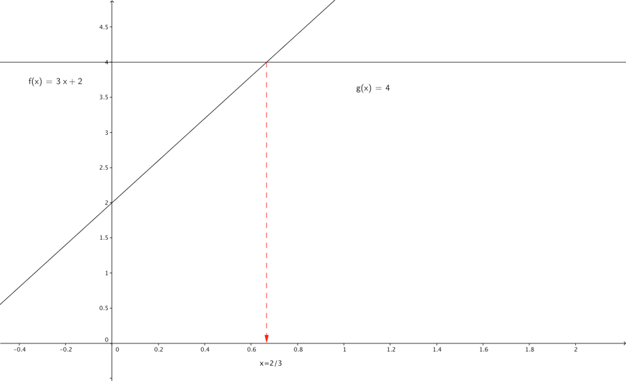{width="6.0in" height="3.651324365704287in"}  

## Selvtest ligninger, potens- procentregning

<a href="https://www.edutest.dk/mod/quiz/view.php?id=86" target="_blank">Gå til selvtesten her.</a>

# Funktioner og ligninger

## Lineære funktioner

### Video funktioner

<br>
<div class='embed-container'><iframe src='https://player.vimeo.com/video/282141226' frameborder='0' webkitAllowFullScreen mozallowfullscreen allowFullScreen></iframe></div>
<br>

### Video Geogebra hjælpeprogram til funktioner
Man kan med fordel benytte fx. Geogebra til at tegne og arbejde med funktioner.  

<br>
<div class='embed-container'><iframe src='https://player.vimeo.com/video/282491959' frameborder='0' webkitAllowFullScreen mozallowfullscreen allowFullScreen></iframe></div>
<br>

## Generel Forskift liniær funktion


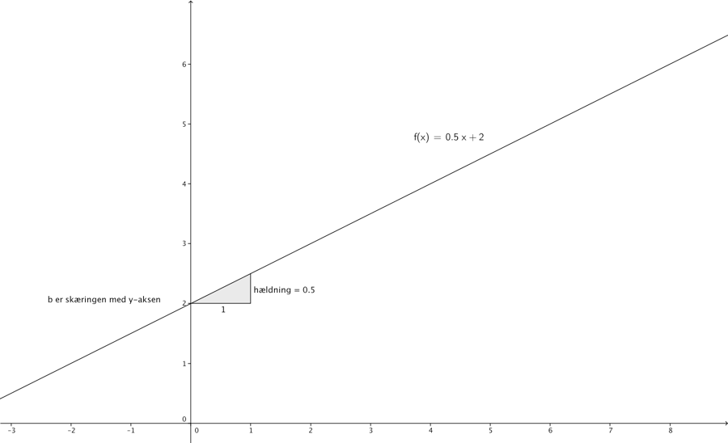{width="6.0in" height="3.651324365704287in"}


En funktion er et redskab, der beskriver sammenhængen mellem en uafhængig variabel x og en afhængig variabel y = f(x). Formen for en lineær funktionsforskrift skrives som:

$$f\left( x \right) = ax + b$$

$$hvor\ a,\ b\  \in \mathbb{R}$$

Vi kalder a for hældningskoefficienten, dette tal fortæller hvor meget y ændrer sig når x vokser med 1. Det vil sige hvor meget ændres funktionsværdien, når vi går en til højre på x-aksen. b er skæringen med y-aksen. Punktet hvor linjen skærer y-aksen har altid første-koordinat 0, dvs. punktet hedder (0,b).

På figuren ovenfor er $f\left( x \right) = 0,5x + 2$ tegnet ind. Her ses som nævnt, at linjen skærer y-aksen i (0,2), og hældningskoefficienten er 0,5.

Når man indsætter en x-værdi i funktionsforskriften får man funktionsværdien eller y-værdien. F.eks. vil x=2 give en y-værdi $f\left( 2 \right) = 0,5 \cdot 2 + 2 = 3$, det betyder punktet $\left( 2,\ 3 \right)$ ligger på den rette linje.

En lineær funktion med positiv hældning $\left( her\ a = 0,5 \right)$ er en monotont voksende funktion, en sådan funktion ligner en bakke der går opad. Jo større a er des stejlere er bakken. En lineær funktion med negativ hældning, er en funktion der er monotont aftagende, det er en funktion der går nedad.

Bestemmelse af forskrift baseret på 2 punkter
---------------------------------------------

Hvis vi kender 2 punkter $\left( x_{1},y_{1} \right)\ og\ (x_{2},y_{2})$ på en ligning kan vi bestemme funktionsforskriften, $f(x) = ax + b$

$$a = \frac{y_{1} - y_{2}}{x_{1} - x_{2}}$$

$$b = y_{1} - ax_{1}$$

Hvorfor? Fordi vi kan skrive opskrive 2 ligninger med 2 ubekendte (a og b), når vi kender den generelle funktionsforskrift og de to punkter:

$$y_{1} = ax_{1} + b$$

$${y_{2} = ax_{2} + b}$$

Se i senere afsnit hvordan man kan løse 2 ligninger med 2 ubekendte, her er de ubekendte jo a og b alle andre størrelser i ligningerne er kendte. Man kan så trække den ene ligning fra den anden, så forsvinder b, og man har en ligning med en ubekendt tilbage.

Hvis vi kender 2 punkter (2,3) og (4,1) på en lineær funktion og ønsker at bestemme forskriften, kan vi altså først finde a:

$$a = \frac{y_{1} - y_{2}}{x_{1} - x_{2}} = \frac{4 - 2}{1 - 3} = - \frac{2}{2} = - 1$$

Bemærk det er ligegyldigt hvilket punkt man vælger som $(x_{1},y_{1})$ og $(x_{2},y_{2})$, men rækkefølgen i brøken, når man har valgt, er vigtig.

Man bestemmer nemt b, da det nu er den eneste ukendte i de 2 ligninger, behøver vi blot indsætte de øvrige kendte værdier i den ene ligning.

$$b = y_{1} - ax_{1} = 3 - \left( - 1 \right) \cdot 2 = 5$$

Så forskriften bliver altså

$$y = - x + 5$$

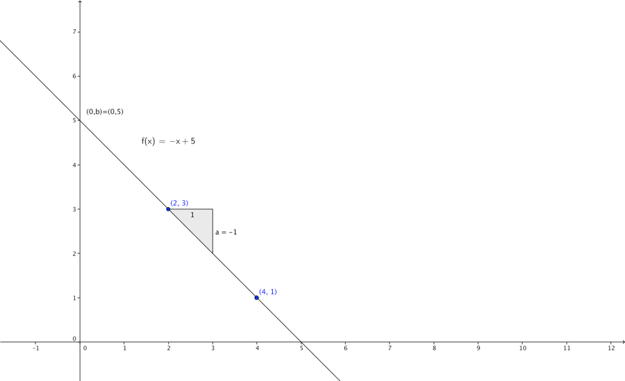{width="6.0in" height="3.6523173665791777in"}

Man kan også benytte <a href="https://www.wolframalpha.com" target="_blank">www.wolframalpha.com her.</a> til at bestemme linjen gennem 2 punkter. Skriv i feltet: line (2,3) and (4,1)  

Det giver ligeledes forskriften for linjen. Man kan ligeledes benytte Wolfram til løsning af uligheder.  

## Selvtest lineære funktioner

<a href="https://www.edutest.dk/mod/quiz/view.php?id=89" target="_blank">Gå til selvtesten her.</a>

  
# 2 ligninger med 2 ubekendte.


### Video 2 ligninger med 2 ubekendte.


<br>
<div class='embed-container'><iframe src='https://player.vimeo.com/video/282140987' frameborder='0' webkitAllowFullScreen mozallowfullscreen allowFullScreen></iframe></div>
<br>


En ligning med 2 ubekendte kan f.eks. være:

$$3x = 2y + 6$$

Denne ligning kan vi omskrive til:

$${y = 1\frac{1}{2}x - 3}$$

I koordinatsystemet vil denne ligning kunne afbilledes som nedenfor:

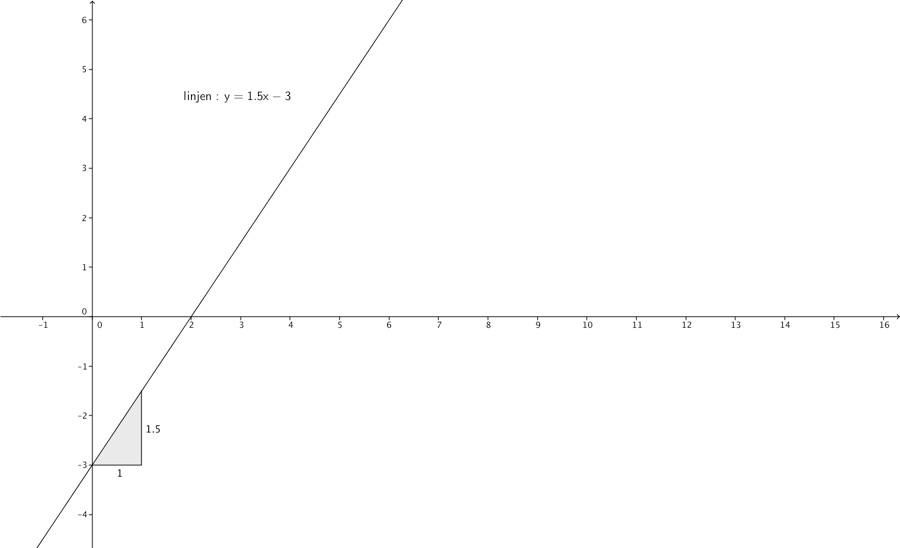{width="6.0in" height="3.6523173665791777in"}

Hvis man skal løse 2 ligninger med 2 ubekendte, skal man gøre det samme, som når man løser en ligning med en ubekendt. Man skal altså finde de værdier af de 2 ubekendte der gør begge ligninger sande samtidigt. Vi kalder også 2 ligninger med 2 ubekendte for et ligningssystem. Sådanne ligninger med 2 ubekendte kan tegnes som rette linjer i et koordinatsystem, og derefter løses grafisk. Det betyder ikke noget at de ubekendte hedder noget andet end x og y, man navngiver dem blot som hhv. x og y. Hvis man tegner ligningerne med de 2 ubekendte ind i koordinatsystemet, er skæringspunktet mellem de to rette linjer, netop der hvor begge ligninger er sande.

Hvis vi f.eks. skal løse de 2 ligninger:

$$3x = 2y + 6$$

$$y = \frac{1}{2}x + 1$$

Kan vi omskrive dem dvs. isolere y'erne på venstresiden:

$$y = 1\frac{1}{2}x - 3$$

$$y = \frac{1}{2}x + 1$$

Og vi indtegner disse og finder skæringspunktet:

$$3x = 2y + 6$$

$$y = 2x + 1$$

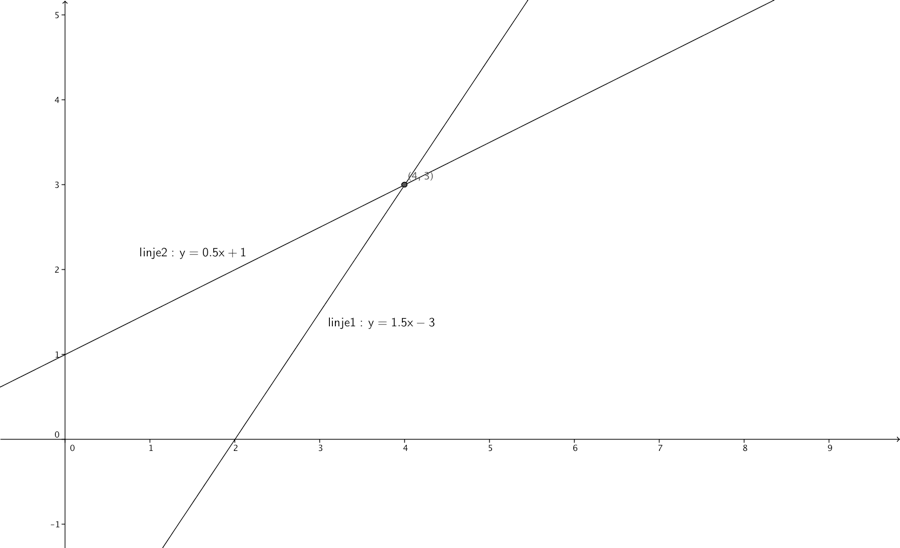{width="6.0in" height="3.6523173665791777in"}

Ligesom med en ligning kan løsningsmængden være tom (hvis de 2 linjer de 2 ligninger danner er parallelle) eller $\mathbb{R}^{2}$, (hvis ligningerne der dannes er identiske ). Men oftest vil linjerne skære hinanden.

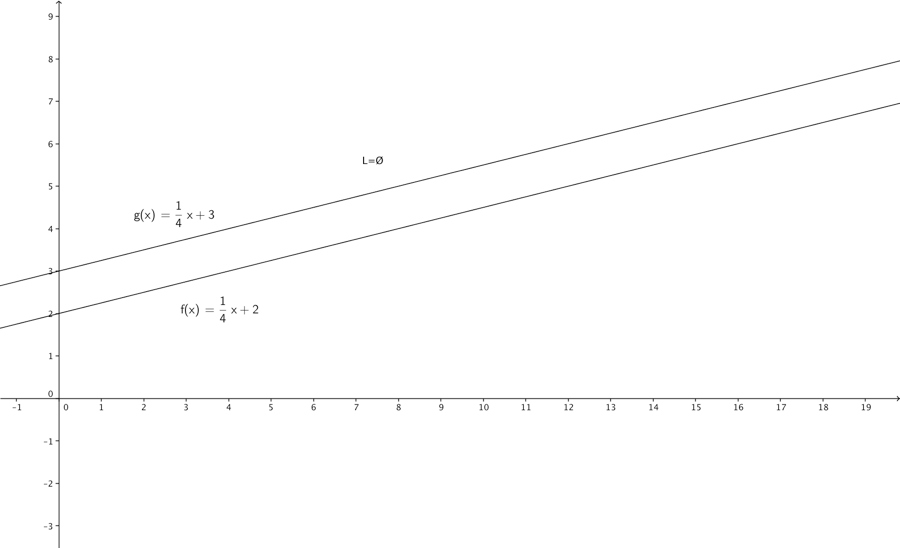{width="6.0in" height="3.6523173665791777in"}

Der findes flere metoder til løsning af 2 ligninger med 2 ubekendte bl.a. substitutionsmetoden. Når vi benytter substitutionsmetoden, isolerer vi y i begge ligninger:

$$y = 1\frac{1}{2}x - 3$$

$$y = \frac{1}{2}x + 1$$

Vi ved at y i første og anden ligning skal have samme værdi når vi finder en løsning. Derfor ved vi også at venstresiderne skal være ens. Vi sætter så venstresiderne lig med hinanden og isolerer x:

$$1\frac{1}{2}x - 3 = \frac{1}{2}x + 1$$

$$1\frac{1}{2}x - \frac{1}{2}x = 3 + 1$$

$$x = 4$$

Vi ved nu at når x er lig med 4, har vi en løsning. Så kan vi bare indsætte x=4, i en af de oprindelige ligninger og finde værdien af y.

$$y = 1\frac{1}{2}x - 3$$

$$y = 1\frac{1}{2} \cdot 4 - 3$$

$$y = 3$$

og vi ser at vi får samme løsning som da vi benyttede den grafiske metode.

$$(4,3)$$

Vi kan ligeledes løse 2 ligninger med 2 ubekendte vha. wolfram. Skriv på <a href="https://www.wolframalpha.com" target="_blank"> https://www.wolframalpha.com</a>: 3 x = 2 y + 6 and y = 1/2 x + 1  

Så får vi skæringen (4,3)  

Man kan løse ligningssystemer med flere end 2 ubekendte med matrix kommandoerne mmult og minverse i excel, men dette når vi ikke at gennemgå på dette kursus.

Vi bruger 2 ligninger med 2 ubekendte i mange økonomiske sammenhænge til fx. at finde den optimale mængde der skal afsættes for. Eller får at finde ligevægten på et marked som i eksemplet nedenfor.  

Udbuds- og efterspørgselskurver
-------------------------------

En vares prissætning er afgørende for hvor meget man kan afsætte af den pågældende vare. Jo højere pris desto færre varer kan man afsætte. Tilsvarende vil prissætningen være afgørende for, hvor meget producenterne vil udbyde, jo højere pris des flere varer udbydes. Vi forudsætter her at sammenhængen mellem pris og afsætning er lineær. Vi kan tegne efterspørgselskurver i et koordinatsystem med pris på y-aksen og afsætning på x-aksen. Dette er omvendt af hvordan vi normalt i matematik ville tegne en lineær funktion, idet vores forklarende variabel pris der styrer afsætningen er y.

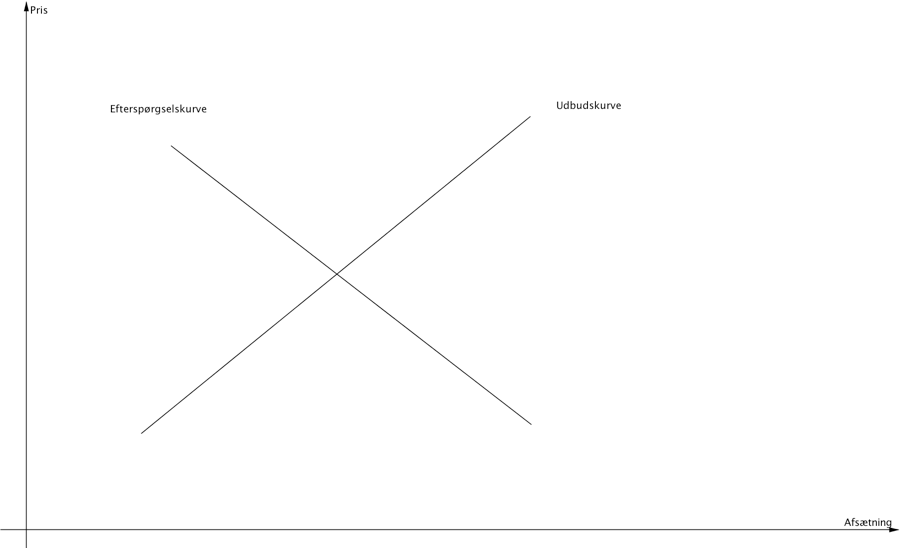{width="6.0in" height="3.651324365704287in"}

Efterspørgselskurven har negativ hældning og udbudskurven har positiv hældning.

Et marked er i ligevægt hvor udbuds- og efterspørgselskurven skærer hinanden.

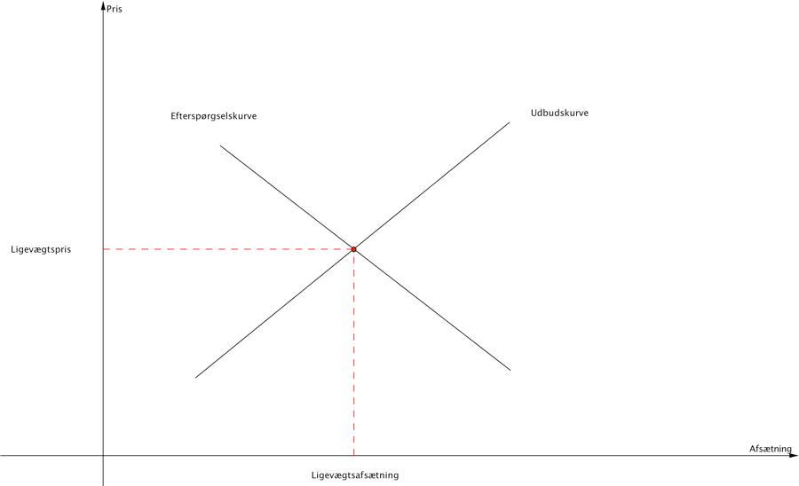{width="6.0in" height="3.651324365704287in"}

Hvordan finder vi ligevægtspris og afsætning?

Det gør vi ved [substitutionsmetoden](#ligninger-med-2-ubekendte.), som vi så tidligere.


## Selvtest 2 ligninger med 2 ubekendte

<a href="https://www.edutest.dk/mod/quiz/view.php?id=91" target="_blank">Gå til selvtesten her.</a>


Polynomier
==========


Polynomium betyder mange led. Grundformen for et n. gradspolynomium er:

$$f\left( x \right) = a_{n}x^{n} + a_{n - 1}x^{n - 1} + \ldots + a_{1}x + a_{0}$$

$$a_{0},\ldots a_{n} \in \mathbb{R,\ }n \in \mathbb{N,\ }a_{n} \neq 0\ \ $$

Hvor a-erne kaldes koefficienterne, og n angiver graden af polynomiet. Bemærk alle eksponenterne tilhører de naturlige tal.

En lineær funktion f.eks. $f(x) = 3x + 4$ kan også beskrives som et 1. gradspolynomium. Så er $a_{1} = 3,a_{0} = 4.$

$$f\left( x \right) = 4x^{3} + 3x^{2} + 2x + 2$$

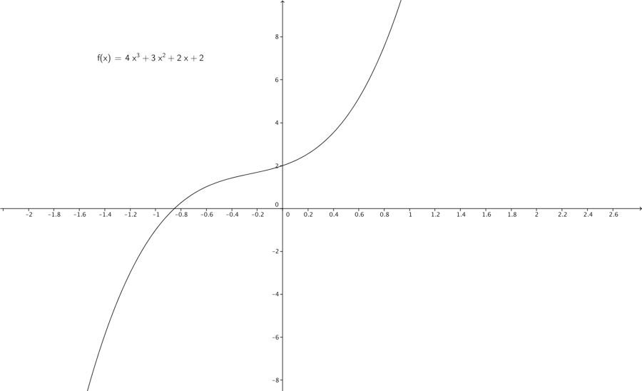{width="6.0in" height="3.651324365704287in"}

Er et 3. gradspolynomium eller en 3. gradsfunktion, polynomiet har navn efter første leds eksponent, der er den største eksponent.

2. Gradspolynomier
------------------

### Video 2. Gradspolynomier.


<br>
<div class='embed-container'><iframe src='https://player.vimeo.com/video/282141026' frameborder='0' webkitAllowFullScreen mozallowfullscreen allowFullScreen></iframe></div>
<br>

### Video Andengradsligninger.

<br>
<div class='embed-container'><iframe src='https://player.vimeo.com/video/282141011' frameborder='0' webkitAllowFullScreen mozallowfullscreen allowFullScreen></iframe></div>
<br>


Vi benytter indenfor økonomi gerne 2. gradsfunktioner til at beskrive f.eks. omsætningsfunktioner.

$$f\left( x \right) = - x^{2} + 3x + 4$$

Er et 2. gradspolynomium/gradsfunktion. Kurven vi kan tegne i koordinatsystemet, kalder vi en parabel.

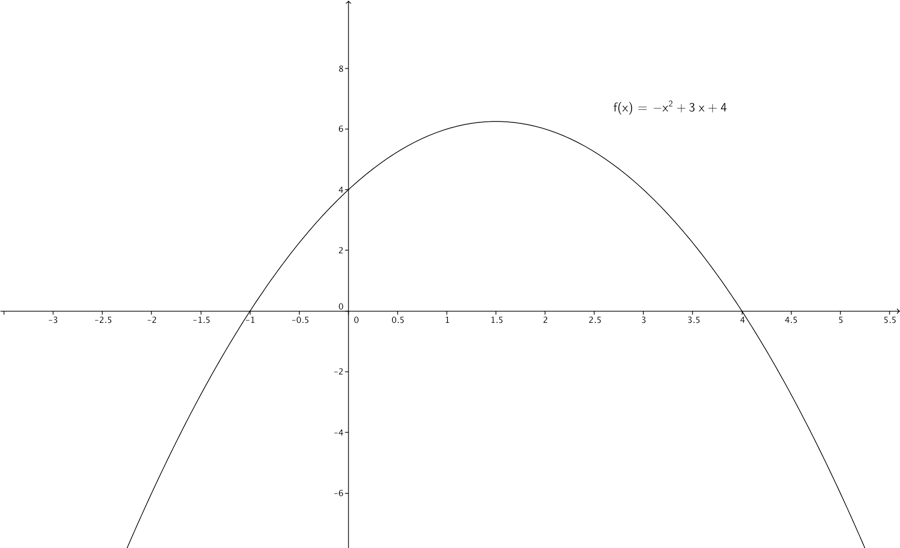{width="6.0in" height="3.651324365704287in"}

Specielt for 2. gradsfunktioner navngiver vi ofte koefficienterne med a, b og c i stedet for $a_{2},a_{1}\text{ og  }a_{0}$, dvs grundformen er: 

$$f\left( x \right) = ax^{2} + bx + c$$

Der gælder at når a som i eksemplet ovenfor er mindre end 0 nemlig -1, siger vi at parablen konkav, eller at grenene/benene vender nedad. Man kan sige grafen krummer nedad. Har 2 gradsfunktionen koefficient $a$ større end 0, siger vi at parablen konveks eller at grenene vender opad.

Vi definerer diskriminanten som $d = b^{2} - 4ac$

For $f\left( x \right) = 2x^{2} + 3x + 4$ er a=-2, b=3 og c=4. Således bliver diskriminanten $3^{2} - 4 \cdot - 1 \cdot 4 = 9 + 16 = 25$

Rødder er de x-værdier for hvilke $ax^{2} + bx + c = 0$. Nulpunkterne er de punkter hvor polynomiets kurve skærer x-aksen. Antallet af rødder for et 2. gradspolynomium bestemmes af værdien af diskriminanten. Hvis:


|Diskriminanten     |Rødder             |Parablen 
|:-------------      |:------------   |:------------   
negativ d<0         |Ingen                |Rører ikke x-aksen    
0                  |1 dobbeltrod               |Spidsen rører x-aksen   
positiv d>0           |2 rødder             |Passerer x-aksen           


I vores eksempel har vi en positiv diskriminant, man ved derfor at der er 2 rødder, dvs. man ved kurven krydser x-aksen to gange.

Man kan også hurtigt afgøre præcis hvor kurven skærer y-aksen, da er x jo 0. Man ved derfor at leddene $ax^{2}\text{ og bx}$ vil være 0. Kurven vil derfor skære i y-aksen i c, i vores eksempel (0,4).

Man kan uden at tegne 2. gradsfunktionens kurve afgøre at grenene vender nedad, hvor mange rødder der er, samt hvor på y aksen kurven skærer.

Når vi skal bestemme rødderne og dermed nulpunkterne[^1], kan man benytte følgende formel:

$$x = \frac{- b \pm \sqrt{d}}{2a}$$

I vores eksempel får vi:

$$x = \frac{- 3 \pm \sqrt{25}}{2 \cdot - 2} = \left\{ \begin{matrix}
\frac{- 3 + 5}{- 2} = - 1 \\
\frac{- 3 - 5}{- 2} = - \frac{- 8}{- 2} = 4 \\
\end{matrix} \right.\ $$

Det betyder altså at vi har nulpunkterne $\left( - 1,0 \right)\ og\ (4,0)$.

Vi kan bestemme toppunktet (der hvor parablen vender) ud fra formlen:

$$T = \left( - \frac{b}{2a}; - \frac{d}{4a} \right)$$

I eksemplet får vi:

$$T = \left( - \frac{3}{2 \cdot - 1}; - \frac{25}{4 \cdot - 1} \right) = \left( \frac{3}{2};6\frac{1}{4} \right)$$

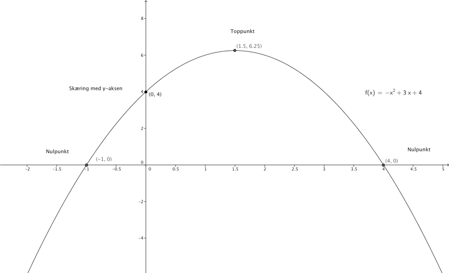{width="6.0in" height="3.651324365704287in"}

Hvis vi ser på 2. gradspolynomiet, $2x^{2} + 4x + 2$, er diskriminanten $d = 4^{2} - 4 \cdot 2 \cdot 2$=0. Derfor har vi dobbeltrod, parablens toppunkt berører (krydser ikke) x-aksen, vi har derfor sammenfald mellem toppunkt og nulpunkt.

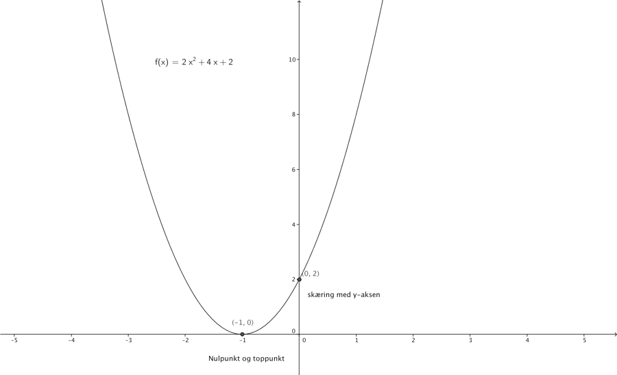{width="6.0in" height="3.651324365704287in"}

Hvis 2. gradspolynomiet, er $- 2x^{2} - 3x - 2$, har vi diskriminant $d = - 7$. Derfor har funktionen ingen rødder.

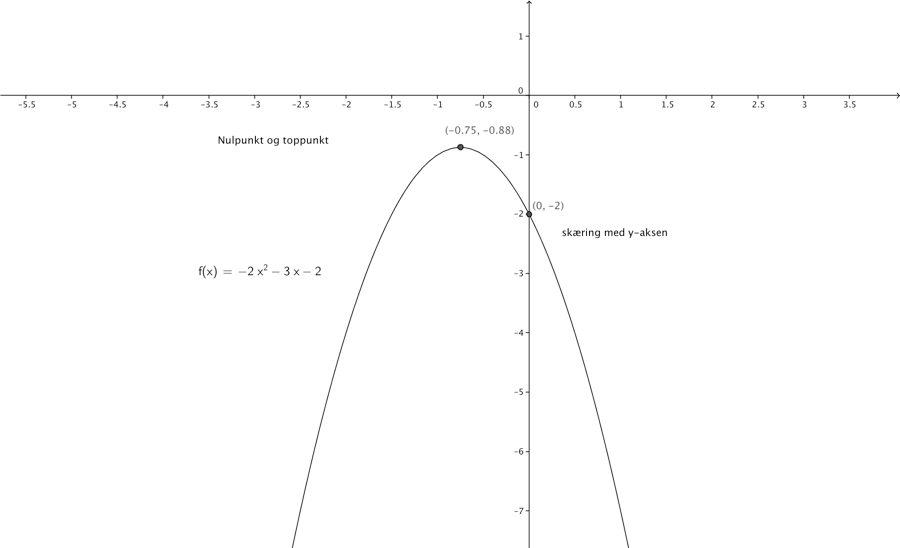{width="6.0in" height="3.651324365704287in"}


Differentialregning
===================

<br>
<div class='embed-container'><iframe src='https://player.vimeo.com/video/282141105' frameborder='0' webkitAllowFullScreen mozallowfullscreen allowFullScreen></iframe></div>
<br>


Når man differentierer en funktion f, kaldes resultatet " den afledede af f mht. x " eller "f mærke af x ". At differentiere en funktion mht. til x, er en operation, hvor vi finder en ny funktion, vi skriver $f^{'}\left( x \right)$, der er en del teori og beviser omkring dette, som vi ikke gennemgår her.

Hvis vi ser på grafen nedenfor, kan man se at funktionsværdien falder fra 0 til -1, når x ændres fra 0,5 til 1. Når x ændres fra 1 til 1,5 falder funktionsværdien fra -1 til -10,125.

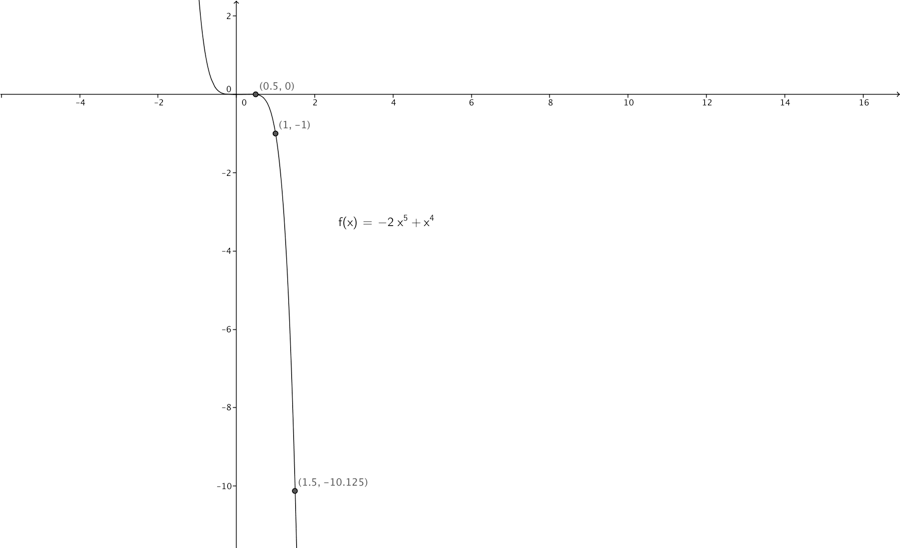{width="6.0in" height="3.651324365704287in"}

En funktion kan altså vokse eller aftage med forskellig hastighed i forskellige punkter. Denne punktvise hastighed kan vi beskrive ved hjælp differentialregning,

Vi kan beskrive denne hastighed af funktionsværdien i et punkt $\left( f\left( x \right),x \right)\ $vha. tangentens hældning i punktet. En tangent er en ret linje, der berører en kurve i et punkt, og har samme hældning som kurven i punktet. Vi kan se nedenfor, at i punktet (1,-1), har tangenten hældning -6. Denne hældning finder vi ved at differentiere funktionen f(x), vi kalder som nævnt den differentierede funktion " f mærke af x " og skriver $f'(x)$.

$$f\left( x \right) = - 2x^{5} + x^{4}$$

$$f^{'}\left( x \right) = 5 \cdot - 2x^{5 - 1} + 4 \cdot x^{4 - 1} = - 10x^{4} + 4x^{3}$$

Her er benyttet en del regler som vi vender tilbage til om et øjeblik.

Når vi har fundet f mærke af x, indsætter vi x værdien, fra punktet vi søger at finde hastigheden for. Da punktet er (1,-1), indsætter i altså 1 i $f'(x)$

$$f^{'}\left( 1 \right) = - 10 \cdot 1^{4} + 4 \cdot 1^{3} = - 10 + 4 = - 6$$

Det betyder at tangentens hældning i punktet (1,-1)[^4] -6, eller løst formuleret hastigheden i punktet er -6. Dette er tegnet ind nedenfor.

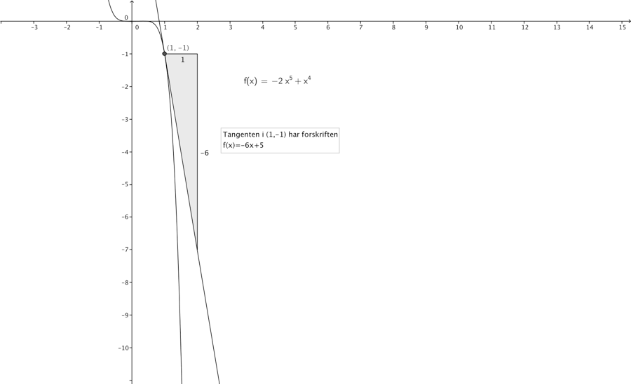{width="6.0in" height="3.651324365704287in"}

Regneregler differentiation 
----------------------------

Nedenstående skema giver en oversigt over gængse differentiationsregneregler, samt eksempler, k er en konstant $a,b \in \mathbb{R,\ }n \in \mathbb{N}$.

+-----------------------------------+-------------------------------------------------------------------+
| $$f(x)$$                          | $$f'(x)$$                                                         |
+===================================+===================================================================+
| $$k$$                             | $$0$$                                                             |
+-----------------------------------+-------------------------------------------------------------------+
| $$x$$                             | $$1$$                                                             |
+-----------------------------------+-------------------------------------------------------------------+
| $$\text{ax}$$                     | $$a$$                                                             |
|                                   |                                                                   |
| $$3x$$                            | $$3$$                                                             |
+-----------------------------------+-------------------------------------------------------------------+
| $$x^{n}$$                         | $$n \cdot x^{n - 1}$$                                             |
|                                   |                                                                   |
| $$x^{3}$$                         | $$3x^{2}$$                                                        |
+-----------------------------------+-------------------------------------------------------------------+
| $$e^{x}$$                         | $$e^{x}$$                                                         |
+-----------------------------------+-------------------------------------------------------------------+
| $$\ln\left( x \right)$$           | $$\frac{1}{x}$$                                                   |
+-----------------------------------+-------------------------------------------------------------------+
| $$\frac{1}{x^{n}} = x^{- n}$$     | $$- nx^{n - 1}$$                                                  |
|                                   |                                                                   |
| $$\frac{1}{x^{2}} = x^{- 2}$$     | $$- 2x^{- 3}$$                                                    |
+-----------------------------------+-------------------------------------------------------------------+
| $$\sqrt[n]{x} = x^{\frac{1}{n}}$$ | $$\frac{1}{n}x^{\frac{1}{n} - 1}$$                                |
|                                   |                                                                   |
| $$\sqrt[3]{x} = x^{\frac{1}{3}}$$ | $$\frac{1}{3}x^{\frac{1}{3} - 1} = \frac{1}{3}x^{- \frac{2}{3}}$$ |
+-----------------------------------+-------------------------------------------------------------------+

Vi har herudover følgende vigtige regneregler:

$$\left( f\left( x \right) \pm g\left( x \right) \right)^{'} = f^{'}\left( x \right) \pm g'(x)$$

f.eks.

$$\left( 3x^{2} - 2x \right)^{'} = 6x - 2$$

Produktreglen:

$$\left( f\left( x \right) \cdot g\left( x \right) \right)^{'} = f^{'}\left( x \right) \cdot g\left( x \right) + f\left( x \right) \cdot g'(x)$$

f.eks.

$$\left( 3x^{4} \cdot \ln\left( x \right) \right)^{'} = 12x^{3} \cdot \ln\left( x \right) + 3x^{4} \cdot \frac{1}{x} = 12x^{3} \cdot \ln\left( x \right) + 3x^{3}$$

Kvotientregnereglen:

$$\left( \frac{f\left( x \right)}{g\left( x \right)} \right)^{'} = \frac{f^{'}\left( x \right) \cdot g\left( x \right) - f\left( x \right) \cdot g^{'}\left( x \right)}{\left( g\left( x \right) \right)^{2}}$$

f.eks.

$${\left( \frac{2x^{2} - 3x + 3}{x + 5} \right)^{'} = \frac{\left( 4x - 3 \right) \cdot \left( x + 5 \right) - \left( 2x^{2} - 3x + 3 \right) \cdot 1}{\left( x - 5 \right)^{2}} = }{\frac{4x^{2} + 20x - 3x - 15 - 2x^{2} + 3x - 3}{\left( x - 5 \right)^{2}} = \frac{2x^{2} + 20x - 18}{\left( x - 5 \right)^{2}}}$$

<!-- Differentiation af sammensatte funktioner. -->
<!-- ------------------------------------------ -->

<!-- En funktion f.eks. $$h\left( x \right) = \sqrt{3x^{2} + x}$$  -->
<!-- kaldes en sammensat funktion af de to funktioner den ydre  -->
<!-- $$f\left( x \right) = \sqrt{\ldots}$$  -->
<!-- og den indre $$g\left( x \right) = 3x^{2} + x$$ -->
<!-- Man skriver det som: -->
<!-- $$h\left( x \right) = f\left( g\left( x \right) \right)$$ -->
<!-- og siger f af g af x, eller  -->
<!-- $$h\left( x \right) = \left( f \circ g \right)\left( x \right)$$" -->
<!-- f bolle g -->

<!-- Man kan finde den afledte af en sammensat funktion som: -->

<!-- $$\left( h\left( x \right) \right)^{'} = f^{'}\left( g\left( x \right) \right) \cdot g'(x)$$ -->

<!-- I vores eksempel får vi altså: -->

<!-- $$\left( \sqrt{3x^{2} + x} \right)^{'} = \left( \left( 3x^{2} + x \right)^{\frac{1}{2}} \right)^{'} =$$ -->

<!-- $${\frac{1}{2}\left( 3x^{2} + x \right)^{\frac{1}{2} - 1} \cdot (6x + 1) = \frac{12x + 2}{\sqrt{3x^{2} + x}}}$$ -->

<!-- Funktionen -->

<!-- $$e^{3x^{2}}$$ -->

<!-- $$g\left( x \right) = 3x^{2},\ f\left( x \right) = e^{\ldots}$$ -->

<!-- Så den afledede bliver: -->

<!-- $$e^{3x^{2}} \cdot 6x$$ -->

<!-- Man kan også med fordel benytte differentiation af sammensatte funktioner i forbindelse med differentiationen andre udtryk f.eks. brøker. -->

<!-- $$\frac{2x^{2} + 3x + 3}{\sqrt{4x^{3} + 2x^{2}}}$$ -->

<!-- Her kan man særskilt afgøre hvad den afledte til nævneren i brøken bliver, og herefter fortsætte med at finde den afledte til brøken. -->

<!-- Man kan med fordel kontrollere sine resultater på <a href="https://www.wolframalpha.com" target="_blank">www.wolframalpha.com her.</a>. Det er gratis at bruge internetversionen, der naturligvis ikke fungerer offline. -->

<!-- Husk hvis man kan huske potensregnereglerne kan man spare sig selv for bøvl, f.eks. kan man finde den afledede til $f\left( x \right) = \frac{1}{9}\left( 3x^{2} \right)^{3}$ nemmere ved at reducere før man differentierer. -->

<!-- $$\frac{1}{9}\left( 3x^{2} \right)^{3} = \frac{1}{9} \cdot 27 \cdot x^{6} = 3x^{6}$$ -->

<!-- Dette udtryk kan jo differentieres direkte til$\ 18x^{5}$. -->

Ekstremumspunkter
-----------------

Indenfor økonomi er det vigtigt at kunne finde den afledede, når $f^{'}\left( x \right) = 0\ $, har vi et globalt eller lokalt, minimum eller maksimum. Man vil således være i stand til at bestemme, f.eks. maksimal omsætning for en omsætningsfunktion vha. differentialregning. Antag vi har en pris/afsætningsfunktion $f\left( x \right) = - 0.25x + 10$. Udfra denne kan vi danne omsætningsfunktionen.

> Omsætning er jo per definition pris gange afsætning. Sælger man 3 is til 10 kr. er afsætningen 3 stk. og omsætningen 30 kr.


Afsætningen er vores x-værdi, og den tilsvarende pris er jo vores funktionsværdi f(x). Derfor kan vi bestemme omsætningsfunktionen som

$$\text{Oms}\left( x \right) = x \cdot f\left( x \right) = x\left( - 0.25x + 10 \right) = - 0.25x^{2} + 10x$$

Vi kan nu bestemme den afledte til omsætningsfunktionen som:

$$\text{Om}s^{'}\left( x \right) = - 0.5x + 10$$

Man kalder også den afledte til omsætningsfunktionen for GROMS grænseomsætningen eller MR marginal revenue, funktionsværdierne for $\text{Om}s^{'}\left( x \right)$, angiver hældningerne for tangenterne på $Oms(x)$ kurven for forskellige afsætningsværdier. GROMS fortæller hvor meget omsætningen vokser med når afsætningen x eller Q vokser med en enhed.

> Hvis en issælger har MR på 5 kr. Betyder det at omsætningen vokser med 5 kr. hvis afsætningen vokser med en is.

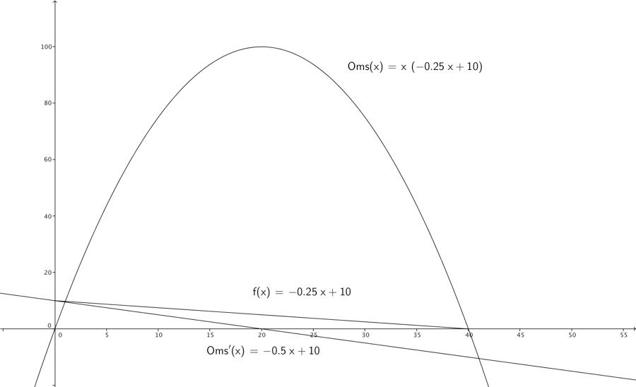{width="6.0in" height="3.651324365704287in"}

Tangentens hældninger angiver funktionens fart, når tangentens hældning er 0, vokser omsætningen ikke. Nedenfor er indtegnet 3 tangenter med de tilsvarende hældninger. Ved en afsætning $x = 5$ er tangenthældningen 7,5, omsætningen vokser altså. Ved en afsætning $x = 20$ er tangenthældningen 0, omsætningen har altså nået et ekstremum i dette tilfælde et globalt maksimum. Ved en afsætning $x = 30$ er tangenthældningen -5, omsætningen er altså aftagende. Man kan også se på $Oms'(x) - GROMS - MR$ kurven, at denne er lig med 0, netop når x er 20.

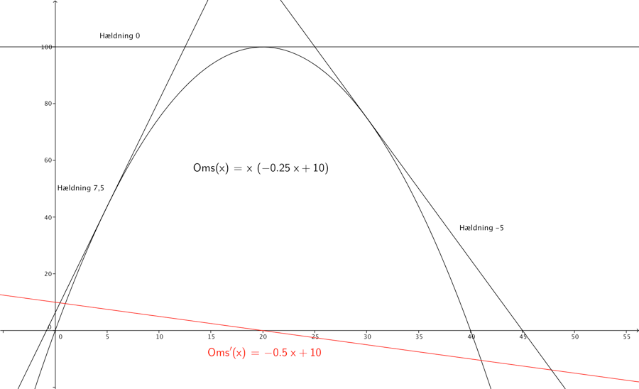{width="6.0in" height="3.651324365704287in"}

Normalt vil man for at bestemme ekstremumspunkter for en funktion blot, differentiere denne og sætte den afledte funktion lig med 0, så kan man bestemme de x'er for hvilket ligningen er sand. I vores eksempel, ville vi altså bestemme $\text{Om}s^{'}\left( x \right).$

$$- 0,5x + 10$$

Og sætte udtrykket lig med 0 og løse mht. x

$$- 0,5x + 10 = 0$$

$$x = 20$$

Lokale og globale ekstremumspunkter
-----------------------------------

Hvis vi har funktioner med flere ekstremaer, må man for at afgøre om der er tale om lokale/globale ekstremaer bestemme funktionsværdierne for x-værdi kandidaterne. I tegningen nedenfor har vi et 4-gradspolynomium $f\left( x \right) = x^{4} - 3x^{3} + 2x^{2} + 3$, her kan man se at den afledede $f^{'}\left( x \right) = \ 4x^{3} - 9x^{2} + 4x $ er tegnet ind med rødt, det fremgår at $f'(x)$ har 3 nulpunkter, hvorfor vi kan konkludere at $f\left( x \right)$ har 3 ekstremaer, lokalt minimum i $(0;3),\ $lokalt maksimum i $(0.6069;3.2017)$ og globalt minimum i (1.6404; 2.3803). Et globalt ekstremum er altså funktionens største eller mindste værdi i hele definitionsmængden. Et lokalt ekstremum er altså funktionens største eller mindste værdi i en omegn omkring punktet.

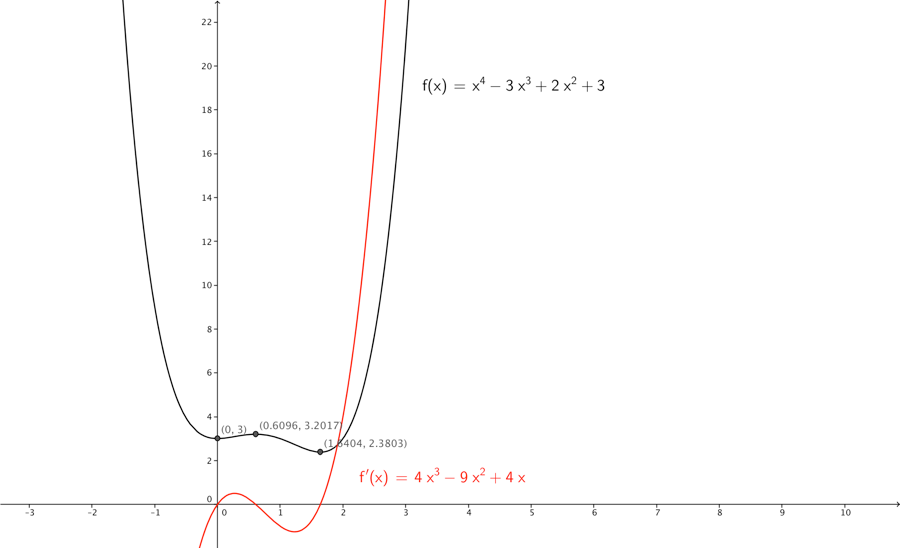{width="6.0in" height="3.651324365704287in"}

Konveksitet og konkavitet
-------------------------

Vi kan ved finde den dobbeltaflede (dvs. differentiere 2 gange) for en funktion , afgøre hvornår en funktion er konkav eller konveks. Dette kan direkte fortælle os om en funktion har maksimum eller minimum i et ekstremumspunkt. I intervaller hvor en funktion er konveks dvs. krummer opad vil ekstremumspunkter være minima, i disse intervaller vil den dobbeltafledede være positiv. I intervaller hvor en funktion er konkav dvs. krummer nedad vil ekstremumspunkter være maksima, i disse intervaller vil den dobbeltafledede være negativ. Når $f^{''}\left( x \right) = 0\ $ skifter grafen mellem konveks og konkav eller omvendt, vi siger grafen har vendetanget. I eksemplet nedenfor kan man se $f\left( x \right)$ er blå når den er konkav, og rød når den er konveks, hvilket stemmer overens med $f''(x)$, der er hhv. negativ for $x \in \rbrack - \infty;1\lbrack$ og positiv for $x \in \rbrack 1;\infty\lbrack$.

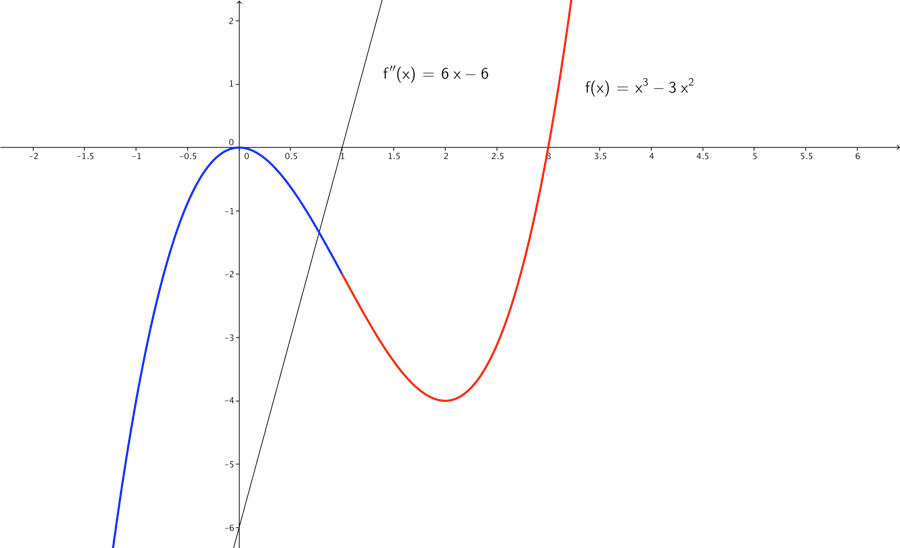{width="6.0in" height="3.651324365704287in"}

Sammenhænge AVC, ATC, TC, TR, MC, MR og $\mathbf{\pi}$
------------------------------------------------------

Vi kan ud fra pris- afsætningskurven P(Q), altså kurven der angiver hvilken mængde man kan afsætte, finde TR(Q) ved at gange med Q.

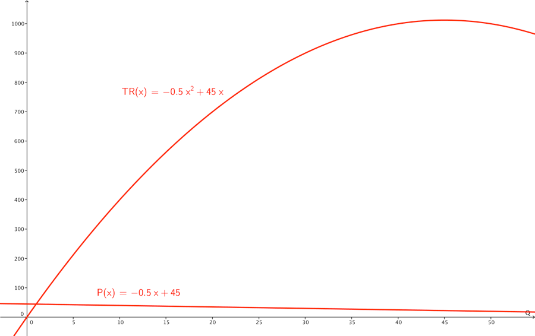{width="6.0in" height="3.774410542432196in"}

Q er quantity/mængde, der produceres og afsættes ud af x-aksen denne uafhængige variabel styrer værdien af de nedenstående størrelser:

FC fixed costs (dansk FO faste omkostninger)

VC total variable costs (dansk VO variable omkostninger).

TC total costs, kan beregnes som VC + FC

AVC average variable costs (dansk VE variable enhedsomkostninger) betyder den gennemsnitlige variable omkostning pr. stk., denne kan beregnes som $AVC = \frac{\text{VC}}{Q}$

ATC average total costs kan beregnes som $ATC = \frac{\text{TC}}{Q}$

MC marginal cost (dansk GROMK grænseomkostninger) betyder hvad koster det at producere en enhed mere. $MC = \frac{\text{dTC}}{\text{dQ}} = \frac{\text{dVC}}{\text{dQ}}$, grafisk er MC hældningen af tangenten i et punkt på TC kurven.

Nedenfor er ovenstående sammenhænge illustreret, bemærk bl.a. at for en afsætning Q på 8, er tangenten med hældning MC indtegnet på både TC og VC kurverne. Her kan man se hvordan vi vil beregne MC ud fra både TC og VC som nævnt ovenfor.

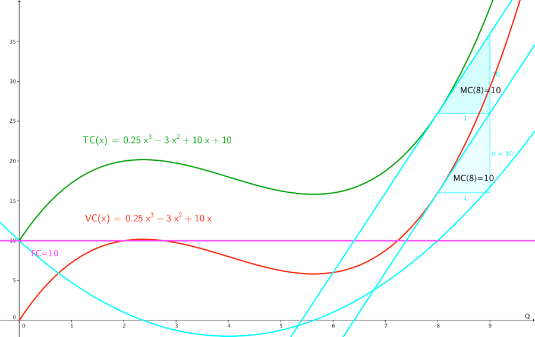{width="6.0in" height="3.7853937007874014in"}

I nedenstående plot er ATC og AVC tegnet ind sammen med TC og VC.

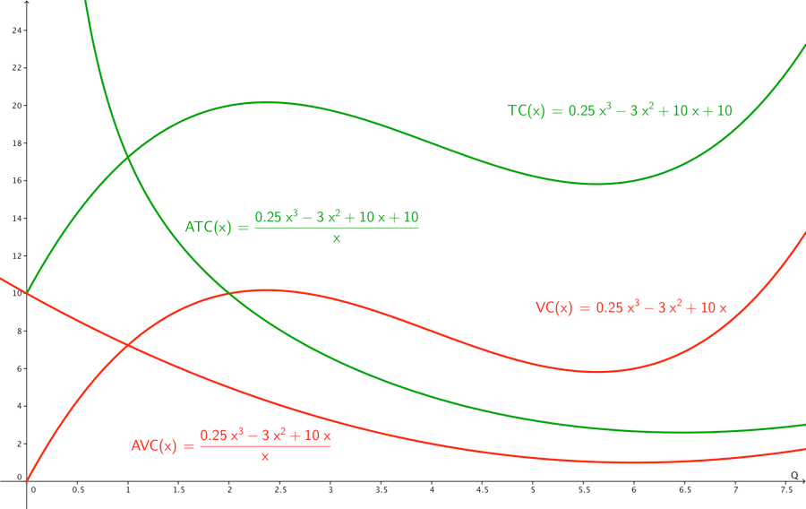{width="6.0in" height="3.7853937007874014in"}

Optimeringseksempel
-------------------

TR total revenue er omsætningen.

MR marginal revenue (dansk Groms grænseomsætningen ) betyder, hvad øges omsætningen med, når der afsættes en enhed mere. $MR = \frac{\text{dTR}}{\text{dQ}}$ , grafisk er MR hældningen af tangenten i et punkt på TR kurven.

I tegningen nedenfor er indtegnet en blå TR kurve og en rød MR kurve og 2 sorte tangenter, hvor MR er hhv. 25 og 0. X-aksen angiver afsætningen Q, y-aksen omsætningen. Man kan se at der hvor MR kurven skærer x-aksen (dvs er 0), har TR-kurven maksimum, for denne afsætning Q=45 er hældningen på tangenten 0. Bemærk MR er den afledte af TR. Den maksimale omsætning bliver $\text{TR}\left( 45 \right) = - 0,5{\cdot 45}^{2} + 45 \cdot 45 = 1012,5$.

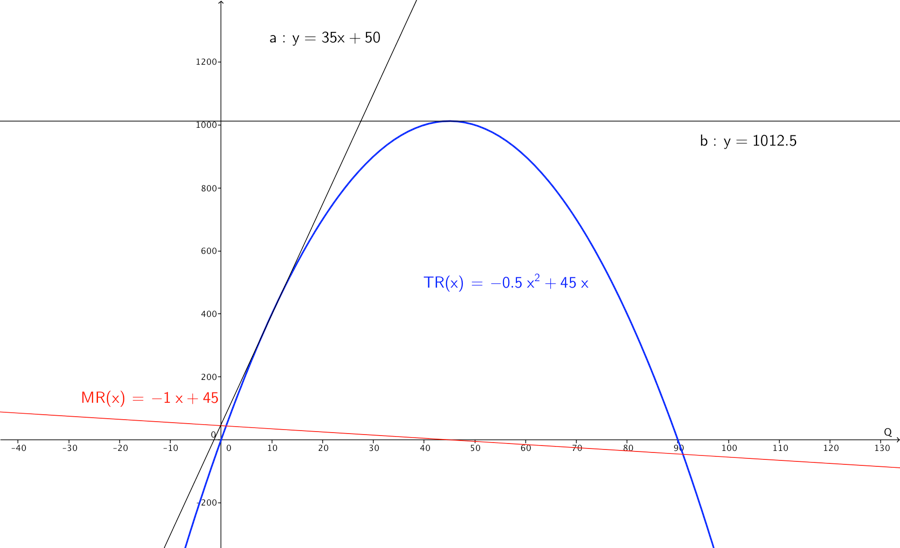{width="6.0in" height="3.651943350831146in"}

Hvis vi også har en TC total costs funktion f.eks. $TC = 0,25Q^{3} - 6Q^{2} + 60Q$, kan vi udfra denne beregne profitfunktion π som.

$$\pi = TR - TC = - 0,5Q^{2} + 45Q - \left( 0,25Q^{3} - 6Q^{2} + 60Q \right) =$$

$$- 0,25Q^{3} + 5,5Q^{2} - 15Q$$

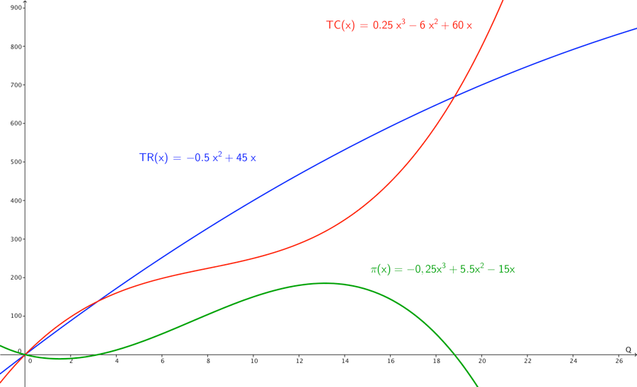{width="6.0in" height="3.6523173665791777in"}

Når vi skal finde den optimale profit, skal vi altså finde maximum for π --funktionen, kan vi differentiere denne, og bestemme hvor den afledede π' er 0. Der hvor π' er 0 ligger tangenten vandret, her har π ekstremumspunkter. For at afgøre om der er tale om maksimum eller minimum kan man tage den dobbeltafledede π'', for intervaller hvor den π'' er negativ, er π konkav (krummer nedad) i disse intervaller vil der være et maksimum.

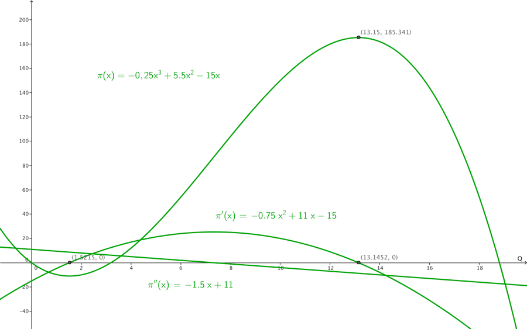{width="6.0in" height="3.75167760279965in"}

Hvis vi skal finde maksimum ved udregning, finder vi π' og finder nulpunkter for denne, herefter π'' bestemmer fortegn for nulpunkter, nulpunkt med negativ dobbeltafledet er et maksimum.

$$\pi^{'} = 3 \cdot - 0,25Q^{3 - 1} + 2 \cdot 5,5Q^{2 - 1} - 15 = - 0,75Q^{2} + 11Q - 15$$

$$rø\ \ dder = \left\{ \begin{matrix}
\frac{- 11 + \sqrt{11^{2} - 4 \cdot - 0,75 \cdot - 15}}{2 \cdot - 0,75} = \frac{- 11 + \sqrt{121 - 45}}{- 1,5} \approx 1,52 \\
\frac{- 11 - \sqrt{11^{2} - 4 \cdot - 0,75 \cdot - 15}}{2 \cdot - 0,75} = \frac{- 11 - \sqrt{121 - 45}}{- 1,5} \approx 13,15 \\
\end{matrix} \right.\ $$

Vi kan se på tegningen ovenfor, at rødderne stemmer overens med nulpunkterne. Vi udregner nu $\pi''$.

$$\pi^{''} = 2 \cdot - 0,75Q^{2 - 1} + 11 = - 1,5Q + 11$$

Vi ser at $\pi''\left( 1,52 \right) = - 1,5 \cdot 1,52 + 11 = 8.72$ dvs. π er konveks for $Q = 1,52$, dette punkt er altså et minimum.

Vi ser at $\pi''\left( 13,15 \right) = - 1,5 \cdot 13,15 + 11 = - 8,73$ dvs. π er konkav for $Q = - 8.725$, dette punkt er altså et maksimum.

Man kan nu udregne den maksimale profit som $\pi\left( 13,15 \right) \approx 185,34$.

Bemærk at man kan også bestemme den optimale afsætning Q, ved at bestemme MC og MR, og sætte disse lig med hinanden, se nedenstående tegning.

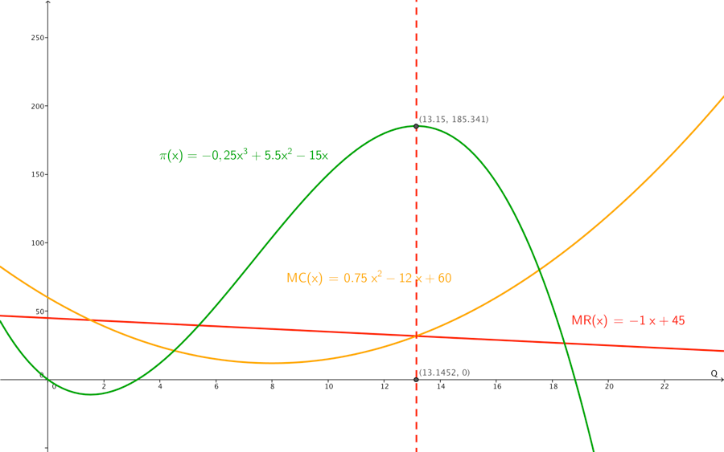{width="6.0in" height="3.75167760279965in"}

Finansiel regning
=================


<br>
<div class='embed-container'><iframe src='https://player.vimeo.com/video/282141416' frameborder='0' webkitAllowFullScreen mozallowfullscreen allowFullScreen></iframe></div>
<br>


### Nutidsværdi og fremtidsværdi af en kapital

Vi benytter i finansiel regning vor viden fra eksponentielle funktioner, nedenstående eksempel viser hvordan sammenhængen er:

En kapital på K~0~ = 10.000 kr. sættes ind på en bankkonto, hvor der hvert år tilskrives en rente på 10%. Betegner vi kapitalens værdi efter 1 år med K~1~ , er denne:

K~1~ =10.000⋅1,10=11.000 kr.

da vi lægger 10 % til et tal ved at gange tallet med 1,10.

Efter 2 år er kapitalens værdi vokset til

K~2~ =11.000⋅1,10=12.100 kr.

og efter 3 år står der følgende beløb på bankkontoen

K~3~ =12.100⋅ 1,10=13.310 kr.

Der gælder altså at:

K~1~ =K~0~ ⋅ (1+r)

K~2~ =K~1~ ⋅ (1+r)

K~3~ =K~2~ ⋅ (1+r)

Osv.

Men dette kan vi skrive som:

K~1~ =K~0~ ⋅ (1+r)

K~2~ =K~0~ ⋅ (1+r)⋅(1+r)

K~3~ =K~0~ ⋅ (1+r)⋅(1+r)⋅(1+r)

Osv.

Eller vha. Potensregnereglerne:

K~1~ =K~0~ ⋅ (1+r)

K~2~ =K~0~ ⋅ (1+r)^2^

K~3~ =K~0~ ⋅ (1+r)^3^

^.^

^.^

^.^

K~n~ =K~0~ ⋅ (1+r)^n^

En mand sætter 10.000 ind på en konto med årlig rentetilskrivning 5%, hvad har han på kontoen efter 3, 13 og 30 år ?

$$K_{3} = 10.000 \cdot {1,05}^{3} = 11.576,25$$

$$K_{13} = 10.000 \cdot {1,05}^{13} = 18.856,49$$

$$K_{30} = 10.000 \cdot {1,05}^{30} = 43.219,42$$

I excel den engelske version, kan man enten skrive ovenstående formler ud, eller benytte fv kommandoen, fv betyder future value. I den danske version skriver man også fv for fremtidsværdi. I første søjle nedenfor står resultaterne, i anden søjle formlen i gåseøjne. Bemærk der er forskel på hvad man separerer argumenter med i forskellige excel-versioner, nogle versioner bruger komma "," , andre versioner bruger semikolon ";". Man kan se hvad man skal bruge i den hjælpetekst der kommer op med gult.

De forskellige argumenter er:

FV(terminsrenten som decimaltal; antal terminer, ydelsen[^2]; nutidsværdi/pv/present value; type angiver man ikke da den står default korrekt)

I B2 cellen nedenfor står der derfor:

=FV(0,05;3;0;-10000)

Vi har altså 5% terminsrente, 3 terminer, ydelser 0 og -10.000,- i nutidsværdi. Bemærk excel angiver nutidsværdien med negativ værdi, man indsætter jo et beløb i dag, man kan tænke på det som man tager penge op af lommen i dag (derfor minus) og sætter dem ind på sin konto. Resultatet fremtidsværdien, bliver positivt, man angiver jo beløbet, man kan hæve og putte i lommen igen.

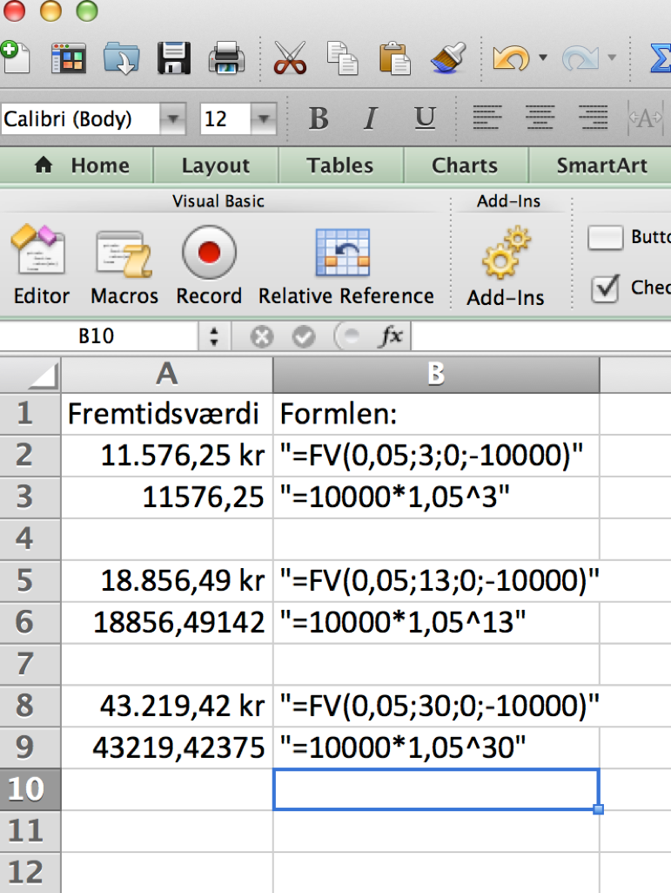{width="5.139245406824147in" height="6.833807961504812in"}

Vi kan opfatte fremtidsværdien K~n~ af en kapital K~0~ på et vilkårligt tidspunkt n ude i fremtiden som en funktion af antallet af år/terminer. Dvs. kapitalen er en konstant, (1+r) er en konstant.

Men potensen n er den variable.

K~n~ =K~0~ ⋅ (1+r)^n^

Kaldes fremskrivningsformlen, vi kalder

K~0~ kapitalen/ nutidsværdien/begyndelsesværdien

K~n~ fremtidsværdien

r renten/vækstraten

a = 1 + r fremskrivningsfaktoren/grundtallet

Vi har altså den generelle formel for fremtidsværdien af en kapital.

$$K_{n} = K_{0}\  \cdot \ \left( 1 + r \right)^{n}$$

Ved at isolere $K_{0}$ får vi formlen for nutidsværdien af en kapital.

$$K_{0}\  = K_{n}\ \left( 1 + r \right)^{- n}$$

Tilsvarende kan vi isolere antallet af terminer vha. logaritmefunktionen ln.

$$K_{n} = K_{0}\  \cdot \ \left( 1 + r \right)^{n}$$

$${\frac{K_{n}}{K_{0}} = \ \left( 1 + r \right)^{n}\ }$$

$${\ln\left( \frac{K_{n}}{K_{0}} \right) = n \cdot \ln\left( 1 + r \right)}$$

$${n = \frac{\ln\left( \frac{K_{n}}{K_{0}} \right)}{\ln\left( 1 + r \right)}\ }$$

Vi kan ligeledes isolere renten r.

$$K_{n} = K_{0}\  \cdot \ \left( 1 + r \right)^{n}$$

$${\frac{K_{n}}{K_{0}} = \left( 1 + r \right)^{n}}$$

$${\sqrt[n]{\frac{K_{n}}{K_{0}}} = 1 + r}$$

$${r = \sqrt[n]{\frac{K_{n}}{K_{0}}} - 1}$$

Annuiteter
----------

<br>
<div class='embed-container'><iframe src='https://player.vimeo.com/video/282141038' frameborder='0' webkitAllowFullScreen mozallowfullscreen allowFullScreen></iframe></div>
<br>

En annuitet er en række lige store betalinger/ydelser betalt ved starten af tidintervaller/terminer, af samme længde, renten er ens og tilskrives efter hver termin.

## Fremtidsværdi af en annuitet

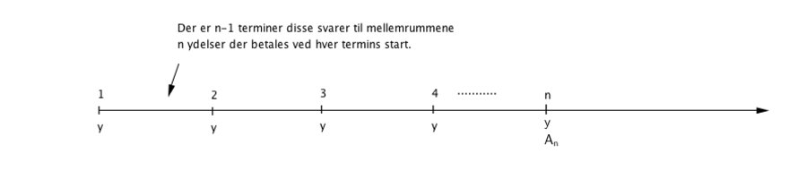{width="6.0in" height="1.398611111111111in"}

Hvis man indbetaler ydelsen y på en konto n gange til en fast terminsrente r, vil man kunne hæve $A_{n}$, på tidspunkt n. Man kalder denne formel opsparingsformlen, fordi man sparer et beløb op det opsparede beløb på tidspunkt n er $A_{n}$. Dette er illustreret på tidslinjen ovenfor, formlen for fremtidsværdien af annuiteten bliver:

$$A_{n} = y \cdot \frac{\left( 1 + r \right)^{n} - 1}{r}$$

En person indbetaler hvert halve år 1.000,- på en konto med halvårlig rentetilskrivning $r = \ 0,02$, der foretages 10 indbetalinger, hvad er saldoen på kontoen efter sidste indbetaling.

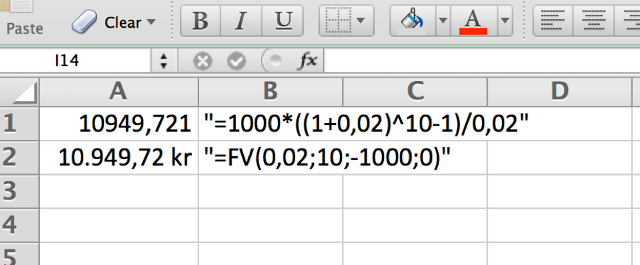{width="6.0in" height="2.4881944444444444in"}

Her benytter vi i B2 cellen igen FV kommandoen. Bemærk ydelse/pmt argumentet der før var 0 er nu -1000, mens pv/nutidsværdi nu er 0. De -1000 er det beløb personen skal indbetale, i starten af hver termin.

Man kan komme ud for at man ikke kender en af de andre størrelser r, n eller y, men derimod kender $A_{n}$. Hvis y eller n er ukendte, kan man udfra ovenstående formel isolere den ukendte størrelse ved reduktionsregnereglerne.

$$y = A_{n} \cdot \frac{r}{\left( 1 + r \right)^{n} - 1}$$

Excelformlen er PMT (YDELSE dansk version) denne bruger følgende argumenter

PMT(rate, nper, pv, fv, type), bemærk denne formel kan bruges til at finde ydelsen for både opsparings- og gældsformlen. Opsparingsformlens fv-værdi skal være 0.

Hvis man skal finde n, kan man isolere n i opsparingsformlen, man får da:

$$A_{n} = y \cdot \frac{\left( 1 + r \right)^{n} - 1}{r} \Leftrightarrow$$

$$n = \frac{\ln\left( \frac{A_{n} \cdot r}{y} + 1 \right)}{\ln\left( 1 + r \right)}$$

Eller bruge NPER(rate,pmt,pv,fv,type) funktionen i excel, her skal man huske at pv present value skal være 0. Hvis Öztürk ønsker at have $A_{n} =$15.000,- til rådighed, og kan betale terminsydelser på $y = 500, -$ og terminsrenten er r=0,01, hvor mange ydelser skal der da betales.

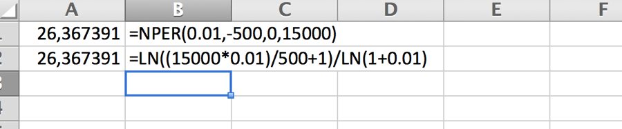{width="6.0in" height="1.24375in"}

Hvis renten er ukendt kan vi ikke opskrive en entydig formel hvor r isoleres. Vi kan benytte excels RATE(nper,pmt,pv,fv,type,guess) funktion. Hvis Sørensen indsætter 2000 hvert 12 gange, og han lige efter sidste indsættelse har 25340,- på kontoen, har terminsrenten været:

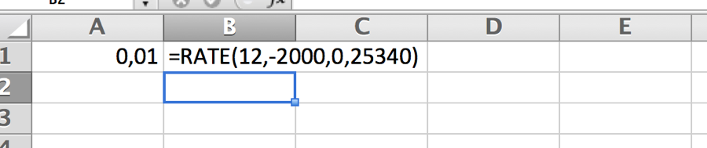{width="6.0in" height="1.2569444444444444in"}

## Nutidsværdi af en annuitet

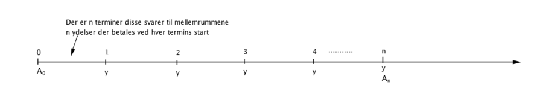{width="6.0in" height="1.1493055555555556in"}

Nutidsværdien af en annuitet fortæller os hvad en person kan låne på tidspunkt 0, hvis han i n terminer afdrager samme beløb y, og renten tilskrives terminsvis. Bemærk tidslinjen har tidpunkt 0 med, i modsætning til fremtidsværdien af en annuitet, det er på dette tidspunkt man låner beløbet $A_{0}$. Man kalder formlen for nutidsværdien af en annuitet gældsformlen fordi, man stifter gæld på tidspunkt 0. Hvorfor starter man ikke ved 1 ligesom i forrige formel, det skyldes at når man ønsker at låne penge nu, låner man ikke penge man betaler tilbage med det samme, dem ville man jo så alligevel ikke have glæde af.

$$A_{0} = y \cdot \frac{1 - \left( 1 + r \right)^{- n}}{r}$$

Hvis en person kan afdrage y/pmt. kr. 1.000,- på et lån over n=10 terminer, og der på restgælden tilskrives en fast terminsrente r=0,02, ved begyndelsen af hver termin, kan han i alt låne kr. 8.982,50 kr nu. Den første linje i udskriften fra excel, viser hvordan formlen bruges. Den anden linje viser hvorledes den indbyggede excelfunktion beregner nutidsværdien, bemærk PV (present value) er den engelske formel den danske hedder NV (nutidsværdien).

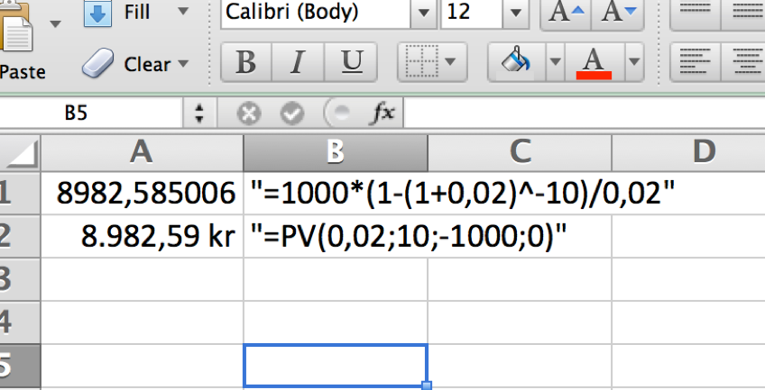{width="5.653170384951881in" height="2.889089020122485in"}

Der er en tæt sammenhæng mellem fremtids- og nutidsværdien af en annuitet. Nutidsværdien af annuiteten er fremtidsværdien $A_{n}$ på tidspunkt n tilbagediskonteret til tidspunkt 0.

$$A_{n} \cdot \left( 1 + r \right)^{- n} = y \cdot \frac{\left( 1 + r \right)^{n} - 1}{r} \cdot \left( 1 + r \right)^{- n} = A_{0}$$

Tilsvarende er $A_{0}\ $ fremskrevet til tidspunkt n ved at gange med faktoren $\left( 1 + r \right)^{n}$ det samme som $A_{n}$.

$$A_{0} \cdot \left( 1 + r \right)^{n} = y \cdot \frac{1 - \left( 1 + r \right)^{- n}}{r} \cdot \left( 1 + r \right)^{n} = A_{n}$$

Man kan komme ud for at man ikke kender en af de andre størrelser r, n eller y, men derimod kender $A_{0}$. Hvis y eller n er ukendte, kan man ud fra ovenstående formel isolere den ukendte størrelse ved reduktionsregnereglerne. Er y ukendt får vi:

$$y = A_{0} \cdot \frac{r}{1 - \left( 1 + r \right)^{- n}}$$

Hvis Jensen gerne vil låne 20.000,- og kender terminsrenten 4%, og skal betale gælden af over 12 terminer, kan man vha. ovenstående formel beregne hans ydelse.

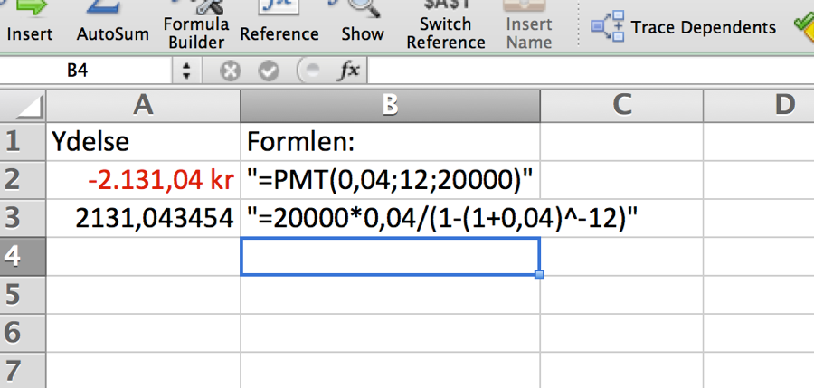{width="6.0in" height="2.859027777777778in"}

Er n antallet af ydelser ukendt kan vi omskrive formlen til

$$n = - \frac{\ln\left( 1 - \frac{\left( A_{0} \cdot r \right)}{y} \right)}{\ln\left( 1 + r \right)}\ $$

Hansen betaler 1.000,- i ydelse, på et lån på 10.000,- med en terminsrente på 3%, antallet af ydelser n bliver:

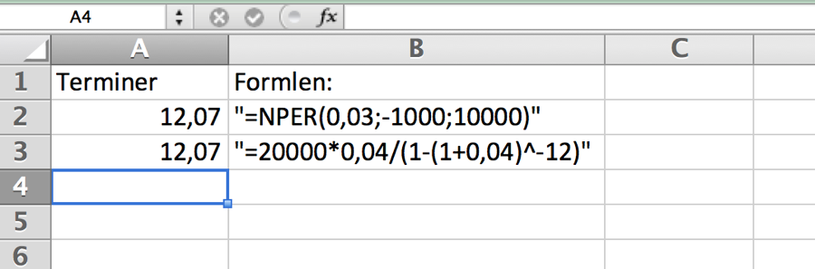{width="6.0in" height="1.9777777777777779in"}

Hansen skal altså betale 13 ydelser, den sidste ydelse bliver mindre end de første 12.

Hvis der er ukendt terminsrente r, kan man ikke opstille et eksplicit udtryk for renten, ligningen bliver et polynomium af grad n. Der findes ikke altid en entydig løsning til et polynomium, hvorfor excel og anden software benytter en algoritme til at finde en løsning.

Hvis Larsen låner 10.000,- der afdrages ved 12 ydelser af 1.500,-, vil vi kunne benytte rate-kommandoen. Vi vil få en terminsrente på 10,45.

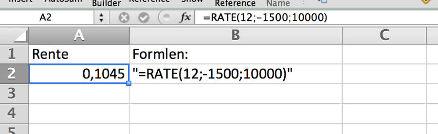{width="6.0in" height="1.8354166666666667in"}
  
## Selvtest finansiel regning

<a href="https://www.edutest.dk/mod/quiz/view.php?id=84" target="_blank">Gå til selvtesten her.</a>


Excel oversættelser
===================

Nedenfor er en liste med de forskellige engelske og danske koder hentet fra hjemmesiden, man kan søge i filen hvis man skal finde en kode. Det er ofte en fordel, hvis man skal finde argumenter til en funktion eller eksempler, at man kan Google den engelske kode.

  **Engelsk kode**   **Dansk kode**
  ------------------ -----------------------------
  ABS                ABS
  ACCRINT            PÅLØBRENTE
  ACCRINTM           PÅLØBRENTE.UDLØB
  ACOS               ARCCOS
  ACOSH              ARCCOSH
  ADDRESS            ADRESSE
  AMORDEGRC          AMORDEGRC
  AMORLINC           AMORLINC
  AND                OG
  AREAS              OMRÅDER
  ASIN               ARCSIN
  ASINH              ARCSINH
  ATAN               ARCTAN
  ATAN2              ARCTAN2
  ATANH              ARCTANH
  AVEDEV             MAD
  AVERAGE            MIDDEL
  AVERAGEA           MIDDELV
  BATHTEXT           BATHTEKST (ikke Excel 2000)
  BESSELI            BESSELI
  BESSELJ            BESSELJ
  BESSELK            BESSELK
  BESSELY            BESSELY
  BETADIST           BETAFORDELING
  BETAINV            BETAINV
  BIN2DEC            BIN.TIL.DEC
  BIN2HEX            BIN.TIL.HEX
  BIN2OCT            BIN.TIL.OKT
  BINOMDIST          BINOMIALFORDELING
  CALL               KALD (kun Excel 2000)
  CEILING            AFRUND.LOFT
  CELL               CELLE
  CHAR               TEGN
  CHIDIST            CHIFORDELING
  CHIINV             CHIINV
  CHITEST            CHITEST
  CHOOSE             VÆLG
  CLEAN              RENS
  CODE               KODE
  COLUMN             KOLONNE
  COLUMNS            KOLONNER
  COMBIN             KOMBIN
  COMPLEX            KOMPLEKS
  CONCATENATE        SAMMENKÆDNING
  CONFIDENCE         KONFIDENSINTERVAL
  CONVERT            KONVERTER
  CORREL             KORRELATION
  COS                COS
  COSH               COSH
  COUNT              TÆL
  COUNTA             TÆLV
  COUNTBLANK         ANTAL.BLANKE
  COUNTIF            TÆL.HVIS
  COUPDAYBS          KUPONDAGE.SA
  COUPDAYS           KUPONDAGE.A
  COUPDAYSNC         KUPONDAGE.ANK
  COUPNCD            KUPONDAG.NÆSTE
  COUPNUM            KUPONBETALINGER
  COUPPCD            KUPONDAG.FORRIGE
  COVAR              KOVARIANS
  CRITBINOM          KRITBINOM
  CUMIPMT            AKKUM.RENTE
  CUMPRINC           AKKUM.HOVEDSTOL
  DATE               DATO
  DATEDIF            DATO.FORSKEL
  DATEVALUE          DATOVÆRDI
  DAVERAGE           DMIDDEL
  DAY                DAG
  DAYS360            DAGE360
  DB                 DB
  DCOUNT             DTÆL
  DCOUNTA            DTÆLV
  DDB                DSA
  DEC2BIN            DEC.TIL.BIN
  DEC2HEX            DEC.TIL.HEX
  DEC2OCT            DEC.TIL.OKT
  DEGREES            GRADER
  DELTA              DELTA
  DEVSQ              SAK
  DGET               DHENT
  DISC               DISKONTO
  DMAX               DMAKS
  DMIN               DMIN
  DOLLAR             KR
  DOLLARDE           KR.DECIMAL
  DOLLARFR           KR.BRØK
  DPRODUCT           DPRODUKT
  DSTDEV             DSTDAFV
  DSTDEVP            DSTDAFVP
  DSUM               DSUM
  DURATION           VARIGHED
  DVAR               DVARIANS
  DVARP              DVARIANSP
  EDATE              EDATO
  EFFECT             EFFEKTIV.RENTE
  EOMONTH            SLUT.PÅ.MÅNED
  ERF                FEJLFUNK
  ERFC               FEJLFUNK.KOMP
  ERROR.TYPE         FEJLTYPE
  EVEN               LIGE
  EXACT              EKSAKT
  EXP                EKSP
  EXPONDIST          EKSPFORDELING
  FACT               FAKULTET
  FACTDOUBLE         DOBBELT.FAKULTET
  FALSE              FALSK
  FDIST              FFORDELING
  FIND               FIND
  FINV               FINV
  FISHER             FISHER
  FISHERINV          FISHERINV
  FIXED              FAST
  FLOOR              AFRUND.GULV
  FORECAST           PROGNOSE
  FREQUENCY          FREKVENS
  FTEST              FTEST
  FV                 FV
  FVSCHEDULE         FVTABEL
  GAMMADIST          GAMMAFORDELING
  GAMMAINV           GAMMAINV
  GAMMALN            GAMMALN
  GCD                STØRSTE.FÆLLES.DIVISOR
  GEOMEAN            GEOMIDDELVÆRDI
  GESTEP             GETRIN
  GETPIVOTDATA       GETPIVOTDATA
  GROWTH             FORØGELSE
  HARMEAN            HARMIDDELVÆRDI
  HEX2BIN            HEX.TIL.BIN
  HEX2DEC            HEX.TIL.DEC
  HEX2OCT            HEX.TIL.OKT
  HLOOKUP            VOPSLAG
  HOUR               TIME
  HYPERLINK          HYPERLINK
  HYPGEOMDIST        HYPGEOFORDELING
  IF                 HVIS
  IMABS              IMAGABS
  IMAGINARY          IMAGINÆR
  IMARGUMENT         IMAGARGUMENT
  IMCONJUGATE        IMAGKONJUGERE
  IMCOS              IMAGCOS
  IMDIV              IMAGDIV
  IMEXP              IMAGEKSP
  IMLN               IMAGLN
  IMLOG10            IMAGLOG10
  IMLOG2             IMAGLOG2
  IMPOWER            IMAGPOTENS
  IMPRODUCT          IMAGPRODUKT
  IMREAL             IMAGREELT
  IMSIN              IMAGSIN
  IMSQRT             IMAGKVROD
  IMSUB              IMAGSUB
  IMSUM              IMAGSUM
  INDEX              INDEKS
  INDIRECT           INDIREKTE
  INFO               INFO
  INT                HELTAL
  INTERCEPT          SKÆRING
  INTRATE            RENTEFOD
  IPMT               R.YDELSE
  IRR                IA
  ISBLANK            ER.TOM
  ISERR              ER.FJL
  ISERROR            ER.FEJL
  ISEVEN             ER.LIGE
  ISLOGICAL          ER.LOGISK
  ISNA               ER.IKKE.TILGÆNGELIG
  ISNONTEXT          ER.IKKE.TEKST
  ISNUMBER           ER.TAL
  ISODD              ER.ULIGE
  ISPMT              ISPMT
  ISREF              ER.REFERENCE
  ISTEXT             ER.TEKST
  KURT               TOPSTEJL
  LARGE              STØRSTE
  LCM                MINDSTE.FÆLLES.MULTIPLUM
  LEFT               VENSTRE
  LEN                LÆNGDE
  LINEST             LINREGR
  LN                 LN
  LOG                LOG
  LOG10              LOG10
  LOGEST             LOGREGR
  LOGINV             LOGINV
  LOGNORMDIST        LOGNORMFORDELING
  LOOKUP             SLÅ.OP
  LOWER              SMÅ.BOGSTAVER
  MATCH              SAMMENLIGN
  MAX                MAKS
  MAXA               MAKSV
  MDETERM            MDETERM
  MDURATION          MVARIGHED
  MEDIAN             MEDIAN
  MID                MIDT
  MIN                MIN
  MINA               MINV
  MINUTE             MINUT
  MINVERSE           MINVERT
  MIRR               MIA
  MMULT              MPRODUKT
  MOD                REST
  MODE               HYPPIGST
  MONTH              MÅNED
  MROUND             MAFRUND
  MULTINOMIAL        MULTINOMIAL
  N                  TAL
  NA                 IKKE.TILGÆNGELIG
  NEGBINOMDIST       NEGBINOMFORDELING
  NETWORKDAYS        ANTAL.ARBEJDSDAGE
  NOMINAL            NOMINEL
  NORMDIST           NORMFORDELING
  NORMINV            NORMINV
  NORMSDIST          STANDARDNORMFORDELING
  NORMSINV           STANDARDNORMINV
  NOT                IKKE
  NOW                NU
  NPER               NPER
  NPV                NUTIDSVÆRDI
  OCT2BIN            OKT.TIL.BIN
  OCT2DEC            OKT.TIL.DEC
  OCT2HEX            OKT.TIL.HEX
  ODD                ULIGE
  ODDFPRICE          ULIGE.KURS.PÅLYDENDE
  ODDFYIELD          ULIGE.FØRSTE.AFKAST
  ODDLPRICE          ULIGE.SIDSTE.KURS
  ODDLYIELD          ULIGE.SIDSTE.AFKAST
  OFFSET             FORSKYDNING
  OR                 ELLER
  PEARSON            PEARSON
  PERCENTILE         FRAKTIL
  PERCENTRANK        PROCENTPLADS
  PERMUT             PERMUT
  PI                 PI
  PMT                YDELSE
  POISSON            POISSON
  POWER              POTENS
  PPMT               H.YDELSE
  PRICE              KURS
  PRICEDISC          KURS.DISKONTO
  PRICEMAT           KURS.UDLØB
  PROB               SANDSYNLIGHED
  PRODUCT            PRODUKT
  PROPER             STORT.FORBOGSTAV
  PV                 NV
  QUARTILE           KVARTIL
  QUOTIENT           KVOTIENT
  RADIANS            RADIANER
  RAND               SLUMP
  RANDBETWEEN        SLUMPMELLEM
  RANK               PLADS
  RATE               RENTE
  RECEIVED           MODTAGET.VED.UDLØB
  REGISTER.ID        REGISTER.ID
  REPLACE            ERSTAT
  REPT               GENTAG
  RIGHT              HØJRE
  ROMAN              ROMERTAL
  ROUND              AFRUND
  ROUNDDOWN          RUND.NED
  ROUNDUP            RUND.OP
  ROW                RÆKKE
  ROWS               RÆKKER
  RSQ                FORKLARINGSGRAD
  RTD                RTD (ikke Excel 2000)
  SEARCH             SØG
  SECOND             SEKUND
  SERIESSUM          SERIESUM
  SIGN               FORTEGN
  SIN                SIN
  SINH               SINH
  SKEW               SKÆVHED
  SLN                LA
  SLOPE              STIGNING
  SMALL              MINDSTE
  SQRT               KVROD
  SQRTPI             KVRODPI
  STANDARDIZE        STANDARDISER
  STDEV              STDAFV
  STDEVA             STDAFVV
  STDEVP             STDAFVP
  STDEVPA            STDAFVPV
  STEYX              STFYX
  SUBSTITUTE         UDSKIFT
  SUBTOTAL           SUBTOTAL
  SUM                SUM
  SUMIF              SUM.HVIS
  SUMPRODUCT         SUMPRODUKT
  SUMSQ              SUMKV
  SUMX2MY2           SUMX2MY2
  SUMX2PY2           SUMX2PY2
  SUMXMY2            SUMXMY2
  SYD                ÅRSAFSKRIVNING
  TAN                TAN
  TANH               TANH
  TBILLEQ            STATSOBLIGATION
  TBILLPRICE         STATSOBLIGATION.KURS
  TBILLYIELD         STATSOBLIGATION.AFKAST
  TDIST              TFORDELING
  TEXT               TEKST
  TIME               TID
  TIMEVALUE          TIDSVÆRDI
  TINV               TINV
  TODAY              IDAG
  TRANSPOSE          TRANSPONER
  TREND              TENDENS
  TRIM               FJERN.OVERFLØDIGE.BLANKE
  TRIMMEAN           TRIMMIDDELVÆRDI
  TRUE               SAND
  TRUNC              AFKORT
  TTEST              TTEST
  TYPE               VÆRDITYPE
  UPPER              STORE.BOGSTAVER
  VALUE              VÆRDI
  VAR                VARIANS
  VARA               VARIANSV
  VARP               VARIANSP
  VARPA              VARIANSPV
  VDB                VSA
  VLOOKUP            LOPSLAG
  WEEKDAY            UGEDAG
  WEEKNUM            UGE.NR
  WEIBULL            WEIBULL
  WORKDAY            ARBEJDSDAG
  XIRR               INTERN.RENTE
  XNPV               NETTO.NUTIDSVÆRDI
  YEAR               ÅR
  YEARFRAC           ÅR.BRØK
  YIELD              AFKAST
  YIELDDISC          AFKAST.DISKONTO
  YIELDMAT           AFKAST.UDLØBSDATO
  ZTEST              ZTEST


